# Harden Infrastructure Validation - Design

## Overview

This design document addresses the 11 identified risks by introducing hardening requirements to the existing infrastructure specification. The design follows the principle of **implementation-agnostic** specifications while ensuring all requirements are **verifiable** with explicit acceptance criteria.

## Design Decisions

### 1. Test Coverage Metrics Clarification

**Problem**: "80% test coverage" is ambiguous - it doesn't specify whether this applies to statements, branches, functions, or lines.

**Decision**: Define explicit metrics for all coverage types.

**Design**:
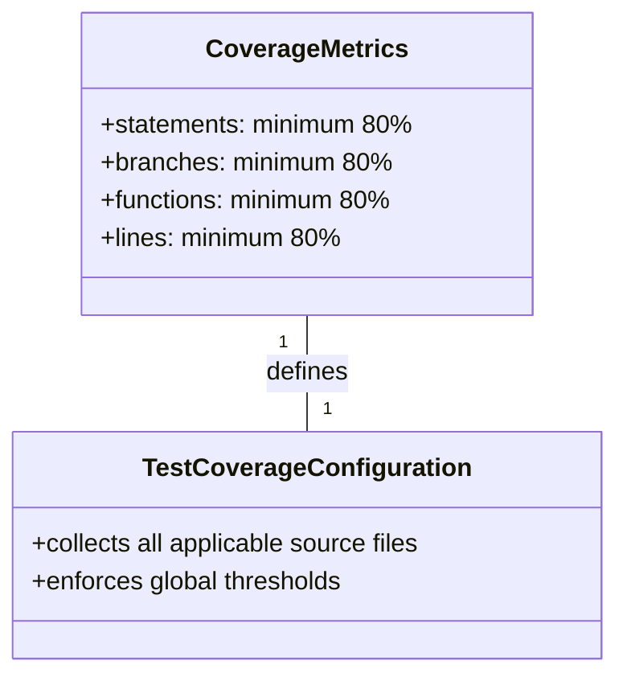
*Caption: Coverage metrics structure with explicit thresholds for each type*

**Rationale**: Each coverage type measures different aspects of code quality. Global thresholds ensure no aspect is neglected. This aligns with industry best practices for comprehensive test coverage.

**Implementation Neutrality**: Does not specify the tool (Jest, Istanbul, etc.), only the metrics that MUST be achieved.

---

### 2. Test Coverage Output Standardization

**Problem**: Jest text coverage output path may be inconsistent with standard reporter behavior.

**Decision**: Explicitly specify output locations.

**Design**:
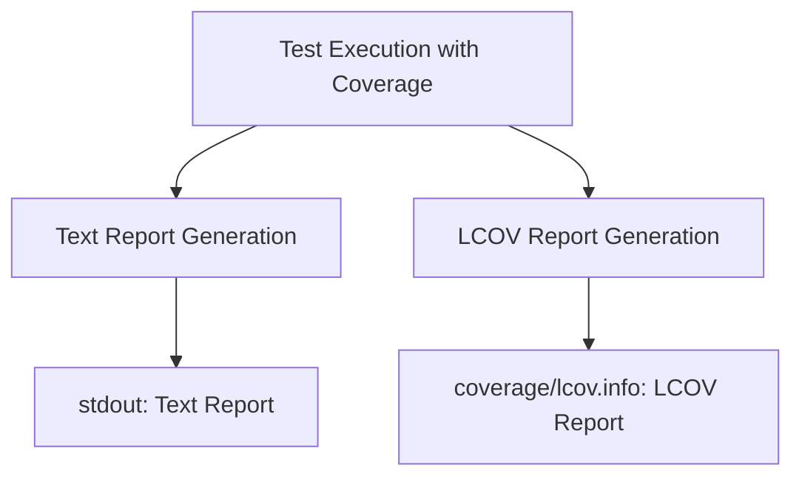
*Caption: Coverage report output standardization workflow*

**Rationale**: 
- stdout is the standard location for text reports in most CI systems
- coverage/lcov.info is the standard location for LCOV reports used by code coverage services
- Explicit paths prevent ambiguity and ensure tooling compatibility

---

### 3. OPFS Mock Requirements

**Problem**: jsdom does not fully support OPFS APIs, causing test failures for OPFS-related functionality.

**Decision**: Require deterministic resettable mocks for unavailable OPFS APIs.

**Design**:
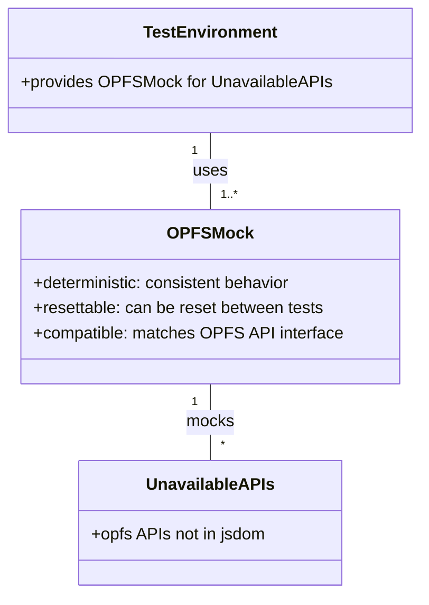
*Caption: OPFS mock structure for unavailable APIs in test environment*

**Rationale**: 
- **Deterministic**: Ensures test reproducibility
- **Resettable**: Ensures test isolation
- **Compatible**: Ensures tests exercise the correct API surface
- Does not require specific mocking library (sinon, jest.mock, etc.)

---

### 4. Entry Point Validation

**Problem**: Build artifacts may exist but npm entry points may still be unusable by consumers.

**Decision**: Require that package entry points and TypeScript declarations are verifiable as usable by consumers.

**Design**:
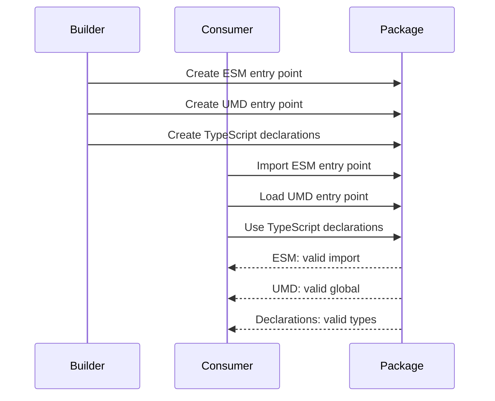
*Caption: Entry point validation sequence between builder, package, and consumer*

**Rationale**: 
- Ensures build artifacts are not just generated but actually functional
- Validates the complete consumer experience
- Does not specify validation method (manual, automated, etc.)

---

### 5. Package Contents Validation

**Problem**: Package may contain errors, sensitive files, or unnecessary files.

**Decision**: Require pre-publish verification of package contents.

**Design**:
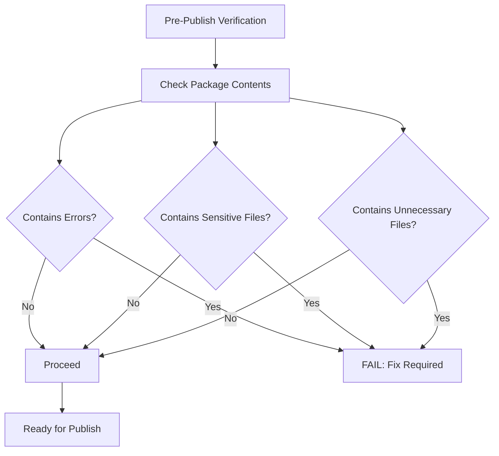
*Caption: Package contents validation decision tree*

**Rationale**: 
- Prevents accidental inclusion of credentials, build artifacts, or development files
- Defines explicit criteria for what constitutes valid package contents
- Does not specify the verification tool or method

---

### 6. Version Consistency

**Problem**: Version tag may not conform to SemVer or may not match package.json version.

**Decision**: Require exact match between SemVer tag and package.json version.

**Design**:
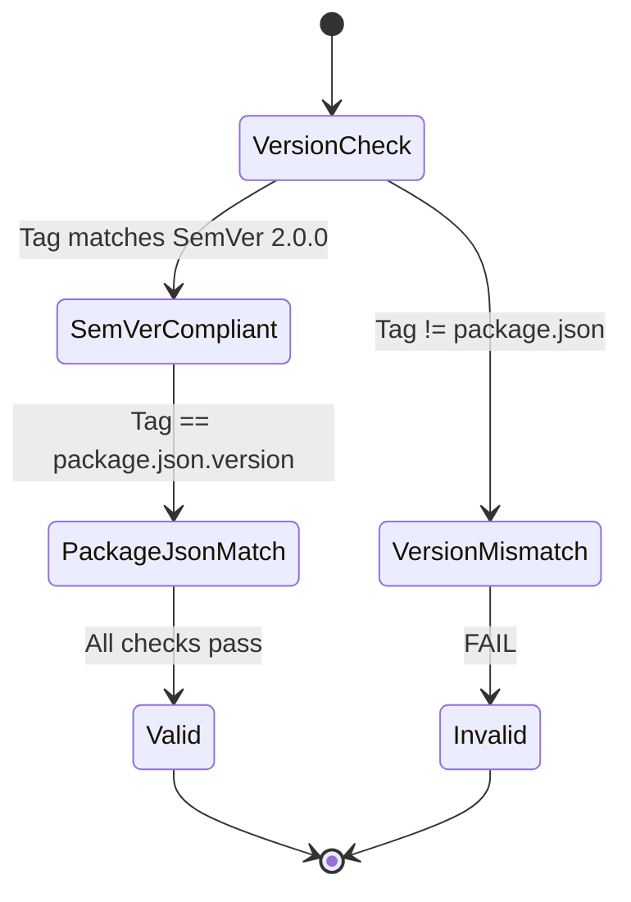
*Caption: Version consistency validation state machine*

**Rationale**: 
- SemVer 2.0.0 compliance ensures predictable versioning
- Exact match prevents confusion between tag and package version
- Fail-fast approach prevents inconsistent releases

---

### 7. Security Boundaries

**Problem**: npm authentication and workflow permissions lack security boundaries.

**Decision**: Define fail-closed publication and prohibit credentials in repository or logs.

**Design**:
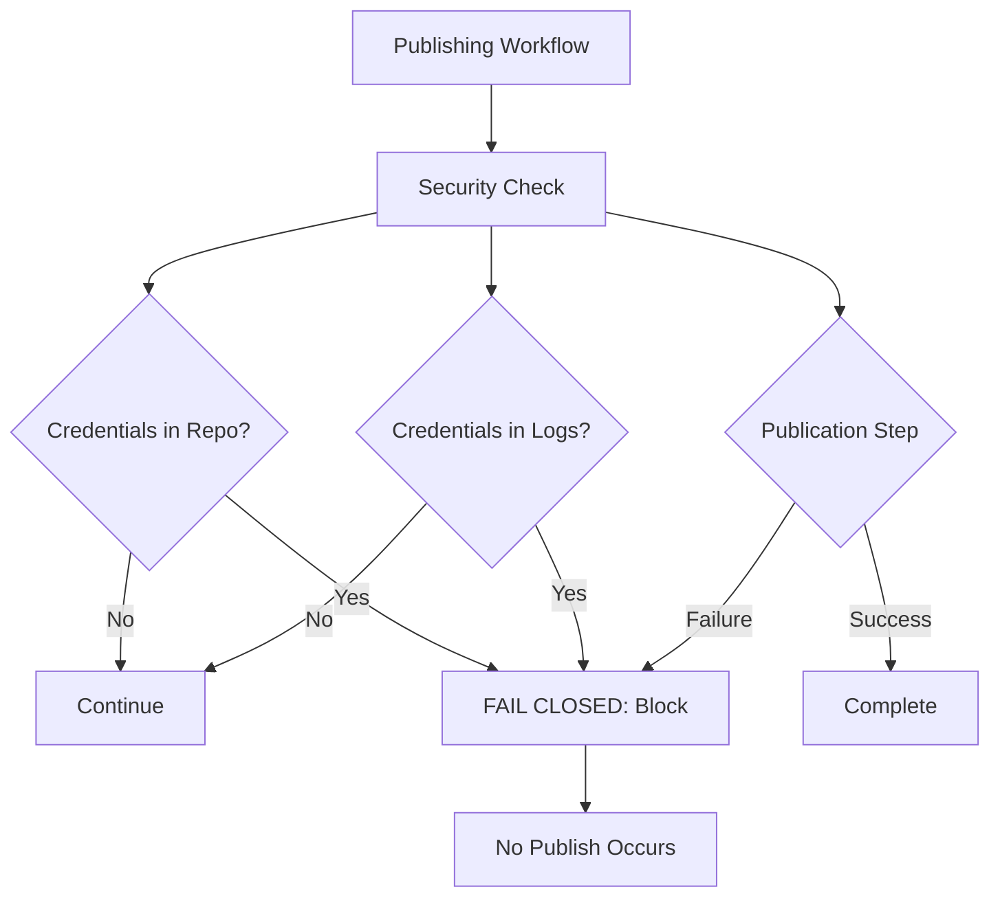
*Caption: Security boundary enforcement with fail-closed behavior*

**Rationale**: 
- **Fail-closed**: Any security violation blocks publication completely
- **No credentials in repo**: Prevents accidental commitment of secrets
- **No credentials in logs**: Prevents secret exposure in CI/CD output
- **No partial publication**: Ensures atomic publish operations

---

### 8. Prerelease Clarification

**Problem**: Prerelease support may be misunderstood as a mandatory release path.

**Decision**: Clarify that prerelease versions are OPTIONAL.

**Design**:
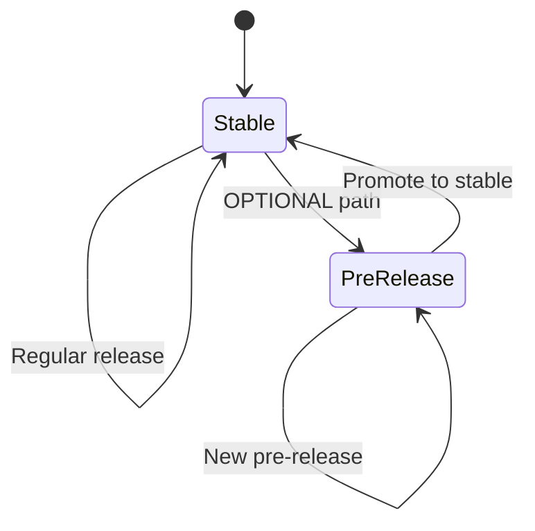
*Caption: Release path state diagram showing prerelease as optional*

**Rationale**: 
- Makes it explicit that projects can choose not to use prereleases
- Does not remove prerelease capability, only clarifies its optional nature
- Aligns with SemVer 2.0.0 which defines prerelease as optional

---

### 9. Changelog Requirement Clarification

**Problem**: CHANGELOG.md SHALL requirement contradicts optional implementation wording.

**Decision**: Clarify that CHANGELOG.md is REQUIRED.

**Design**:
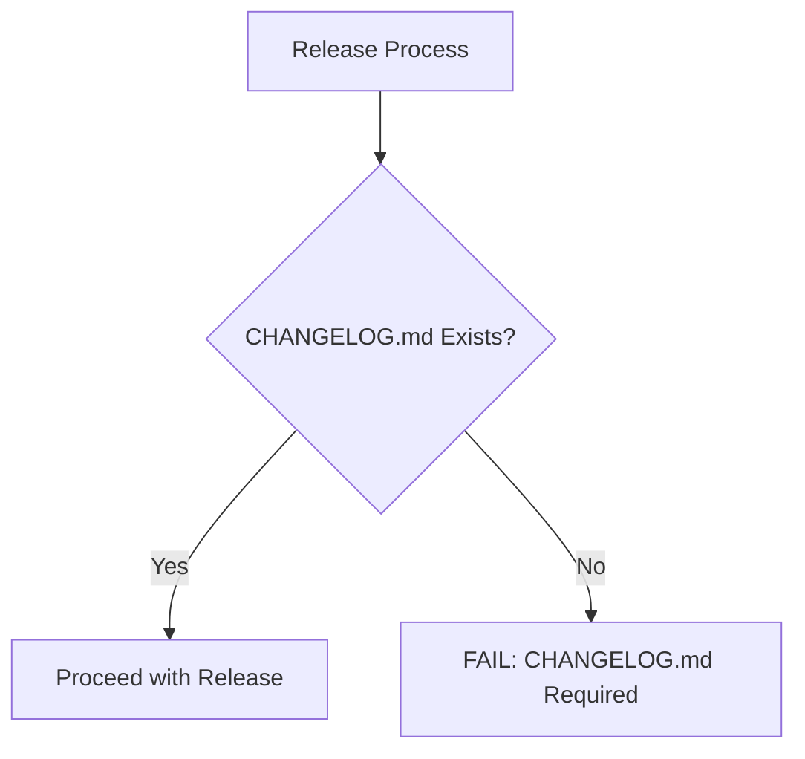
*Caption: Changelog requirement enforcement flow*

**Rationale**: 
- Provides transparent release history
- Required for maintainability and user communication
- Industry standard practice

---

### 10. Comprehensive Release Validation

**Problem**: prepublishOnly cannot guarantee all release validation is executed.

**Decision**: Require that tests, coverage, build, and package validation MUST all pass before publish.

**Design**:
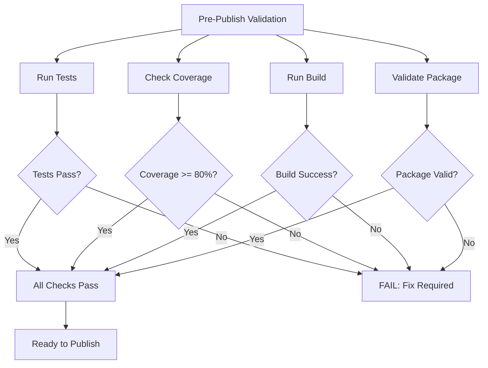
*Caption: Comprehensive release validation with all required checks*

**Rationale**: 
- Prevents incomplete validation from blocking issues
- Ensures all quality gates are passed before publication
- Does not specify the validation mechanism (prepublishOnly, custom script, etc.)

---

### 11. Safe Publishing Verification

**Problem**: Using actual npm publish for verification can cause accidental production releases.

**Decision**: Prohibit actual npm publish for verification, require dry-run only.

**Design**:
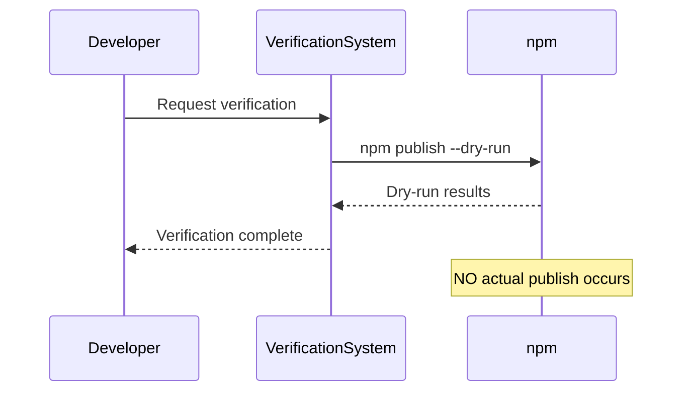
*Caption: Safe publishing verification using dry-run only*

**Rationale**: 
- Prevents accidental production releases
- Dry-run validates all publish steps without side effects
- Can be run multiple times safely
- No risk of version conflicts or duplicate publications

---

## Design Principles

1. **Implementation-Neutral**: All requirements specify WHAT must be achieved, not HOW to achieve it
2. **Verifiable**: Every requirement has explicit acceptance criteria that can be tested
3. **Non-Breaking**: Hardening adds validation without changing existing functionality
4. **Security-First**: All security-related requirements use fail-closed behavior
5. **Consumer-Focused**: Entry points and package contents are validated from consumer perspective

## Dependencies

- Existing infrastructure baseline specification (`openspec/specs/infrastructure/spec.md`)
- No new external dependencies required
- No changes to runtime behavior

## Constraints

- MUST NOT modify the formal infrastructure specification at `openspec/specs/infrastructure/spec.md`
- MUST NOT duplicate existing capabilities
- MUST follow SDD workflow: proposal -> specs -> design -> tasks
- MUST use English only in all openspec/ files
- MUST include Mermaid diagrams for complex concepts
- MUST provide scenarios with #### headers for every requirement

---

*Document Version: 1.0.0*
*Last Updated: 2026-07-16*
*Status: Draft*
*Related Change: harden-infrastructure-validation*
*Author: Mistral Vibe*
*Source of Truth: openspec/specs/infrastructure/spec.md*
