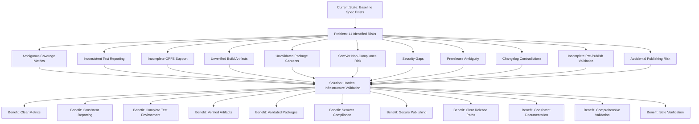

# Harden Infrastructure Validation - Proposal

## Why

The current Infrastructure Baseline Specification at `openspec/specs/infrastructure/spec.md` defines foundational requirements for build system, testing system, CI/CD pipeline, dependency management, and release management. However, analysis has identified 11 critical risks that require hardening to ensure infrastructure reliability, security, and consistency.

Without addressing these risks, the project faces potential issues including:
- Unclear coverage metrics leading to insufficient test quality
- Inconsistent test reporting causing integration issues
- Incomplete OPFS API support in test environment
- Build artifacts that may be unusable by consumers
- Package contents that may include errors, sensitive data, or unnecessary files
- Version inconsistencies violating SemVer standards
- Security vulnerabilities in publishing workflows
- Misinterpretation of prerelease requirements
- Contradictory changelog requirements
- Incomplete validation before publication
- Risk of accidental production releases during verification

*Caption: Risk analysis flow from current state through identified risks to hardening solution and benefits*

## What Changes

This change proposes hardening the infrastructure specification by:

### Modified Requirements
- **Test Coverage Configuration**: Clarify coverage metrics to specify statements, branches, functions, and lines each at minimum 80%
- **Testing System Configuration**: Specify exact Jest text coverage output to stdout and LCOV report to coverage/lcov.info
- **Release Management**: Clarify that prerelease versions are OPTIONAL, not mandatory
- **Release Management**: Clarify that CHANGELOG.md is REQUIRED, not optional
- **Release Management**: Clarify that SemVer tag MUST match package.json version exactly

### Added Requirements
- **OPFS Mock Requirements**: Define deterministic resettable mocks for unavailable OPFS APIs in jsdom
- **Entry Point Validation**: Ensure package entry points and TypeScript declarations are usable by consumers
- **Package Contents Validation**: Verify package contents before publish, excluding errors, sensitive files, and unnecessary files
- **Security Boundaries**: Define that credentials MUST NOT be written to repository or logs, and publication failure MUST be fail-closed
- **Release Validation**: Define that tests, coverage, build, and package validation MUST all pass before publish
- **Safe Publishing**: Define that only non-publish verification methods (dry-run) may be used for validation

### Scope Boundaries

**Included in this change:**
- Hardening of validation requirements for existing infrastructure capabilities
- New requirements for OPFS mocking, package validation, security, and safe publishing
- Clarification of ambiguous requirements in the baseline spec

**Explicitly EXCLUDED from this change:**
- Runtime feature changes
- Provider changes
- Real-browser test framework adoption
- Automated version selection
- Automated changelog generation
- Production implementation
- Actual npm publication
- Spec archival

## Capabilities

### Modified Capabilities
- `infrastructure`: Hardened validation requirements for test coverage, testing system, and release management

### New Capabilities
None - this change hardens existing infrastructure capability without adding new capabilities

## Impact

- **Documentation**: Adds comprehensive hardening requirements to the infrastructure delta specification
- **Testing**: Strengthens test coverage requirements with explicit metrics
- **Build**: Ensures build artifacts are verified for consumer usability
- **Security**: Establishes clear security boundaries for publishing workflows
- **Release**: Clarifies prerelease, changelog, and version consistency requirements
- **Maintenance**: Improves infrastructure reliability through stricter validation
- **SDD Adoption**: Demonstrates continuous improvement of specifications through delta changes

## Risk Analysis

| Risk | Likelihood | Impact | Mitigation Strategy |
|------|------------|--------|---------------------|
| Ambiguous coverage metrics lead to insufficient testing | High | High | Define explicit metrics for statements, branches, functions, lines at 80% |
| Jest text coverage output path inconsistent with standard reporters | Medium | Medium | Explicitly specify stdout for text report and coverage/lcov.info for LCOV |
| jsdom incomplete OPFS support causes test failures | High | High | Require deterministic resettable mocks for unavailable APIs |
| Build artifacts exist but entry points unusable | Medium | High | Require validation of ESM/UMD/TypeScript declarations by consumers |
| Package contains errors, sensitive, or unnecessary files | Medium | High | Require pre-publish verification of package contents |
| Version tag violates SemVer or mismatches package.json | Medium | High | Require exact match between SemVer tag and package.json version |
| npm auth and workflow permissions lack security boundaries | High | High | Define fail-closed publication, prohibit credentials in repo/logs |
| Prerelease interpreted as mandatory release path | Medium | Medium | Clarify prerelease is OPTIONAL |
| CHANGELOG.md SHALL requirement contradicts optional implementation | Medium | Medium | Clarify CHANGELOG.md is REQUIRED |
| prepublishOnly cannot guarantee all validation executed | High | High | Require all validation (tests, coverage, build, package) to pass before publish |
| Using npm publish for verification causes accidental publishing | High | High | Prohibit actual npm publish for verification, require dry-run only |

---

*Document Version: 1.0.0*
*Last Updated: 2026-07-16*
*Status: Draft*
*Related Change: harden-infrastructure-validation*
*Author: Mistral Vibe*
*Source of Truth: openspec/specs/infrastructure/spec.md*
