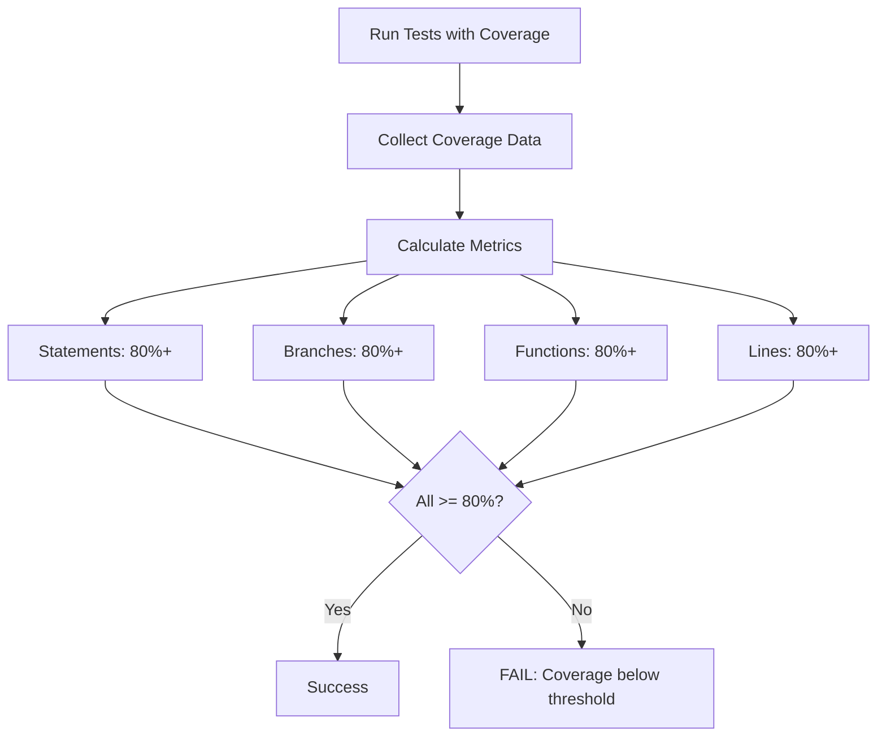
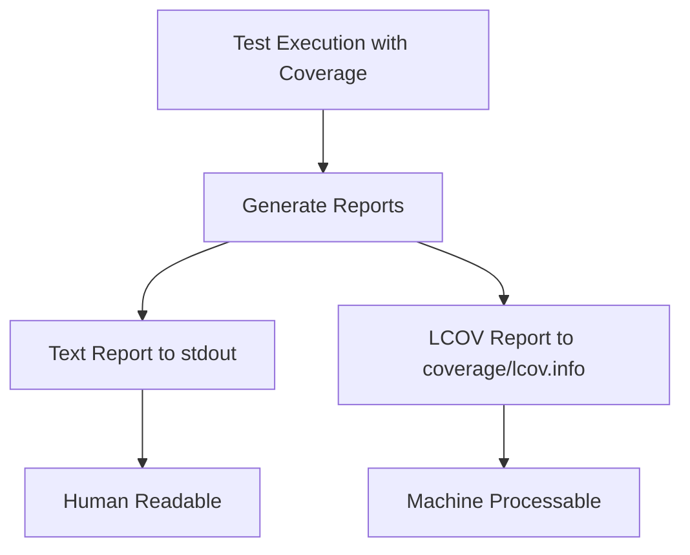
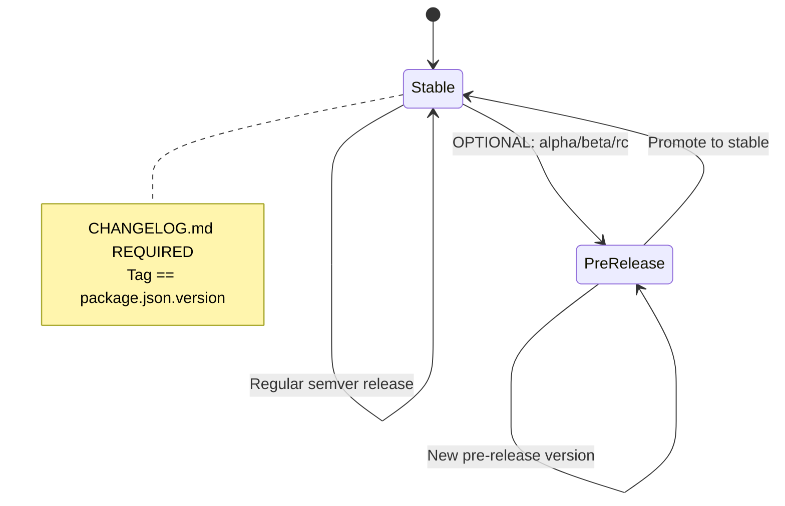
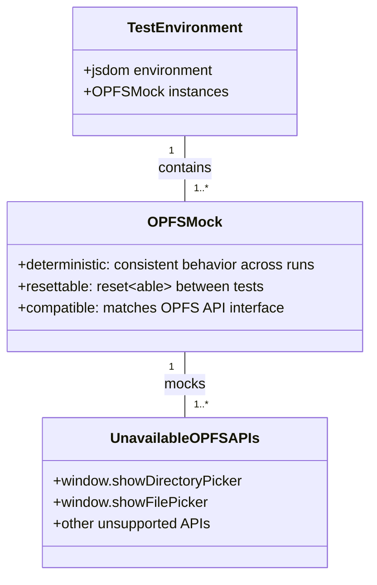
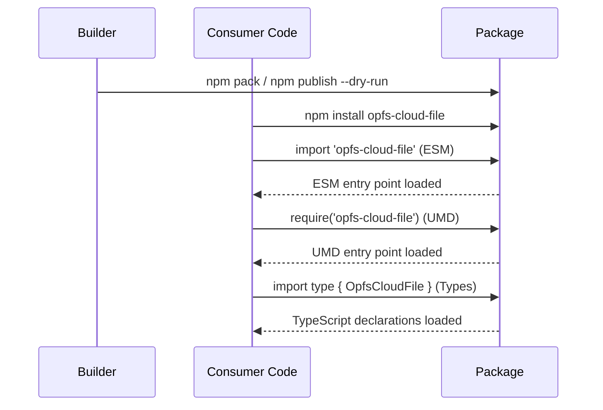
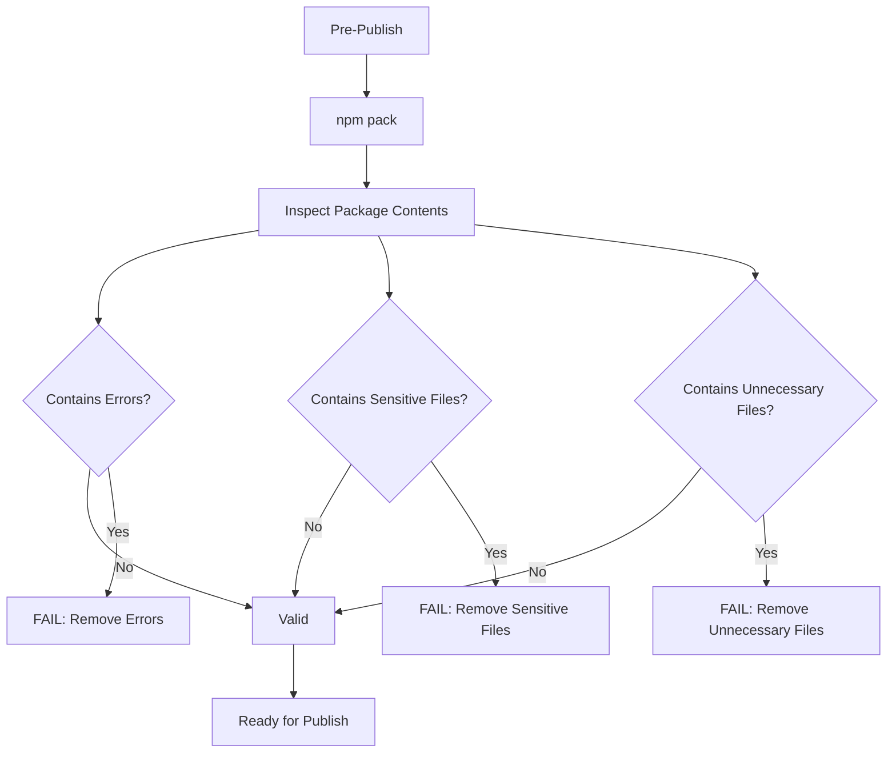
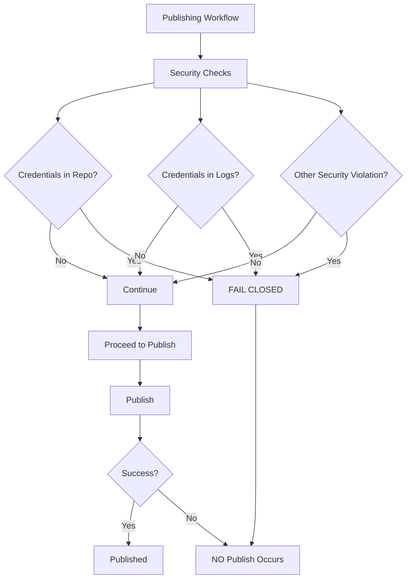
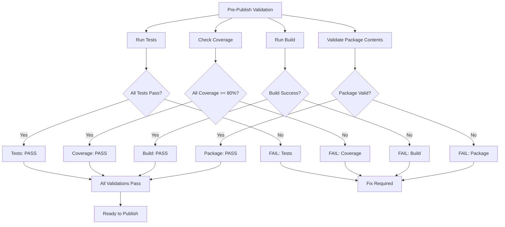
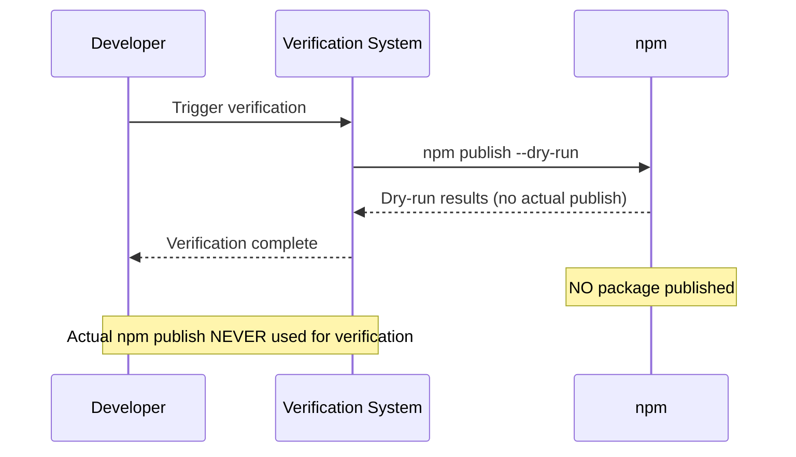
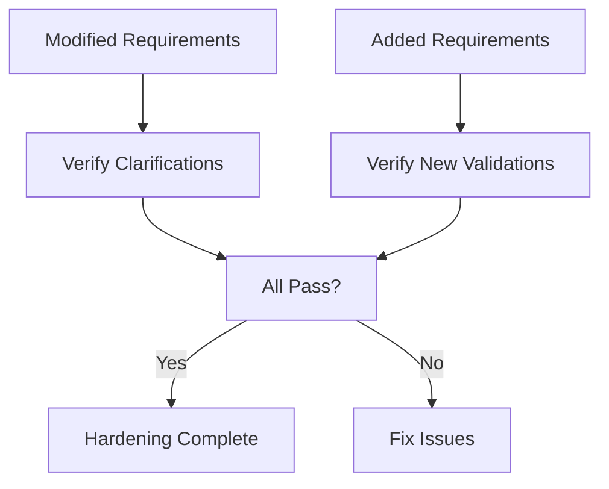

# Infrastructure Hardening Delta Specification

## Purpose

This delta specification hardens the Infrastructure Baseline Specification defined in `../../../../specs/infrastructure/spec.md` by addressing 11 identified risks. It modifies existing requirements for clarity and adds new requirements for validation, security, and safety.

**Source of Truth**: `openspec/specs/infrastructure/spec.md`

**Delta Type**: Hardening - clarifies ambiguous requirements and adds validation requirements

## Modified Requirements

### Requirement: Test Coverage Configuration (MODIFIED)

The testing system SHALL enforce minimum test coverage thresholds of 80% for statements, branches, functions, and lines globally.

The testing system SHALL collect coverage data for all applicable source files in the project.

**Implementation**: jest.config.cjs (coverage thresholds), package.json (test scripts)
**Verification**: npm test -- --coverage

*Caption: Test coverage collection with explicit metrics for statements, branches, functions, and lines*

#### Scenario: Statement coverage meets minimum threshold
- **WHEN** `npm test -- --coverage` is executed
- **THEN** system reports statement coverage at or above 80%

#### Scenario: Branch coverage meets minimum threshold
- **WHEN** `npm test -- --coverage` is executed
- **THEN** system reports branch coverage at or above 80%

#### Scenario: Function coverage meets minimum threshold
- **WHEN** `npm test -- --coverage` is executed
- **THEN** system reports function coverage at or above 80%

#### Scenario: Line coverage meets minimum threshold
- **WHEN** `npm test -- --coverage` is executed
- **THEN** system reports line coverage at or above 80%

#### Scenario: Coverage collection includes all applicable source files
- **WHEN** coverage data is collected
- **THEN** system includes all source files under src/, providers/, and index.js

---

### Requirement: Testing System Configuration (MODIFIED)

The testing system SHALL output Jest text coverage report to stdout.

The testing system SHALL generate LCOV coverage report at `coverage/lcov.info`.

The testing system SHALL generate coverage reports in text format for human readability to stdout.

The testing system SHALL generate coverage reports in LCOV format for machine processing to `coverage/lcov.info`.

**Implementation**: jest.config.cjs (coverageReporters configuration)
**Verification**: npm test -- --coverage

*Caption: Testing system coverage report output locations*

#### Scenario: Text coverage report output to stdout
- **WHEN** `npm test -- --coverage` is executed
- **THEN** system outputs text coverage report to stdout

#### Scenario: LCOV coverage report generated at coverage/lcov.info
- **WHEN** `npm test -- --coverage` is executed
- **THEN** system creates coverage/lcov.info file with LCOV format coverage data

#### Scenario: coverage/lcov.info file exists after test execution
- **WHEN** `npm test -- --coverage` completes successfully
- **THEN** file coverage/lcov.info exists and contains valid LCOV data

---

### Requirement: Release Management (MODIFIED)

The project SHALL support pre-release versions with identifiers: alpha, beta, rc as an OPTIONAL path.

The project SHALL maintain a CHANGELOG.md file for tracking release history as a REQUIRED artifact.

The project SHALL ensure that SemVer version tag MUST match package.json version exactly with no discrepancies.

**Implementation**: package.json (version field), CHANGELOG.md
**Verification**: Version comparison between git tag and package.json, CHANGELOG.md existence check

*Caption: Release management state diagram with optional prerelease path and required changelog*

#### Scenario: Prerelease versions are optional
- **WHEN** project decides on release strategy
- **THEN** project MAY choose to use prerelease versions (alpha, beta, rc) OR may use only stable releases

#### Scenario: CHANGELOG.md is required for releases
- **WHEN** a release is prepared
- **THEN** CHANGELOG.md file MUST exist in the repository root

#### Scenario: Version tag matches package.json version exactly
- **WHEN** a version tag is created for release
- **THEN** the git tag version MUST be identical to package.json version field

---

## Added Requirements

### Requirement: OPFS Mock Requirements (ADDED)

The testing system SHALL provide deterministic mock implementations for OPFS APIs that are not supported by jsdom.

The testing system SHALL ensure OPFS mocks are resettable between test executions to maintain test isolation.

The testing system SHALL ensure OPFS mocks provide behavior that is compatible with the actual OPFS API interface.

**Implementation**: Test setup files (jest.setup.js or similar)
**Verification**: Test execution with OPFS-dependent code

*Caption: OPFS mock structure for unavailable APIs in jsdom test environment*

#### Scenario: Deterministic OPFS mock behavior
- **WHEN** the same test is executed multiple times
- **THEN** OPFS mocks produce identical results each time

#### Scenario: Resettable OPFS mocks between tests
- **WHEN** a new test begins execution
- **THEN** OPFS mocks are in their initial state, isolated from previous tests

#### Scenario: Compatible OPFS mock API interface
- **WHEN** code calls mocked OPFS APIs
- **THEN** the mock accepts the same parameters and returns compatible values as the real OPFS API

#### Scenario: Unsupported OPFS APIs are mocked
- **WHEN** code uses OPFS APIs not supported by jsdom
- **THEN** mock implementations are available and prevent test failures

---

### Requirement: Entry Point Validation (ADDED)

The build system SHALL verify that package entry points (ESM, UMD) are usable by consumer code through import and global access patterns.

The build system SHALL verify that TypeScript declaration files are usable by TypeScript consumers for type checking and IntelliSense.

**Implementation**: Build verification scripts, consumer test projects
**Verification**: Package installation and usage in consumer environment

*Caption: Entry point and declaration validation sequence from consumer perspective*

#### Scenario: ESM entry point is usable by consumers
- **WHEN** consumer code executes `import 'opfs-cloud-file'`
- **THEN** ESM entry point loads successfully without errors

#### Scenario: UMD entry point is usable by consumers
- **WHEN** consumer code executes `require('opfs-cloud-file')` or uses browser global
- **THEN** UMD entry point loads successfully without errors

#### Scenario: TypeScript declarations are usable by consumers
- **WHEN** consumer TypeScript code imports types from 'opfs-cloud-file'
- **THEN** TypeScript compiler successfully resolves types without errors

#### Scenario: Package entry points function correctly
- **WHEN** consumer code uses the package as intended
- **THEN** all exported functionality works as specified

---

### Requirement: Package Contents Validation (ADDED)

The publishing system SHALL verify package contents before publication to ensure no error files are included.

The publishing system SHALL verify package contents before publication to ensure no sensitive files (credentials, secrets, private keys) are included.

The publishing system SHALL verify package contents before publication to ensure no unnecessary files (development dependencies, build artifacts, temporary files) are included.

**Implementation**: Pre-publish verification scripts, npm pack inspection
**Verification**: npm pack output validation

*Caption: Package contents validation decision tree with three security checks*

#### Scenario: Package does not contain error files
- **WHEN** package contents are inspected before publish
- **THEN** no error files (*.err, *.log with errors, crash dumps) are present in the package

#### Scenario: Package does not contain sensitive files
- **WHEN** package contents are inspected before publish
- **THEN** no sensitive files (.env, *.pem, *.key, credentials) are present in the package

#### Scenario: Package does not contain unnecessary files
- **WHEN** package contents are inspected before publish
- **THEN** no unnecessary files (node_modules, devDependencies, build artifacts, temporary files) are present in the package

#### Scenario: Validated package ready for publication
- **WHEN** all package content validations pass
- **THEN** package is approved for publication

---

### Requirement: Security Boundaries (ADDED)

The publishing system SHALL adopt fail-closed behavior where any security violation prevents publication completely.

The publishing system SHALL ensure credentials are NEVER written to the repository in any form.

The publishing system SHALL ensure credentials are NEVER written to logs or console output in any form.

The publishing system SHALL ensure publication failure results in NO package being published, not even partially.

**Implementation**: CI/CD workflow security checks, environment variable management
**Verification**: Security audit of publishing workflow

*Caption: Security boundary enforcement with fail-closed behavior for all violations*

#### Scenario: Fail-closed on credential in repository
- **WHEN** credentials are detected in the repository
- **THEN** publishing workflow is blocked and NO package is published

#### Scenario: Fail-closed on credential in logs
- **WHEN** credentials are detected in workflow logs
- **THEN** publishing workflow is blocked and NO package is published

#### Scenario: No credentials in repository
- **WHEN** repository is scanned for credentials
- **THEN** no credential files or credential values are found in any committed files

#### Scenario: No credentials in logs
- **WHEN** publishing workflow executes
- **THEN** no credential values appear in any log output or console output

#### Scenario: No partial publication on failure
- **WHEN** publishing workflow encounters any error
- **THEN** NO package is published to the registry, even partially

---

### Requirement: Release Validation (ADDED)

The publishing system SHALL require that all tests pass with 100% pass rate before package publication.

The publishing system SHALL require that all coverage thresholds (80% minimum for statements, branches, functions, lines) are met before package publication.

The publishing system SHALL require that build completes successfully without errors before package publication.

The publishing system SHALL require that package contents validation passes before package publication.

**Implementation**: CI/CD workflow pre-publish checks, custom validation scripts
**Verification**: Complete pre-publish validation execution

*Caption: Comprehensive release validation with four mandatory checks before publication*

#### Scenario: All tests pass before publish
- **WHEN** pre-publish validation runs
- **THEN** all tests MUST pass with 100% pass rate

#### Scenario: Coverage thresholds met before publish
- **WHEN** pre-publish validation runs
- **THEN** coverage for statements, branches, functions, and lines MUST all be at or above 80%

#### Scenario: Build succeeds before publish
- **WHEN** pre-publish validation runs
- **THEN** build MUST complete successfully without any errors

#### Scenario: Package validation passes before publish
- **WHEN** pre-publish validation runs
- **THEN** package contents validation MUST pass

#### Scenario: All validations must pass for publication
- **WHEN** any validation fails
- **THEN** publication is blocked until all validations pass

---

### Requirement: Safe Publishing (ADDED)

The verification system SHALL use only non-publish methods (such as `npm publish --dry-run`) for validation purposes.

The verification system SHALL NEVER use actual `npm publish` for verification or testing purposes.

**Implementation**: Verification scripts, CI/CD workflow design
**Verification**: Inspection of verification commands

*Caption: Safe publishing verification using dry-run only, never actual publish*

#### Scenario: Dry-run used for verification
- **WHEN** verification of publishing is performed
- **THEN** system uses `npm publish --dry-run` or equivalent non-publish command

#### Scenario: No actual publish during verification
- **WHEN** verification commands are executed
- **THEN** NO actual package is published to any registry

#### Scenario: Verification can be run multiple times safely
- **WHEN** verification is executed multiple times
- **THEN** no side effects occur and no packages are published

---

## Acceptance Criteria Verification

The infrastructure hardening SHALL have all modified requirements pass their verification checks.

The infrastructure hardening SHALL have all added requirements pass their verification checks.

The infrastructure hardening SHALL maintain backward compatibility with existing infrastructure specification.

**Implementation**: All configuration files and workflows
**Verification**: Complete validation cycle execution

*Caption: Acceptance criteria verification for hardening requirements*

#### Scenario: Modified requirements verified
- **WHEN** all modified requirements are checked
- **THEN** each modified requirement passes its verification criteria

#### Scenario: Added requirements verified
- **WHEN** all added requirements are checked
- **THEN** each added requirement passes its verification criteria

#### Scenario: Backward compatibility maintained
- **WHEN** existing infrastructure is validated against hardened spec
- **THEN** all existing functionality continues to work

---

*Document Version: 1.0.0*
*Last Updated: 2026-07-16*
*Status: Draft*
*Related Change: harden-infrastructure-validation*
*Source of Truth: ../../../../specs/infrastructure/spec.md*
*Delta Classification: Hardening - MODIFIED and ADDED requirements only*
*Author: Mistral Vibe*
