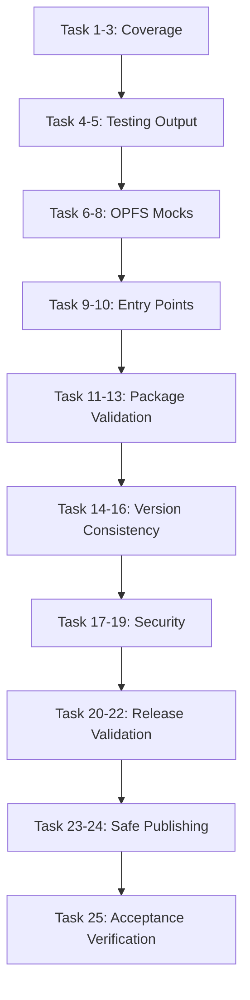
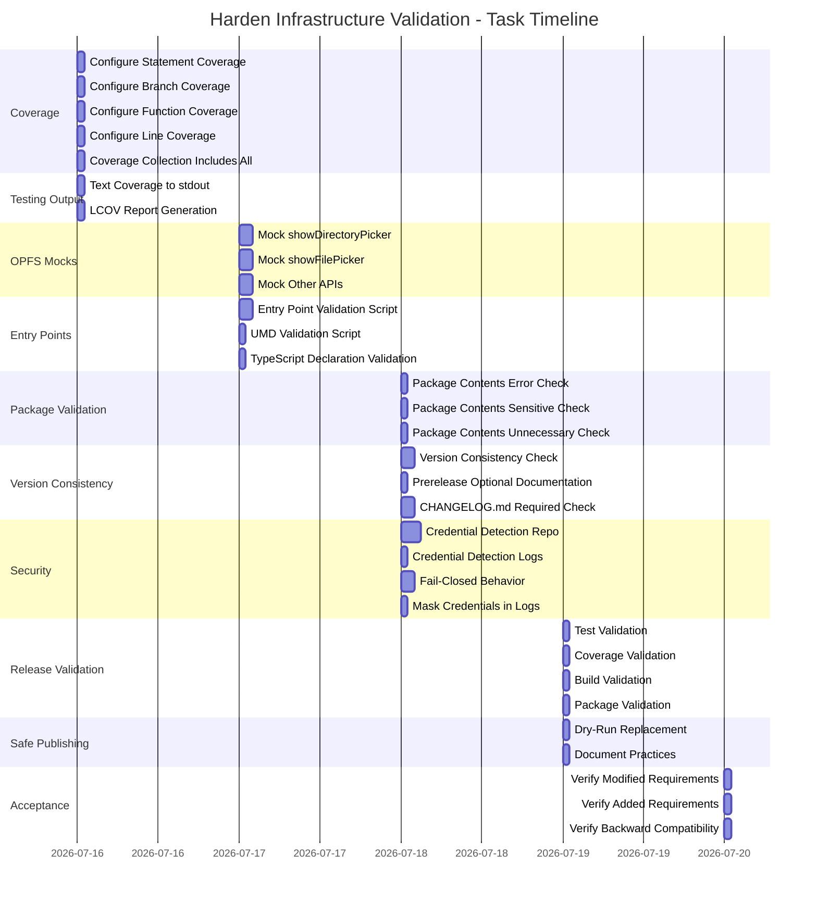

# Harden Infrastructure Validation - Implementation Tasks

## Overview

This document defines the implementation tasks required to satisfy the hardening requirements specified in the delta specification at `specs/infrastructure/spec.md`.

Each task corresponds to one or more requirements from the delta spec. Tasks are ordered by dependency and priority.

*Caption: Task dependency flow for hardening implementation*

## 1. Coverage Configuration

- [x] 1.1 Configure statement coverage threshold to 80% minimum in jest.config.cjs
- [x] 1.2 Configure branch coverage threshold to 80% minimum in jest.config.cjs
- [x] 1.3 Configure function coverage threshold to 80% minimum in jest.config.cjs
- [x] 1.4 Configure line coverage threshold to 80% minimum in jest.config.cjs
- [x] 1.5 Ensure coverage collection includes all source files (src/, providers/, index.js)

## 2. Testing Output Standardization

- [x] 2.1 Configure Jest to output text coverage report to stdout
- [x] 2.2 Configure Jest to generate LCOV report at coverage/lcov.info

## 3. OPFS Mock Implementation

- [x] 3.1 Create deterministic, resettable mock for window.showDirectoryPicker
- [x] 3.2 Create deterministic, resettable mock for window.showFilePicker
- [x] 3.3 Identify and create mocks for other OPFS APIs not supported by jsdom

## 4. Entry Point Validation

- [x] 4.1 Create script to validate ESM entry point usability by consumers
- [x] 4.2 Create script to validate UMD entry point and global access usability
- [x] 4.3 Create script to validate TypeScript declaration file usability

## 5. Package Contents Validation

- [x] 5.1 Create script to check for error files in package contents
- [x] 5.2 Create script to check for sensitive files in package contents
- [x] 5.3 Create script to check for unnecessary files in package contents

## 6. Version Consistency

- [x] 6.1 Add version consistency check to publish workflow (tag == package.json.version)
- [x] 6.2 Update documentation to clarify prerelease versions are OPTIONAL
- [x] 6.3 Add CHANGELOG.md existence check to publish workflow

## 7. Security Boundaries

- [x] 7.1 Add credential detection to pre-publish security validation (repo scan)
- [x] 7.2 Add credential detection to pre-publish security validation (log scan)
- [x] 7.3 Implement fail-closed behavior for all security violations
- [x] 7.4 Configure CI/CD to mask credentials in logs

## 8. Release Validation

- [x] 8.1 Add test execution with 100% pass rate requirement to pre-publish workflow
- [x] 8.2 Add coverage threshold validation (80% for all types) to pre-publish workflow
- [x] 8.3 Add build validation to pre-publish workflow
- [x] 8.4 Add package contents validation to pre-publish workflow

## 9. Safe Publishing

- [x] 9.1 Replace all npm publish commands in verification with npm publish --dry-run
- [x] 9.2 Document safe publishing practices in project documentation

## 10. Final Acceptance Verification

- [x] 10.1 Verify all modified requirements pass their acceptance criteria
- [x] 10.2 Verify all added requirements pass their acceptance criteria
- [x] 10.3 Verify backward compatibility with existing infrastructure specification

---

## Task Summary by Category

| Category | Task Count | Priority | Total Effort |
|----------|------------|----------|--------------|
| Coverage Configuration | 5 | HIGH | 5 hours |
| Testing Output | 2 | HIGH | 2 hours |
| OPFS Mocks | 3 | HIGH | 6 hours |
| Entry Point Validation | 3 | HIGH | 4 hours |
| Package Contents Validation | 3 | HIGH | 2 hours |
| Version Consistency | 3 | HIGH | 5 hours |
| Security Boundaries | 4 | HIGH | 6 hours |
| Release Validation | 4 | HIGH | 3 hours |
| Safe Publishing | 2 | HIGH | 2 hours |
| Acceptance Verification | 3 | MEDIUM | 2 hours |
| **Total** | **32** | - | **35 hours** |

## Task Dependencies Diagram

*Caption: Suggested task timeline for hardening implementation*

---

## Implementation Notes

1. **Implementation-Neutral**: All tasks focus on achieving the specified requirements without dictating implementation details
2. **Verification**: Each task has explicit acceptance criteria that can be tested
3. **Traceability**: Each task references specific requirements from the delta spec
4. **Priority**: All tasks are HIGH priority except the final acceptance verification which is MEDIUM
5. **Dependencies**: Tasks are ordered to minimize blocking and maximize parallel execution where possible

---

## Open Questions

1. Should the coverage thresholds be configurable per-file or only global?
2. Should the OPFS mocks be bundled into a separate package or kept internal?
3. Should the validation scripts be part of the published package or only in development?
4. Should we implement automated changelog validation or only existence check?

---

*Document Version: 1.0.0*
*Last Updated: 2026-07-16*
*Status: Draft*
*Related Change: harden-infrastructure-validation*
*Author: Mistral Vibe*
