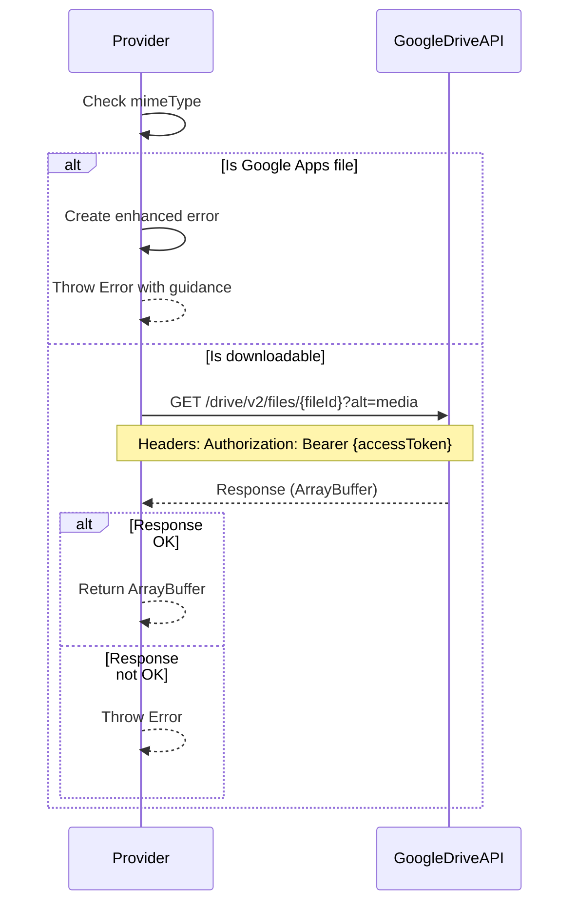

# Google Drive V2 Provider Hardening Specification

## Purpose

This specification defines hardening requirements for the **Google Drive V2 Provider**, addressing identified weaknesses in error handling and user experience. This DELTA specification MODIFIES existing requirements to improve error messages and user guidance.

## Scope

This specification covers modifications to:
- Error handling for Google Apps files
- Error message quality and actionability

This specification builds upon and modifies the existing google-drive-v2-provider baseline specification.

---

## MODIFIED Requirements

### Requirement: File Download

The Google Drive V2 Provider SHALL download file content from Google Drive.

The `download()` method SHALL:
- Check if the file is a Google Apps file by examining `_meta.mimeType`
- If the mimeType starts with `application/vnd.google-apps.`, throw an error with **enhanced error message**
- Construct the download URL as `https://www.googleapis.com/drive/v2/files/{fileId}?alt=media`
- Send a GET request with the Authorization header: `Bearer {accessToken}`
- If the response is not OK, throw an error with the status code
- Return the response as an ArrayBuffer

**Note**: This MODIFIES the existing requirement to enhance error messages for Google Apps files.

**Implementation**: `providers/google-drive-v2/GoogleDriveV2Provider.js:31-40` (to be updated)
**Verification**: Unit tests for file download with enhanced error messages

*Caption: File download sequence with enhanced Google Apps file error handling*

#### Scenario: Throw enhanced error for Google Apps files
- **WHEN** `provider.download()` is called and _meta.mimeType is 'application/vnd.google-apps.document'
- **THEN** system throws error with message containing file type, explanation, and suggestion

#### Scenario: Enhanced error message format
- **WHEN** download fails for Google Apps file
- **THEN** error message includes: file type (e.g., 'Google Docs'), reason (not downloadable as binary), and suggestion (use Google Drive web interface to export)

#### Scenario: Download non-Google Apps file successfully
- **WHEN** `provider.download()` is called for non-Google Apps file
- **THEN** system downloads and returns ArrayBuffer as before

#### Scenario: Download with correct URL
- **WHEN** `provider.download()` is called with fileId 'test-file-id'
- **THEN** system makes request to `https://www.googleapis.com/drive/v2/files/test-file-id?alt=media`

#### Scenario: Download error handling for API errors
- **WHEN** Google Drive API returns non-OK response with status 500
- **THEN** system throws error with message 'download failed: 500'

---

## Traceability

| Requirement | Type | Implementation | Verification |
|-------------|------|----------------|--------------|
| File Download | MODIFIED | `providers/google-drive-v2/GoogleDriveV2Provider.js:31-40` | Unit tests for enhanced error messages |

---

*Document Version: 1.0.0*  
*Last Updated: 2026-07-16*  
*Status: Draft*  
*Author: Mistral Vibe*  
*Type: DELTA - Modifies existing google-drive-v2-provider specification*
