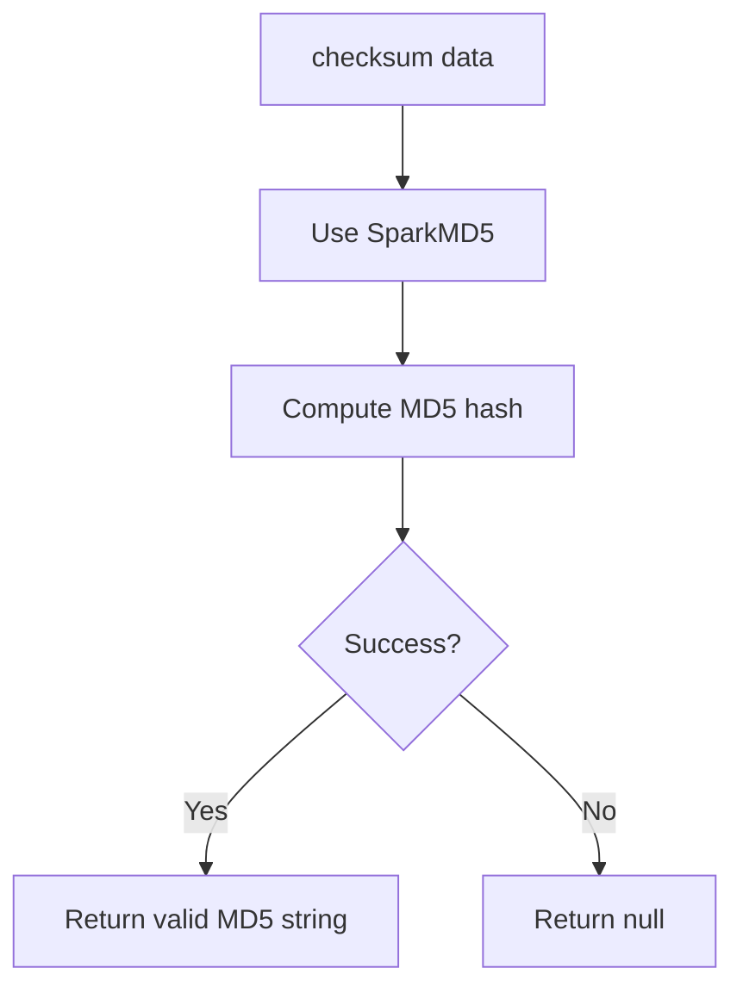
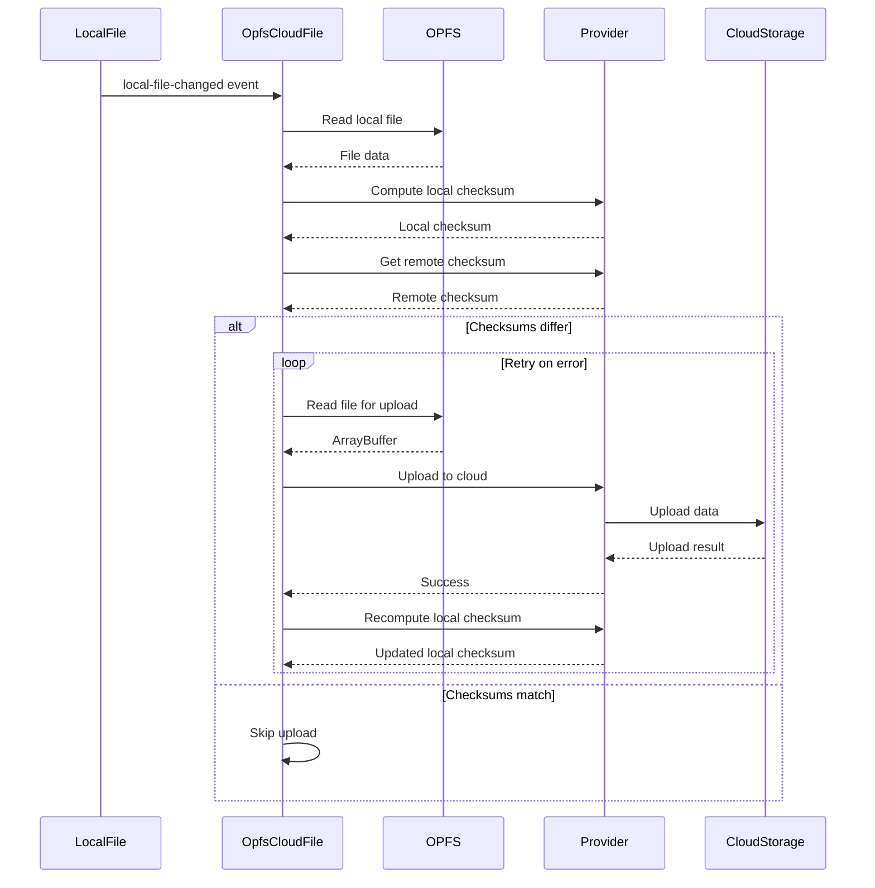
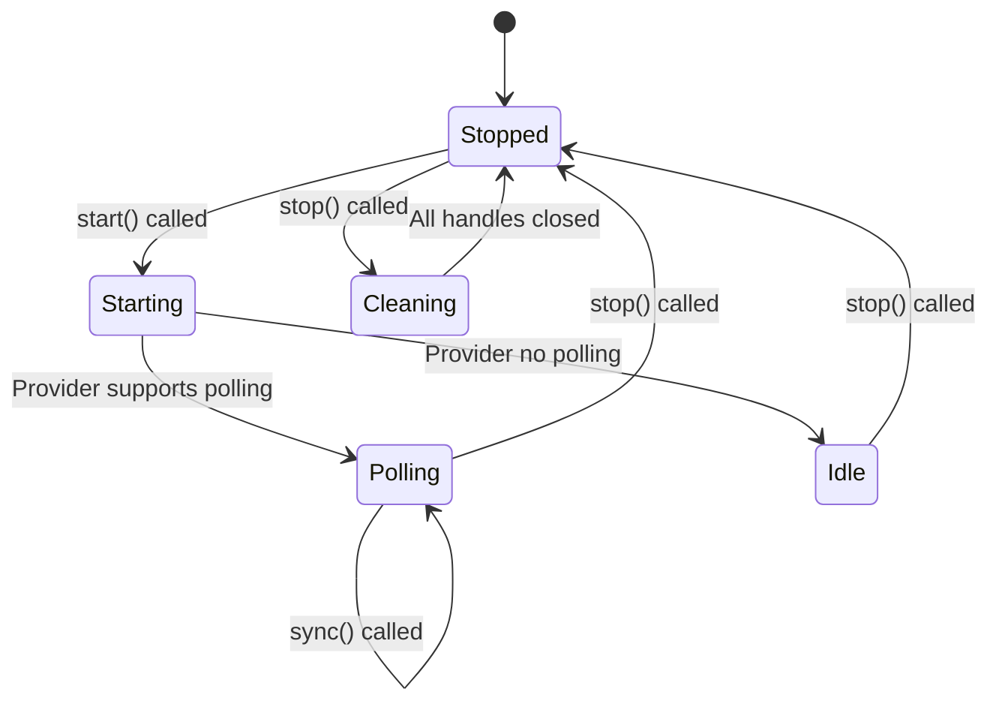
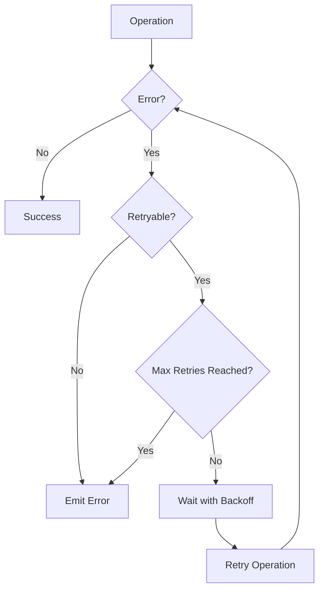
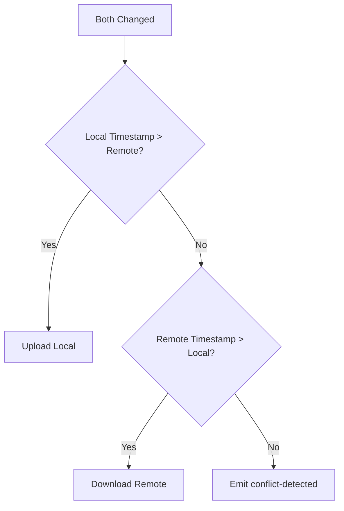
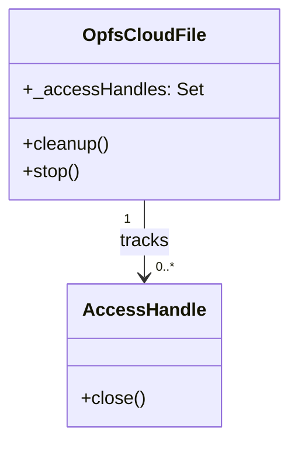
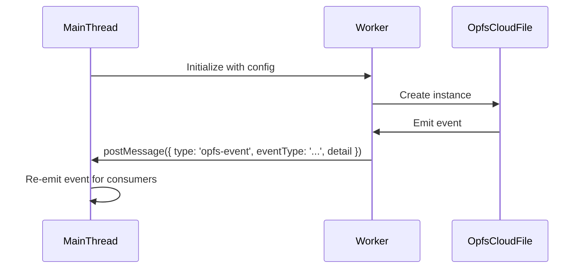

# OpfsCloudFile Hardening Specification

## Purpose

This specification defines the hardening requirements for the **opfs-cloud-file** library, addressing all critical weaknesses identified in the implementation analysis. This DELTA specification MODIFIES existing requirements and ADDS new requirements to improve reliability, data integrity, and functionality.

## Scope

This specification covers modifications to:
- Core file synchronization behavior
- Error handling and recovery mechanisms
- Conflict detection and resolution
- Resource management
- Web Worker event forwarding

This specification builds upon and modifies the existing opfs-cloud-file baseline specification.

---

## MODIFIED Requirements

### Requirement: Checksum Computation

The library SHALL provide checksum computation for local data using a reliable MD5 algorithm implementation.

The checksum utility SHALL:
- Accept ArrayBuffer data as input
- Return a Promise resolving to a **valid MD5 hash string** (not a placeholder)
- Return null on error
- Use SparkMD5 library for consistent hash computation across environments

**Note**: This MODIFIES the existing requirement to mandate a valid MD5 implementation instead of allowing placeholder fallbacks.

**Implementation**: `utils/md5.js:5-16` (to be updated)
**Verification**: Unit tests for checksum computation with known MD5 values

*Caption: Checksum computation flow with SparkMD5 library for reliable hashing*

#### Scenario: Checksum computation returns valid MD5 hash
- **WHEN** checksum is computed for ArrayBuffer with known content
- **THEN** system returns correct MD5 hash string (e.g., 'd41d8cd98f00b204e9800998ecf8427e' for empty buffer)

#### Scenario: Checksum is deterministic
- **WHEN** checksum is computed multiple times for the same data
- **THEN** system returns the same valid MD5 hash string each time

#### Scenario: Checksum computation error
- **WHEN** checksum computation encounters an error
- **THEN** system returns null

---

### Requirement: Local Change Handling

The library SHALL listen for `local-file-changed` events and automatically upload local changes to the cloud storage.

When a `local-file-changed` event is received, the system SHALL:
- Compute the local file checksum
- Compare it with the remote file checksum
- If checksums differ, read the local file from OPFS and upload it to cloud storage
- Recompute the local checksum after upload to ensure consistency
- Emit `opfs-cloud-error` if any error occurs during the process
- **NEW**: Implement retry logic with configurable retry configuration for transient errors

**Note**: This MODIFIES the existing requirement to add retry logic for error recovery.

**Implementation**: `src/OpfsCloudFile.js:41-57` (to be updated)
**Verification**: Unit tests for local change upload flow with retry

*Caption: Local change handling sequence with retry logic for transient errors*

#### Scenario: Local change triggers upload
- **WHEN** local-file-changed event is dispatched
- **THEN** system computes local checksum and compares with remote

#### Scenario: Upload when checksums differ
- **WHEN** local checksum differs from remote checksum
- **THEN** system reads local file from OPFS and uploads to cloud storage

#### Scenario: Skip upload when checksums match
- **WHEN** local checksum matches remote checksum
- **THEN** system does not perform upload operation

#### Scenario: Retry on transient error
- **WHEN** upload fails with a retryable error (network error, 429, 500-599)
- **THEN** system waits and retries the operation up to maxRetries times

#### Scenario: No retry on permanent error
- **WHEN** upload fails with a non-retryable error (401, 403, 404)
- **THEN** system does not retry and emits opfs-cloud-error immediately

#### Scenario: Error after all retries exhausted
- **WHEN** all retry attempts fail
- **THEN** system emits opfs-cloud-error with final error

---

### Requirement: Start and Stop Control

The library SHALL provide `start()` and `stop()` methods for controlling the synchronization process.

The `start()` method SHALL:
- Download the remote file to OPFS
- Start periodic polling if the provider supports polling and polling is not already active
- Perform an initial sync check

The `stop()` method SHALL:
- Stop any active polling timer
- Set internal stopped flag to true
- Call the provider's `dispose()` method if it exists
- **NEW**: Clean up all tracked OPFS access handles to prevent resource leaks

**Note**: This MODIFIES the existing requirement to add resource cleanup on stop.

**Implementation**: `src/OpfsCloudFile.js:98-117` (to be updated)
**Verification**: Unit tests for start/stop behavior with resource tracking

*Caption: Start/stop state machine with resource cleanup on stop*

#### Scenario: Start begins polling
- **WHEN** `cloudFile.start()` is called with a polling provider
- **THEN** system starts periodic polling

#### Scenario: Start downloads file
- **WHEN** `cloudFile.start()` is called
- **THEN** system downloads remote file to OPFS

#### Scenario: Stop halts polling
- **WHEN** `cloudFile.stop()` is called
- **THEN** system stops any active polling timer

#### Scenario: Stop calls provider dispose
- **WHEN** `cloudFile.stop()` is called
- **THEN** system calls provider.dispose() if the method exists

#### Scenario: Stop cleans up access handles
- **WHEN** `cloudFile.stop()` is called
- **THEN** system cleans up all tracked OPFS access handles

#### Scenario: Stop is idempotent
- **WHEN** `cloudFile.stop()` is called multiple times
- **THEN** system handles subsequent calls without error

---

## ADDED Requirements

### Requirement: Error Recovery Configuration

The library SHALL provide configurable error recovery with retry mechanism.

The OpfsCloudFile constructor SHALL accept optional retry configuration:
- `maxRetries`: Number of retry attempts (default: 3)
- `retryDelayMs`: Base delay between retries in milliseconds (default: 1000)
- `backoffMultiplier`: Multiplier for exponential backoff (default: 2)
- `retryableErrors`: Array of error types to retry (default: network errors, 429, 500-599)

The retry mechanism SHALL:
- Automatically retry failed operations for retryable error types
- Use exponential backoff: delay = retryDelayMs * (backoffMultiplier ^ attemptNumber)
- Emit `opfs-cloud-error` only after all retries are exhausted
- Not retry for non-retryable errors (authentication, authorization, not found)

**Implementation**: `src/OpfsCloudFile.js:7-20` (to be updated)
**Verification**: Unit tests for retry behavior

*Caption: Error recovery flow with exponential backoff retry logic*

#### Scenario: Retry on transient error
- **WHEN** operation fails with retryable error and maxRetries not reached
- **THEN** system waits with exponential backoff and retries

#### Scenario: No retry on permanent error
- **WHEN** operation fails with non-retryable error
- **THEN** system emits opfs-cloud-error immediately without retry

#### Scenario: All retries exhausted
- **WHEN** operation fails after maxRetries attempts
- **THEN** system emits opfs-cloud-error with final error

#### Scenario: Exponential backoff calculation
- **WHEN** operation fails on first retry
- **THEN** system waits retryDelayMs * backoffMultiplier^1 before retrying
- **WHEN** operation fails on second retry
- **THEN** system waits retryDelayMs * backoffMultiplier^2 before retrying

---

### Requirement: Conflict Detection and Resolution

The library SHALL detect conflicts when both local and remote files have changed.

The system SHALL:
- Track local file modification timestamps
- Track remote file modification timestamps from metadata
- When both local and remote checksums differ from last known state:
  - If local timestamp > remote timestamp: Upload local changes (local wins)
  - If remote timestamp > local timestamp: Download remote changes (remote wins)
  - If timestamps are equal: Emit `conflict-detected` event for manual resolution

The library SHALL emit a new event type:
- `conflict-detected`: Emitted when local and remote changes conflict and timestamps are equal
  - Event detail contains: localChecksum, remoteChecksum, localTimestamp, remoteTimestamp, fileName

**Implementation**: `src/OpfsCloudFile.js:41-57` (to be updated)
**Verification**: Unit tests for conflict detection and resolution

*Caption: Conflict resolution flow based on timestamp comparison*

#### Scenario: Local wins based on timestamp
- **WHEN** both local and remote files changed and local timestamp is newer
- **THEN** system uploads local changes to cloud

#### Scenario: Remote wins based on timestamp
- **WHEN** both local and remote files changed and remote timestamp is newer
- **THEN** system downloads remote changes to OPFS

#### Scenario: Conflict detected when timestamps equal
- **WHEN** both local and remote files changed and timestamps are equal
- **THEN** system emits conflict-detected event with conflict details

---

### Requirement: Resource Tracking and Cleanup

The library SHALL track OPFS access handles to prevent resource leaks.

The system SHALL:
- Maintain a Set of all active access handles
- Add handles to the Set when created
- Remove handles from the Set when closed
- On `stop()`: Close all handles in the Set and emit warning for any that fail to close
- Provide a `cleanup()` method for explicit resource cleanup

**Implementation**: `utils/opfs.js:1-59` (to be updated), `src/OpfsCloudFile.js` (to be updated)
**Verification**: Unit tests for resource tracking and cleanup

*Caption: Resource tracking class diagram with access handle management*

#### Scenario: Handle tracked on creation
- **WHEN** OPFS access handle is created
- **THEN** system adds it to the access handles Set

#### Scenario: Handle removed on close
- **WHEN** OPFS access handle is closed
- **THEN** system removes it from the access handles Set

#### Scenario: All handles cleaned up on stop
- **WHEN** `cloudFile.stop()` is called
- **THEN** system closes all tracked access handles

#### Scenario: Warning for failed cleanup
- **WHEN** `cloudFile.stop()` is called and some handles fail to close
- **THEN** system emits warning event with details of failed cleanups

---

### Requirement: Worker Event Forwarding

The library SHALL forward events from Web Worker to the main thread.

The worker SHALL:
- Wrap event listeners to forward events via `postMessage`
- Forward all event types: local-file-changed, cloud-file-changed, opfs-cloud-error, conflict-detected
- Include event type and detail in the message
- Use message format: `{ type: 'opfs-event', eventType: string, detail: object }`

The main thread SHALL:
- Listen for worker messages of type 'opfs-event'
- Re-emit events locally for consumers

**Implementation**: `src/worker.ts:1-27` (to be updated)
**Verification**: Integration tests for worker event forwarding

*Caption: Worker event forwarding sequence from worker to main thread*

#### Scenario: Event forwarded from worker
- **WHEN** event is emitted in worker context
- **THEN** worker forwards event to main thread via postMessage

#### Scenario: Main thread receives and re-emits event
- **WHEN** main thread receives 'opfs-event' message from worker
- **THEN** main thread re-emits the event for local consumers

---

## Traceability

| Requirement | Type | Implementation | Verification |
|-------------|------|----------------|--------------|
| Checksum Computation | MODIFIED | `utils/md5.js:5-16` | Unit tests with known MD5 values |
| Local Change Handling | MODIFIED | `src/OpfsCloudFile.js:41-57` | Unit tests with retry logic |
| Start and Stop Control | MODIFIED | `src/OpfsCloudFile.js:98-117` | Unit tests with resource cleanup |
| Error Recovery Configuration | ADDED | `src/OpfsCloudFile.js:7-20` | Unit tests for retry behavior |
| Conflict Detection and Resolution | ADDED | `src/OpfsCloudFile.js:41-57` | Unit tests for conflict scenarios |
| Resource Tracking and Cleanup | ADDED | `utils/opfs.js:1-59`, `src/OpfsCloudFile.js` | Unit tests for resource management |
| Worker Event Forwarding | ADDED | `src/worker.ts:1-27` | Integration tests for worker events |

---

*Document Version: 1.0.0*  
*Last Updated: 2026-07-16*  
*Status: Draft*  
*Author: Mistral Vibe*  
*Type: DELTA - Modifies existing opfs-cloud-file specification*
