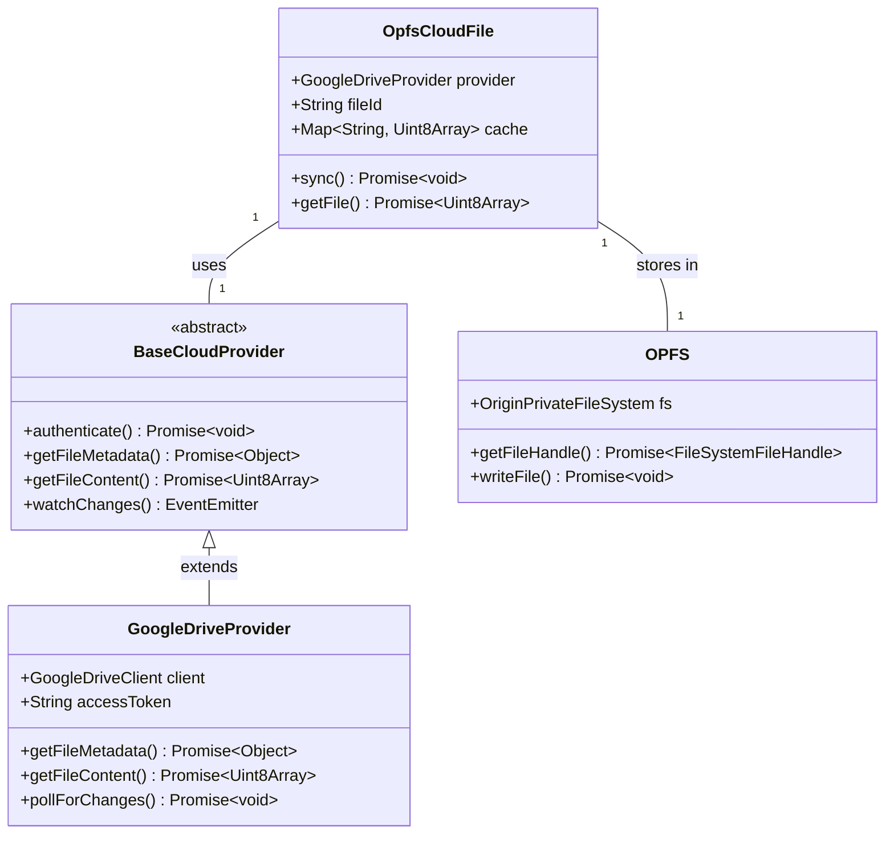
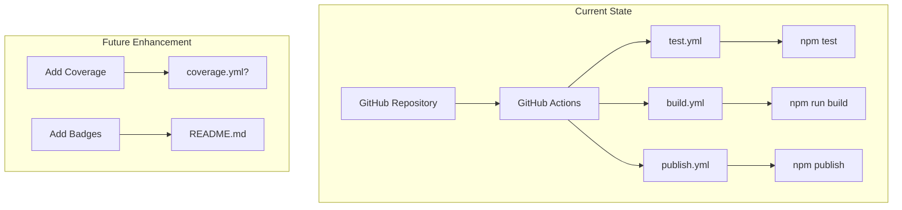
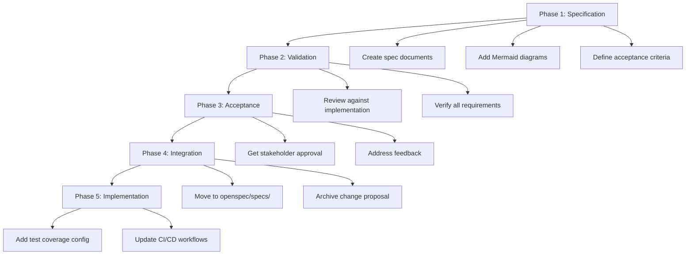

## Context

The opfs-cloud-file project is a JavaScript/TypeScript library that maps cloud files (Google Drive) to OPFS (Origin Private File System).

*Caption: opfs-cloud-file class architecture with OPFS and cloud providers*

The project currently has the following infrastructure in place:

- **Build System**: Vite 7.2.2 with vite-plugin-dts, outputting ESM and UMD formats
- **Testing System**: Jest 30.2.0 with jsdom environment and babel-jest transformer
- **CI/CD Pipeline**: GitHub Actions with test, build, and publish workflows
- **Dependency Management**: npm with package-lock.json
- **Release Management**: Semantic versioning with npm publishing

However, there is no formal specification document that defines these infrastructure requirements, acceptance criteria, or risks. The existing infrastructure-baseline.md in openspec/specs/ was created but needs to be properly integrated through the SDD workflow.

## Goals / Non-Goals

**Goals:**
- Create comprehensive Infrastructure Baseline Specification document
- Define verifiable acceptance criteria for all infrastructure components
- Document all technical decisions and their rationale
- Identify and mitigate infrastructure risks
- Establish traceability between specs and implementation
- Enable SDD (Spec-Driven Development) methodology adoption

**Non-Goals:**
- Modify existing infrastructure implementation (only specification)
- Add new infrastructure features beyond what's already in place
- Replace existing configuration files
- Create implementation tasks (these will be in tasks.md)

## Decisions

### Build System: Vite + vite-plugin-dts

**Decision**: Use Vite as the build tool with vite-plugin-dts for TypeScript declarations

**Rationale**:
- Vite provides fast, modern build tooling with ESM support
- vite-plugin-dts generates TypeScript declaration files automatically
- Vite's library mode supports both ESM and UMD outputs natively
- Already configured and working in the project

**Alternatives Considered**:
- Rollup: More configuration overhead, Vite uses Rollup internally
- Webpack: Heavier, slower for library builds
- esbuild: Doesn't support TypeScript declarations natively

### Testing Framework: Jest + jsdom

**Decision**: Use Jest as the testing framework with jsdom environment

**Rationale**:
- Jest is industry standard for JavaScript/TypeScript testing
- jsdom provides DOM environment for testing browser APIs
- babel-jest enables transpilation for modern JavaScript features
- Good integration with CI/CD pipelines

**Alternatives Considered**:
- Vitest: Would require migration, Vite-based but less mature for this use case
- Mocha + Chai: More configuration overhead
- Node.js test runner: Doesn't support jsdom environment

### Test Coverage: 80% Threshold

**Decision**: Set minimum test coverage threshold at 80%

**Rationale**:
- 80% provides balance between code quality and development velocity
- Industry standard for well-tested libraries
- Can be increased as codebase matures
- Encourages good test practices without being overly restrictive

**Alternatives Considered**:
- 70%: Too permissive, may miss significant untested code
- 90%: Too strict initially, may block legitimate changes
- No threshold: Defeats purpose of coverage requirements

### CI/CD Platform: GitHub Actions

**Decision**: Use GitHub Actions for CI/CD pipelines

**Rationale**:
- Native integration with GitHub repositories
- Free for public repositories
- Good documentation and community support
- Already configured with test, build, and publish workflows

**Alternatives Considered**:
- GitLab CI: Would require repository migration
- CircleCI: Additional configuration and setup
- Jenkins: Overkill for this project size

*Caption: Current CI/CD workflow structure with GitHub Actions*

### Package Manager: npm

**Decision**: Use npm as the exclusive package manager

**Rationale**:
- Standard Node.js package manager
- Consistent with existing project setup
- Good support for CI/CD integration
- No need for additional tooling

**Alternatives Considered**:
- yarn: Additional dependency, similar benefits
- pnpm: More efficient but less common in CI environments
- bun: Too new, limited ecosystem support

### Versioning: Semantic Versioning 2.0.0

**Decision**: Follow Semantic Versioning (semver) 2.0.0 specification

**Rationale**:
- Industry standard for version management
- Clear communication of breaking vs. non-breaking changes
- Compatible with npm registry expectations
- Already being followed (current version: 0.1.4)

**Alternatives Considered**:
- Date-based versioning: Less predictable for consumers
- CalVer: Not appropriate for library projects
- Custom scheme: Causes confusion and compatibility issues

### Node.js Version: 20.x

**Decision**: Use Node.js 20.x for development and CI

**Rationale**:
- Current LTS version with long-term support
- Good compatibility with all project dependencies
- Already configured in CI workflows
- Modern JavaScript features available

**Alternatives Considered**:
- Node.js 18.x: Older LTS, less modern features
- Node.js 22.x: Newer but less tested with project dependencies

## Risks / Trade-offs

**[Risk] Browser Compatibility Issues**
**Likelihood**: Low
**Impact**: Medium
**Mitigation**: Use Babel transpilation, document minimum browser requirements, test on range of modern browsers

**[Risk] Web Worker Support Limitations**
**Likelihood**: Low
**Impact**: Medium
**Mitigation**: Use native browser Web Worker API, document known limitations, test Web Worker functionality

**[Risk] npm Publishing Failures**
**Likelihood**: Low
**Impact**: High
**Mitigation**: Use automated publishing with proper authentication, maintain backup methods, monitor npm registry status

**[Risk] Dependency Version Conflicts**
**Likelihood**: Medium
**Impact**: Medium
**Mitigation**: Use npm ci for reproducible installs, lock all dependency versions, regularly update and test dependencies

**[Risk] Test Coverage Threshold Too Strict**
**Likelihood**: Medium
**Impact**: Low
**Mitigation**: Start with 80% threshold, adjust based on current coverage baseline, allow overrides with justification

## Migration Plan

Since this change is primarily about documentation and specification (not implementation changes), the migration plan is straightforward:

*Caption: Infrastructure specification migration plan with 5 phases*

1. **Phase 1 - Specification**: Create and review the Infrastructure Baseline Specification document
2. **Phase 2 - Validation**: Verify existing infrastructure against specification requirements
3. **Phase 3 - Acceptance**: Get stakeholder approval on specification
4. **Phase 4 - Integration**: Merge specification into main specs directory
5. **Phase 5 - Implementation**: Address any gaps identified during validation (e.g., test coverage configuration)

**Rollback Strategy**: Since this is a documentation change, rollback simply involves reverting the specification documents. No implementation changes require rollback.

## Open Questions

1. Should we add test coverage enforcement to CI immediately, or start with measurement only?
2. Should we create separate specification documents for each infrastructure component (build, test, CI/CD, etc.), or keep them combined?
3. Should we add infrastructure-specific tasks to the project's issue tracker?
4. How should we handle updates to the specification when infrastructure changes are made?

---

*Document Version: 1.0.0*
*Last Updated: 2026-07-16*
*Status: Draft*
*Related Change: infrastructure*
*Author: Mistral Vibe*
