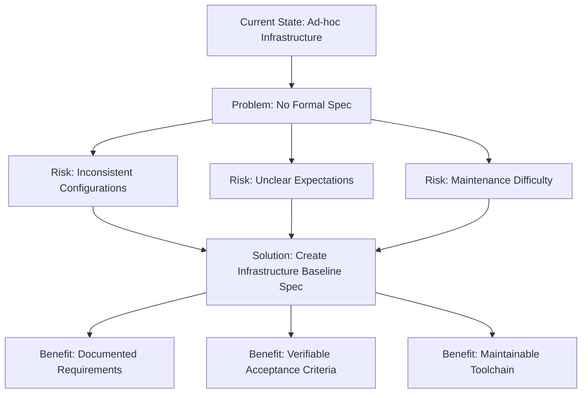

## Why

The opfs-cloud-file project currently has build, testing, CI/CD, and dependency management infrastructure in place, but lacks a formal, comprehensive specification that defines the infrastructure requirements and standards.

*Caption: Problem analysis and solution flow for infrastructure specification*

Without a clear infrastructure baseline specification, there is a risk of inconsistent configurations, unclear expectations, and difficulty in maintaining and evolving the project's toolchain.

This change establishes a formal Infrastructure Baseline Specification to ensure all infrastructure decisions are documented, verifiable, and maintainable following SDD (Spec-Driven Development) methodology.

The infrastructure-baseline.md spec explicitly requires setting and enforcing test coverage thresholds and reporting, but these are not yet implemented in the project configuration.

## What Changes

- Create formal Infrastructure Baseline Specification document
- Define requirements for build system (Vite, TypeScript, outputs)
- Define requirements for testing system (Jest, coverage, environment)
- Define requirements for CI/CD pipeline (GitHub Actions workflows)
- Define requirements for dependency management (npm, version pinning)
- Define requirements for release management (semver, npm publishing)
- Establish acceptance criteria for all infrastructure components
- Document dependencies and risks for infrastructure

## Capabilities

### New Capabilities
- `infrastructure`: Complete infrastructure baseline specification covering build system, testing system, CI/CD pipeline, dependency management, and release management

### Modified Capabilities

## Impact

- **Documentation**: Adds comprehensive infrastructure specification to openspec/specs/
- **Development Workflow**: Provides clear guidance for infrastructure decisions
- **CI/CD**: Existing workflows will be validated against spec requirements
- **Project Maintenance**: Improves ability to audit and maintain infrastructure
- **Onboarding**: Helps new contributors understand project infrastructure requirements
- **SDD Adoption**: Demonstrates and reinforces Spec-Driven Development methodology

---

*Document Version: 1.0.0*
*Last Updated: 2026-07-16*
*Status: Draft*
*Related Change: infrastructure*
*Author: Mistral Vibe*
