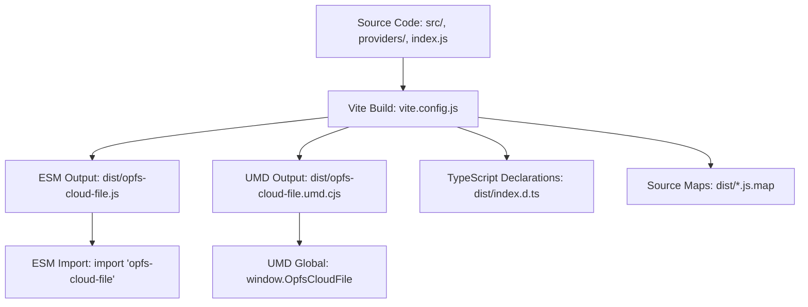
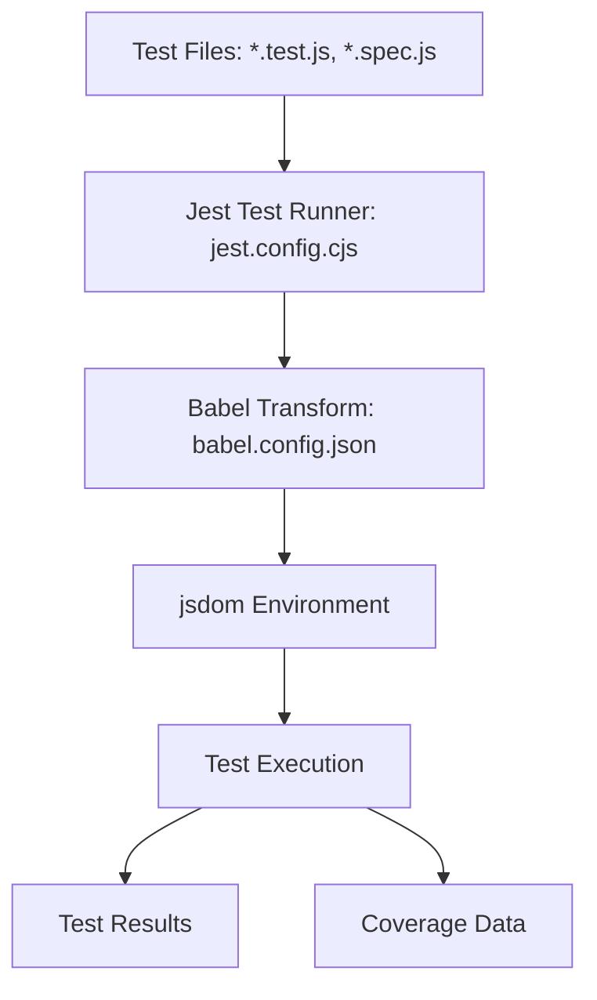
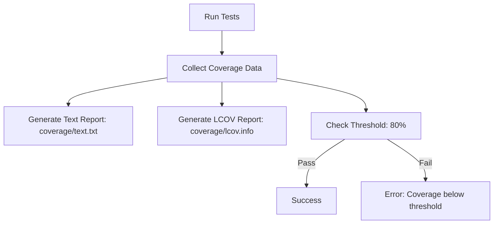
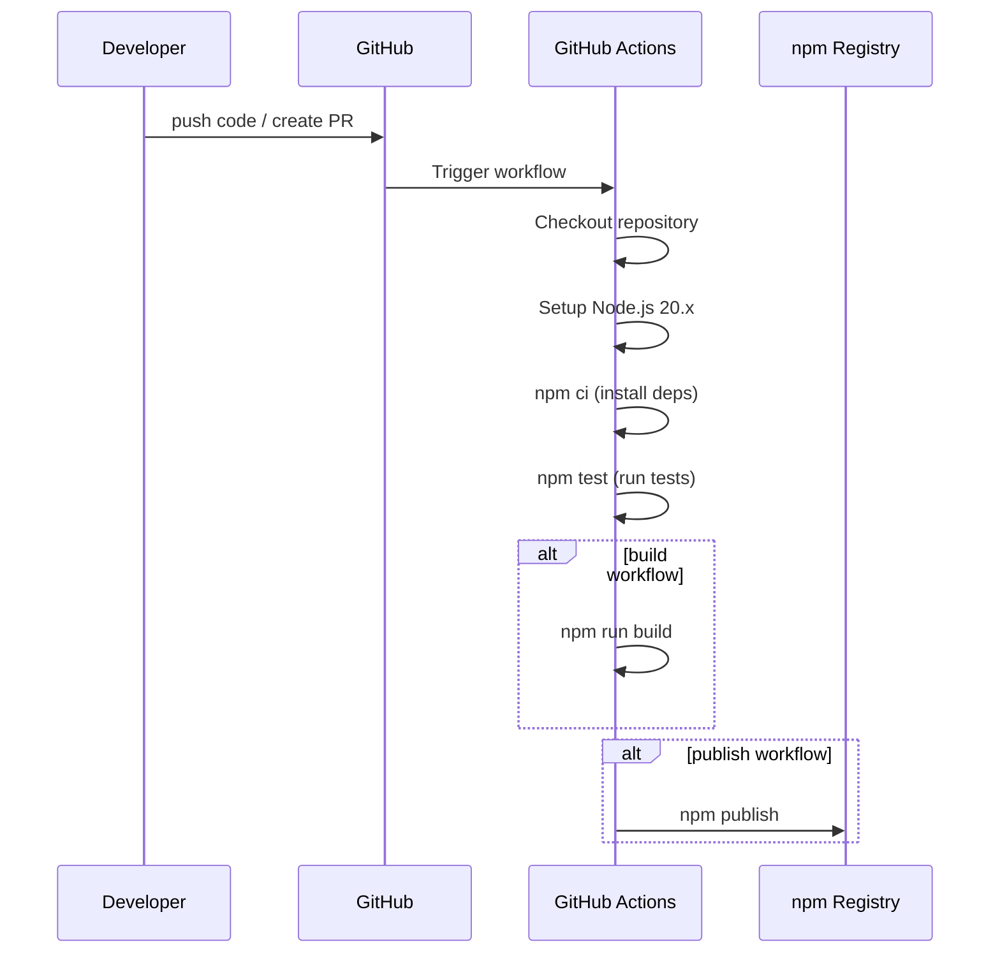
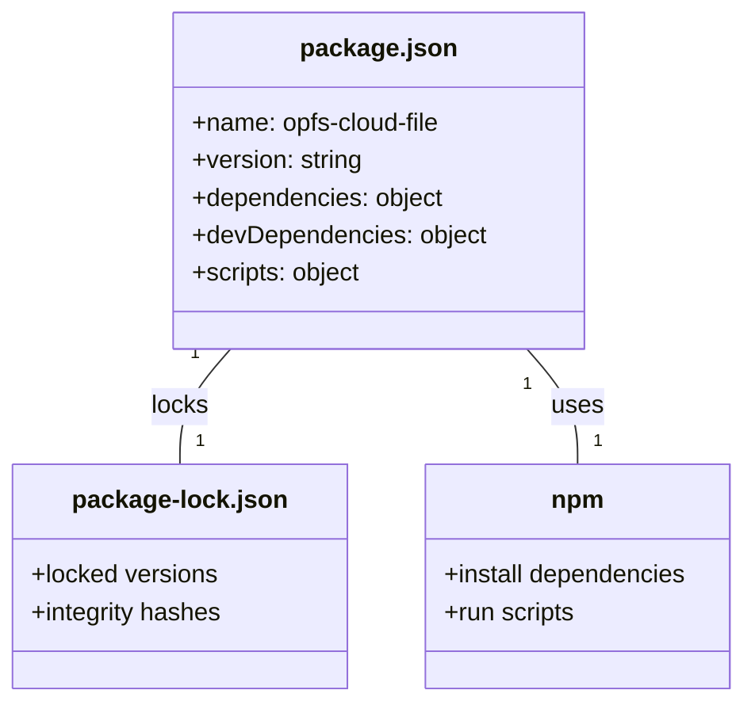
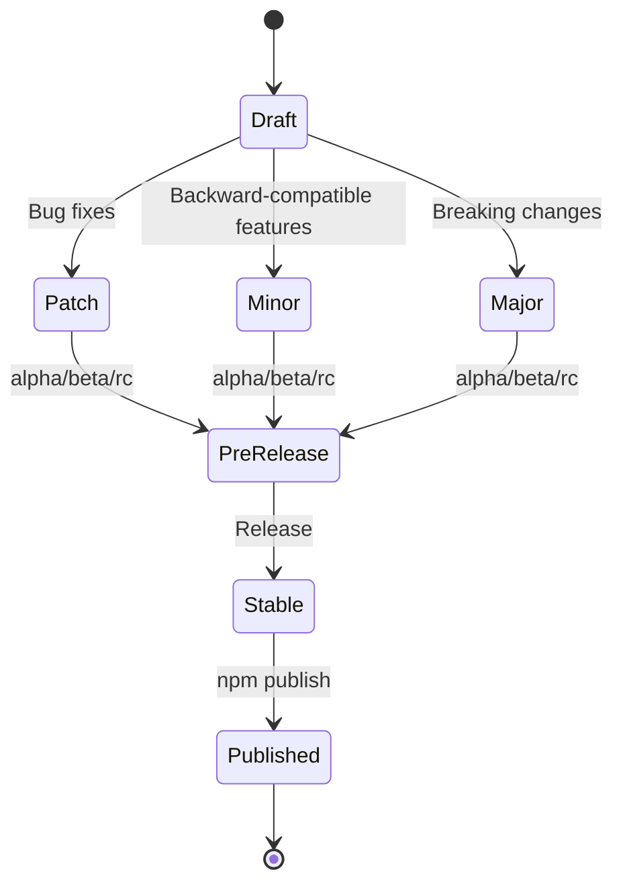
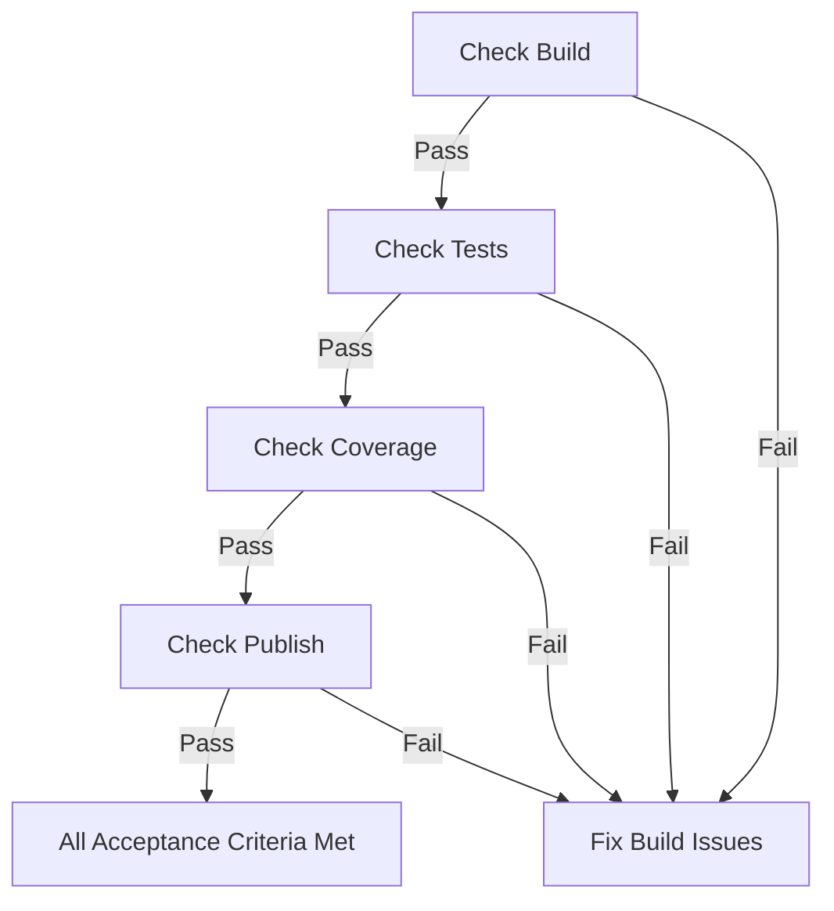

## ADDED Requirements

### Requirement: Build System Configuration

The project SHALL use Vite 7.x as the primary build tool with vite-plugin-dts for TypeScript declaration generation.

The build system SHALL output both ESM (ES Modules) and UMD (Universal Module Definition) formats.

The build system SHALL support library mode with appropriate entry points.

The build system SHALL preserve TypeScript strict mode settings during compilation.

**Implementation**: vite.config.js, tsconfig.json
**Verification**: npm run build

*Caption: Vite build system workflow for ESM and UMD outputs with TypeScript declarations*

#### Scenario: Successful library build
- **WHEN** `npm run build` is executed
- **THEN** system generates `opfs-cloud-file.js` (ESM) and `opfs-cloud-file.umd.cjs` (UMD) in dist/ directory

#### Scenario: TypeScript declarations generated
- **WHEN** build completes successfully
- **THEN** system generates TypeScript declaration files (.d.ts) in dist/ directory

#### Scenario: Source maps generated
- **WHEN** build completes successfully
- **THEN** system generates source map files for debugging

---

### Requirement: Testing System Configuration

The project SHALL use Jest 30.x as the primary testing framework.

The testing system SHALL configure jsdom environment for DOM-related tests.

The testing system SHALL transform source code using Babel with @babel/preset-env.

The testing system SHALL run on Node.js 20.x environment.

The testing system SHALL support asynchronous test execution.

**Implementation**: jest.config.cjs, babel.config.json
**Verification**: npm test

*Caption: Jest testing system workflow with Babel transformation and jsdom environment*

#### Scenario: Tests execute successfully
- **WHEN** `npm test` is executed
- **THEN** all defined tests run and complete successfully

#### Scenario: jsdom environment available
- **WHEN** tests requiring DOM APIs are executed
- **THEN** jsdom environment provides necessary DOM APIs

#### Scenario: Babel transformation applied
- **WHEN** tests with modern JavaScript syntax are executed
- **THEN** Babel transforms code to runnable format

---

### Requirement: Test Coverage Configuration

The testing system SHALL collect test coverage data when tests are executed.

The testing system SHALL generate coverage reports in text format for human readability.

The testing system SHALL generate coverage reports in LCOV format for machine processing.

The testing system SHALL output coverage reports to ./coverage directory.

The testing system SHALL enforce a minimum test coverage threshold of 80%.

**Implementation**: jest.config.cjs (coverage configuration), .gitignore
**Verification**: npm test -- --coverage

*Caption: Test coverage collection and threshold enforcement workflow*

#### Scenario: Coverage data collected
- **WHEN** `npm test` is executed with coverage enabled
- **THEN** system collects coverage data for all source files

#### Scenario: Coverage reports generated
- **WHEN** tests complete with coverage enabled
- **THEN** system generates text and LCOV coverage reports in ./coverage directory

#### Scenario: Minimum coverage threshold enforced
- **WHEN** test coverage is below 80%
- **THEN** system fails the test run with coverage threshold error

---

### Requirement: CI/CD Pipeline Configuration

The project SHALL use GitHub Actions as the CI/CD platform.

The CI/CD pipeline SHALL execute on push and pull_request events to all branches.

The CI/CD pipeline SHALL use ubuntu-latest as the execution environment.

The CI/CD pipeline SHALL setup Node.js 20.x environment for all jobs.

The CI/CD pipeline SHALL install dependencies using `npm ci` for reproducible builds.

**Implementation**: .github/workflows/test.yml, .github/workflows/build.yml, .github/workflows/publish.yml
**Verification**: GitHub Actions execution

*Caption: CI/CD pipeline sequence for push, PR, and release events*

#### Scenario: Test workflow triggers on push
- **WHEN** code is pushed to any branch
- **THEN** test.yml workflow executes automatically

#### Scenario: Test workflow triggers on PR
- **WHEN** pull request is created to any branch
- **THEN** test.yml workflow executes automatically

#### Scenario: Build workflow executes successfully
- **WHEN** code is merged to main branch
- **THEN** build.yml workflow builds the library successfully

#### Scenario: Publish workflow executes on release
- **WHEN** new version tag is pushed
- **THEN** publish.yml workflow publishes to npm registry

#### Scenario: Dependencies installed reproducibly
- **WHEN** CI workflow executes
- **THEN** `npm ci` installs exact dependency versions from package-lock.json

---

### Requirement: Dependency Management

The project SHALL use npm as the exclusive package manager.

The project SHALL lock all dependency versions using package-lock.json.

The project SHALL use `npm ci` for installation in CI environments.

The project SHALL document all development dependencies in package.json.

The project SHALL include type definitions for all TypeScript-consuming dependencies.

**Implementation**: package.json, package-lock.json
**Verification**: npm ci

*Caption: npm dependency management structure with package.json and package-lock.json*

#### Scenario: Dependencies installed
- **WHEN** `npm ci` is executed
- **THEN** system installs all dependencies without errors

#### Scenario: Version locking maintained
- **WHEN** package.json is modified
- **THEN** package-lock.json is updated to match

#### Scenario: Type definitions available
- **WHEN** TypeScript code imports external dependencies
- **THEN** type definitions are available for type checking

---

### Requirement: Release Management

The project SHALL follow Semantic Versioning (semver) 2.0.0 specification for all releases.

The project SHALL use MAJOR.MINOR.PATCH format for stable releases.

The project SHALL support pre-release versions with identifiers: alpha, beta, rc.

The project SHALL publish to the public npm registry.

The project SHALL include prepublishOnly script for pre-publish validation.

The project SHALL maintain a changelog for tracking release history.

**Implementation**: package.json (version, scripts), CHANGELOG.md (if exists)
**Verification**: npm publish

*Caption: Semantic versioning state machine with pre-release versions*

#### Scenario: Semantic versioning followed
- **WHEN** new version is released
- **THEN** version follows MAJOR.MINOR.PATCH format

#### Scenario: Pre-release versions supported
- **WHEN** pre-release version is created
- **THEN** version includes alpha, beta, or rc identifier (e.g., 1.0.0-alpha.1)

#### Scenario: Package published to npm
- **WHEN** publish workflow completes successfully
- **THEN** package is available on npm registry

#### Scenario: Prepublish validation runs
- **WHEN** npm publish is executed
- **THEN** prepublishOnly script runs to validate build

---

### Requirement: Acceptance Criteria Verification

The infrastructure SHALL have all build scripts execute successfully without errors.

The infrastructure SHALL have all tests pass with 100% pass rate.

The infrastructure SHALL meet or exceed the 80% test coverage threshold.

The infrastructure SHALL successfully publish to npm registry when version tags are pushed.

**Implementation**: All configuration files and workflows
**Verification**: Complete build, test, and publish cycle

*Caption: Acceptance criteria verification workflow*

#### Scenario: Build scripts execute successfully
- **WHEN** `npm run build` is executed
- **THEN** command completes without errors

#### Scenario: All tests pass
- **WHEN** `npm test` is executed
- **THEN** all tests pass with 100% pass rate

#### Scenario: Coverage threshold met
- **WHEN** `npm test` is executed with coverage
- **THEN** coverage meets or exceeds 80% threshold

#### Scenario: Publishing succeeds
- **WHEN** version tag is pushed to repository
- **THEN** package is published to npm registry successfully

---

*Document Version: 1.0.0*
*Last Updated: 2026-07-16*
*Status: Draft*
*Related Change: infrastructure*
*Author: Mistral Vibe*
