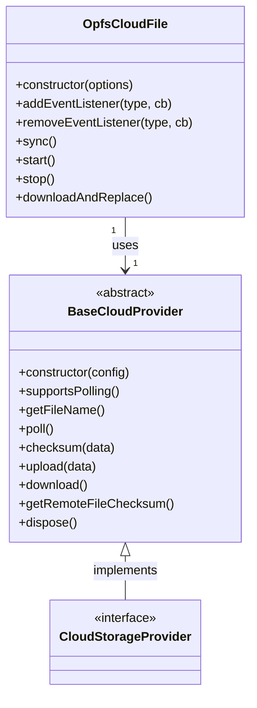
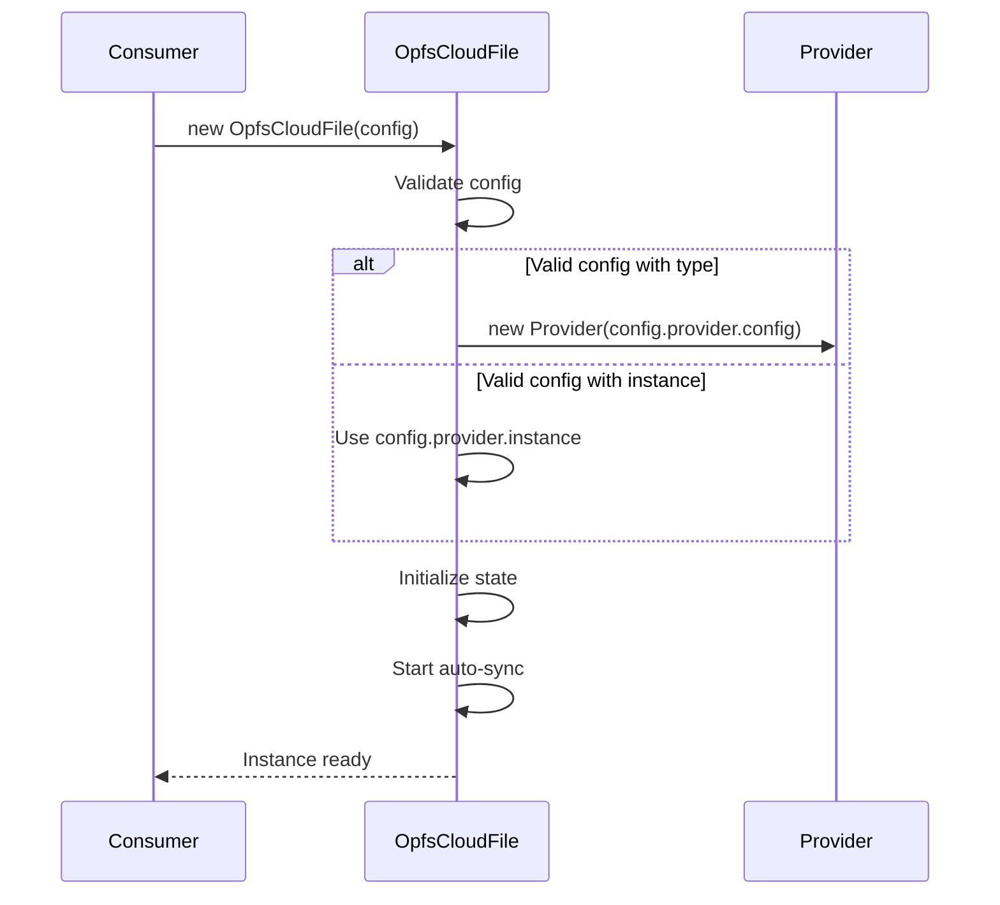
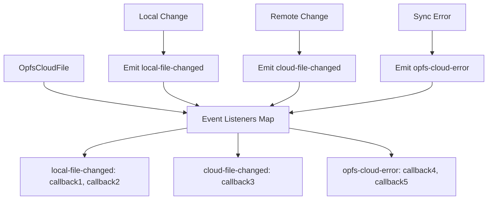
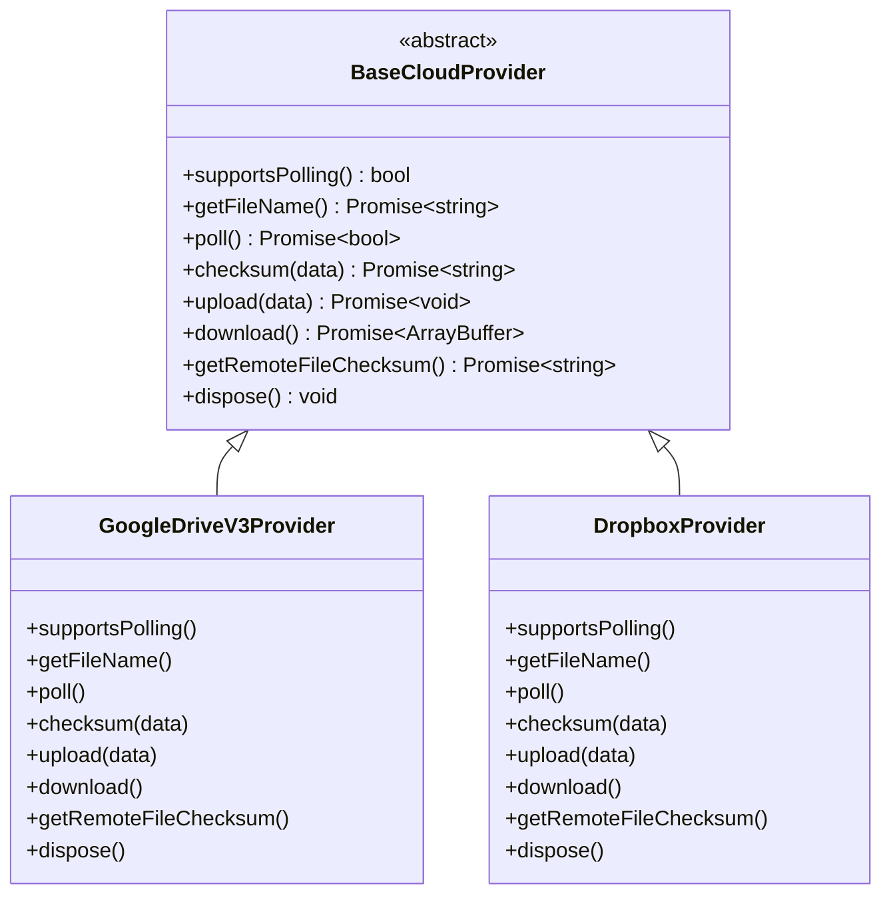
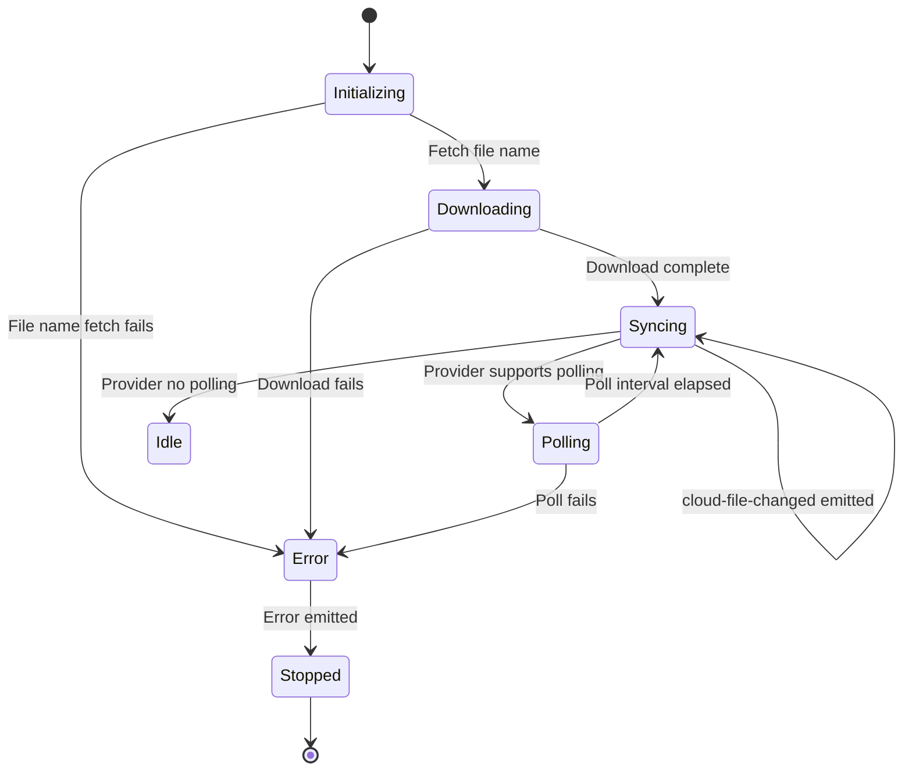
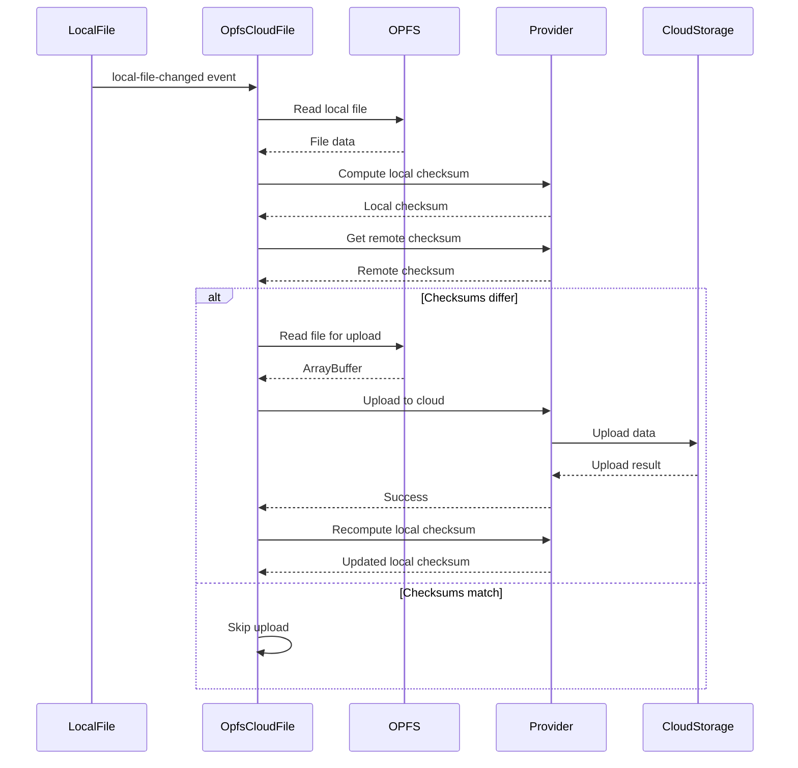
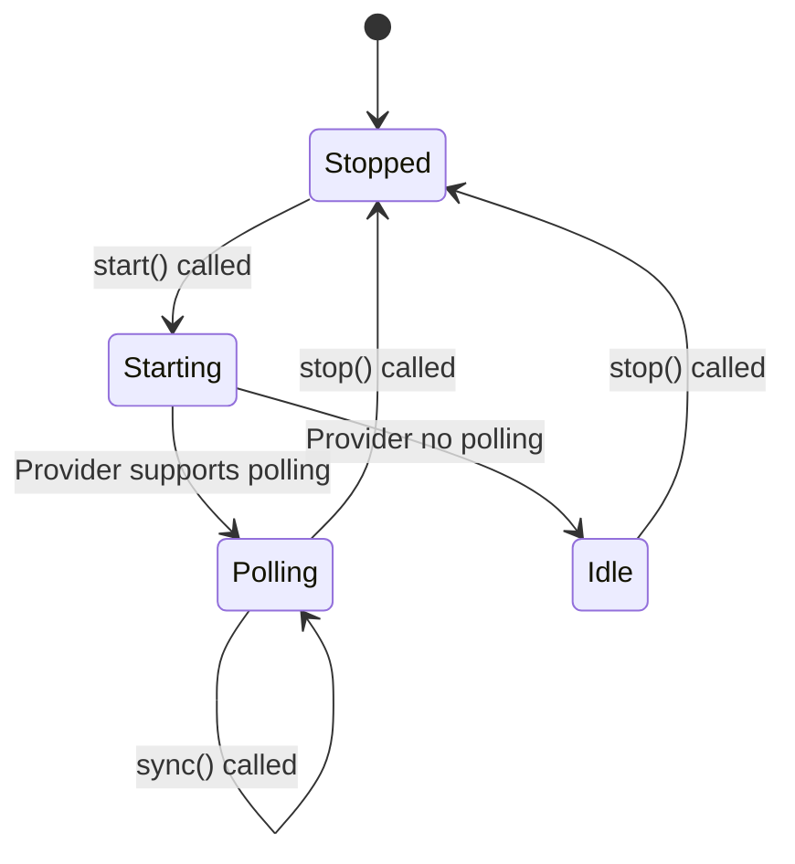
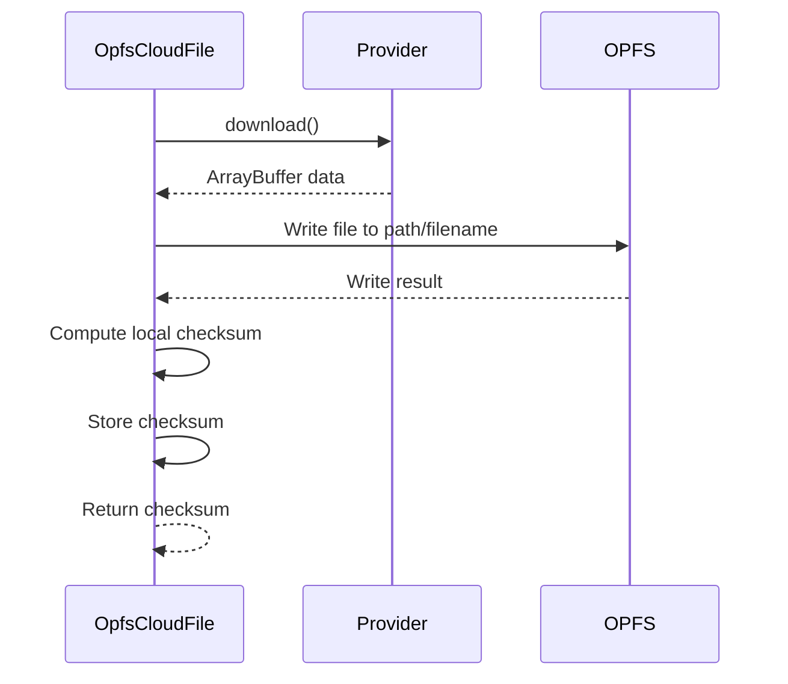
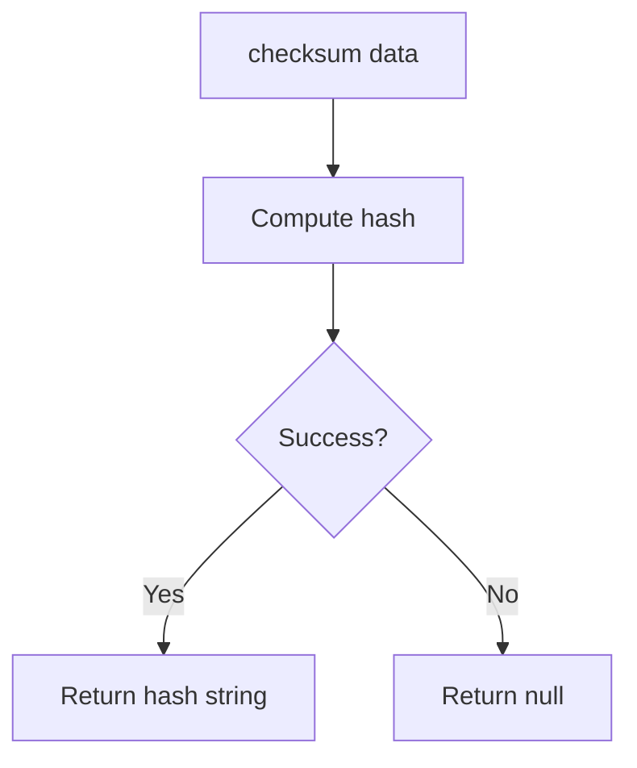
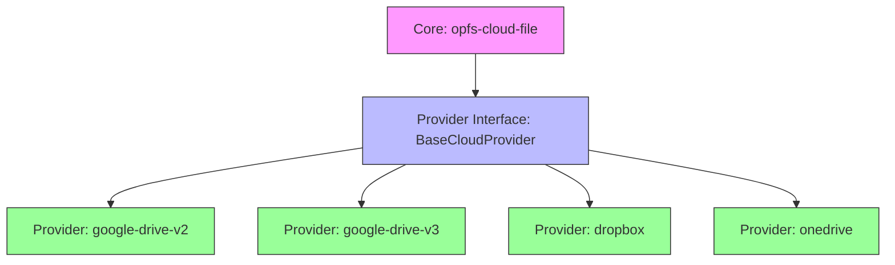

# OpfsCloudFile Baseline Specification

## Purpose

This specification defines the baseline requirements for the **opfs-cloud-file** library, which provides file synchronization between the Origin Private File System (OPFS) and cloud storage providers. This specification explicitly excludes cloud storage provider implementations (such as Google Drive, Dropbox, etc.), which SHALL be defined as separate capabilities implementing the provider interface defined herein.

## Scope

This specification covers:
- Core file synchronization behavior
- Event-driven architecture contract
- Provider interface requirements
- Error handling and state management
- File change detection mechanisms

This specification does NOT cover:
- Specific cloud storage provider implementations
- Provider authentication mechanisms
- Provider-specific API details
- Build, test, or CI/CD infrastructure (covered by separate infrastructure specification)


*Caption: Class diagram showing OpfsCloudFile core class, BaseCloudProvider abstract class, and cloud storage provider relationship*

## ADDED Requirements

### Requirement: Library Initialization

The library SHALL provide an `OpfsCloudFile` class that can be instantiated with a configuration object.

The configuration object SHALL accept the following properties:
- `provider`: An object containing either a `type` string or an `instance` of a provider implementing the BaseCloudProvider interface
- `opfsPath`: A string specifying the path within OPFS where files will be stored
- `pollingInterval`: An optional number specifying the polling interval in milliseconds (defaults to provider's default or 8000ms)

The constructor SHALL throw an error if the provider configuration is invalid or missing.

**Implementation**: `src/OpfsCloudFile.js:7-20`
**Verification**: Unit tests for constructor validation


*Caption: OpfsCloudFile initialization sequence with provider creation and auto-sync startup*

#### Scenario: Successful initialization with provider type
- **WHEN** `new OpfsCloudFile({ type: 'provider-name', provider: { config: {} }, opfsPath: 'test' })` is called
- **THEN** system creates provider instance and initializes OpfsCloudFile successfully

#### Scenario: Successful initialization with provider instance
- **WHEN** `new OpfsCloudFile({ provider: { instance: providerInstance }, opfsPath: 'test' })` is called
- **THEN** system uses the provided instance and initializes OpfsCloudFile successfully

#### Scenario: Invalid provider configuration
- **WHEN** `new OpfsCloudFile({ provider: {}, opfsPath: 'test' })` is called with missing provider config
- **THEN** system throws an error with message indicating provider is required

#### Scenario: Auto-sync starts on initialization
- **WHEN** OpfsCloudFile instance is created
- **THEN** system automatically starts synchronization process

---

### Requirement: Event System

The library SHALL implement a custom event system that allows consumers to subscribe to and unsubscribe from events.

The library SHALL emit the following event types:
- `local-file-changed`: Emitted when local OPFS file changes are detected
- `cloud-file-changed`: Emitted when remote cloud file changes are detected
- `opfs-cloud-error`: Emitted when an error occurs during synchronization

Each event SHALL contain a `detail` property with event-specific data.

**Implementation**: `src/OpfsCloudFile.js:59-72`, `src/events.js:1-3`
**Verification**: Unit tests for event subscription and emission


*Caption: Event system flow showing event types, listener storage, and emission triggers*

#### Scenario: Subscribe to local file change event
- **WHEN** `cloudFile.addEventListener('local-file-changed', callback)` is called
- **THEN** the callback is added to the event listeners for local-file-changed events

#### Scenario: Subscribe to multiple event types
- **WHEN** multiple `addEventListener` calls are made for different event types
- **THEN** each callback is stored under its respective event type

#### Scenario: Unsubscribe from event
- **WHEN** `cloudFile.removeEventListener('local-file-changed', callback)` is called
- **THEN** the specified callback is removed from the event listeners

#### Scenario: Event emission triggers all callbacks
- **WHEN** a local file change occurs
- **THEN** all registered callbacks for 'local-file-changed' are executed with event detail

#### Scenario: Error event contains error detail
- **WHEN** an error occurs during synchronization
- **THEN** the 'opfs-cloud-error' event is emitted with error information in the detail property

---

### Requirement: Provider Interface

The library SHALL define a `BaseCloudProvider` abstract class that serves as the interface contract for all cloud storage providers.

All cloud storage provider implementations SHALL extend `BaseCloudProvider` and implement the following methods:
- `supportsPolling()`: Returns a boolean indicating if the provider supports change polling
- `getFileName()`: Returns a Promise resolving to the cloud file name as a string or null
- `poll()`: Returns a Promise resolving to a boolean indicating if the remote file has changed
- `checksum(data)`: Returns a Promise resolving to a string checksum for the provided data
- `upload(data)`: Returns a Promise for uploading data to cloud storage
- `download()`: Returns a Promise resolving to ArrayBuffer containing the cloud file content
- `getRemoteFileChecksum()`: Returns a Promise resolving to a string checksum of the remote file
- `dispose()`: Cleans up any provider-specific resources

**Implementation**: `providers/BaseCloudProvider.js:1-12`
**Verification**: Provider implementations must pass interface validation


*Caption: Provider interface inheritance showing BaseCloudProvider abstract class and concrete provider implementations*

#### Scenario: Provider implements all required methods
- **WHEN** a new provider class extends BaseCloudProvider
- **THEN** the provider MUST implement all abstract methods defined in BaseCloudProvider

#### Scenario: Provider supports polling
- **WHEN** `provider.supportsPolling()` is called on a provider that supports polling
- **THEN** system returns true

#### Scenario: Provider does not support polling
- **WHEN** `provider.supportsPolling()` is called on a provider that does not support polling
- **THEN** system returns false

#### Scenario: Get file name from provider
- **WHEN** `provider.getFileName()` is called
- **THEN** system returns a Promise that resolves to the cloud file name string or null

#### Scenario: Poll for remote changes
- **WHEN** `provider.poll()` is called
- **THEN** system returns a Promise that resolves to true if remote file has changed, false otherwise

#### Scenario: Upload data to cloud storage
- **WHEN** `provider.upload(data)` is called with ArrayBuffer data
- **THEN** system uploads the data to cloud storage and returns a Promise

#### Scenario: Download data from cloud storage
- **WHEN** `provider.download()` is called
- **THEN** system returns a Promise that resolves to ArrayBuffer containing the file content

#### Scenario: Get remote file checksum
- **WHEN** `provider.getRemoteFileChecksum()` is called
- **THEN** system returns a Promise that resolves to a string checksum of the remote file

#### Scenario: Clean up provider resources
- **WHEN** `provider.dispose()` is called
- **THEN** system cleans up any provider-specific resources and connections

---

### Requirement: Automatic Synchronization

The library SHALL automatically start the synchronization process when an OpfsCloudFile instance is created.

The synchronization process SHALL:
- Download the remote file to OPFS on first initialization
- Start periodic polling for remote changes if the provider supports polling
- Emit `cloud-file-changed` event when remote changes are detected

The polling interval SHALL be configurable via the `pollingInterval` option or default to the provider's default interval.

**Implementation**: `src/OpfsCloudFile.js:29-34, 98-110`
**Verification**: Integration tests for auto-sync behavior


*Caption: Synchronization state machine showing initialization, download, polling, and error states*

#### Scenario: Download on initialization
- **WHEN** OpfsCloudFile instance is created
- **THEN** system downloads the remote file to OPFS

#### Scenario: Periodic polling starts
- **WHEN** OpfsCloudFile is initialized with a provider that supports polling
- **THEN** system starts periodic polling at the configured interval

#### Scenario: Polling detects remote change
- **WHEN** provider.poll() returns true
- **THEN** system emits cloud-file-changed event with remote hash

#### Scenario: Polling interval configurable
- **WHEN** OpfsCloudFile is created with custom pollingInterval
- **THEN** system uses the custom interval for polling

#### Scenario: Polling uses provider default
- **WHEN** OpfsCloudFile is created without pollingInterval and provider has pollIntervalMs
- **THEN** system uses provider's default polling interval

---

### Requirement: Local Change Handling

The library SHALL listen for `local-file-changed` events and automatically upload local changes to the cloud storage.

When a `local-file-changed` event is received, the system SHALL:
- Compute the local file checksum
- Compare it with the remote file checksum
- If checksums differ, read the local file from OPFS and upload it to cloud storage
- Recompute the local checksum after upload to ensure consistency
- Emit `opfs-cloud-error` if any error occurs during the process

**Implementation**: `src/OpfsCloudFile.js:36-57`
**Verification**: Unit tests for local change upload flow


*Caption: Local change handling sequence from event reception to upload completion*

#### Scenario: Local change triggers upload
- **WHEN** local-file-changed event is dispatched
- **THEN** system computes local checksum and compares with remote

#### Scenario: Upload when checksums differ
- **WHEN** local checksum differs from remote checksum
- **THEN** system reads local file from OPFS and uploads to cloud storage

#### Scenario: Skip upload when checksums match
- **WHEN** local checksum matches remote checksum
- **THEN** system does not perform upload operation

#### Scenario: Error during local change handling
- **WHEN** an error occurs during local file read or upload
- **THEN** system emits opfs-cloud-error event with error details

---

### Requirement: Manual Synchronization

The library SHALL provide a `sync()` method that performs a manual synchronization check.

The `sync()` method SHALL:
- Call the provider's `poll()` method to check for remote changes
- If changes are detected, emit `cloud-file-changed` event with the remote checksum
- Throw errors encountered during polling
- Not perform upload operations (upload is triggered by local-file-changed events)

**Implementation**: `src/OpfsCloudFile.js:84-96`
**Verification**: Unit tests for manual sync behavior

```mermaid
flowchart TD
    A[Start sync] --> B[Call provider.poll()]
    B --> C{Changes detected?}
    C -->|Yes| D[Emit cloud-file-changed]
    C -->|No| E[Return]
    B -->|Error| F[Throw error]
```
*Caption: Manual synchronization flow with change detection and error handling*

#### Scenario: Manual sync detects changes
- **WHEN** `cloudFile.sync()` is called and provider.poll() returns true
- **THEN** system emits cloud-file-changed event

#### Scenario: Manual sync detects no changes
- **WHEN** `cloudFile.sync()` is called and provider.poll() returns false
- **THEN** system completes without emitting events

#### Scenario: Manual sync error handling
- **WHEN** `cloudFile.sync()` is called and provider.poll() throws an error
- **THEN** system re-throws the error and emits opfs-cloud-error event

---

### Requirement: Start and Stop Control

The library SHALL provide `start()` and `stop()` methods for controlling the synchronization process.

The `start()` method SHALL:
- Download the remote file to OPFS
- Start periodic polling if the provider supports polling and polling is not already active
- Perform an initial sync check

The `stop()` method SHALL:
- Stop any active polling timer
- Set internal stopped flag to true
- Call the provider's `dispose()` method if it exists

**Implementation**: `src/OpfsCloudFile.js:98-117`
**Verification**: Unit tests for start/stop behavior


*Caption: Start/stop state machine for synchronization control*

#### Scenario: Start begins polling
- **WHEN** `cloudFile.start()` is called with a polling provider
- **THEN** system starts periodic polling

#### Scenario: Start downloads file
- **WHEN** `cloudFile.start()` is called
- **THEN** system downloads remote file to OPFS

#### Scenario: Stop halts polling
- **WHEN** `cloudFile.stop()` is called
- **THEN** system stops any active polling timer

#### Scenario: Stop calls provider dispose
- **WHEN** `cloudFile.stop()` is called
- **THEN** system calls provider.dispose() if the method exists

#### Scenario: Stop is idempotent
- **WHEN** `cloudFile.stop()` is called multiple times
- **THEN** system handles subsequent calls without error

---

### Requirement: File Download and Replace

The library SHALL provide a `downloadAndReplace()` method that downloads the remote file and replaces the local OPFS file.

The `downloadAndReplace()` method SHALL:
- Call the provider's `download()` method to get the remote file data
- Write the data to OPFS at the configured path with the remote filename
- Compute and store the local checksum of the downloaded file
- Return the local checksum

**Implementation**: `src/OpfsCloudFile.js:119-125`
**Verification**: Unit tests for download and replace behavior


*Caption: Download and replace sequence for fetching remote file and updating local OPFS*

#### Scenario: Download and replace success
- **WHEN** `cloudFile.downloadAndReplace()` is called
- **THEN** system downloads remote file and writes to OPFS

#### Scenario: Download and replace returns checksum
- **WHEN** `cloudFile.downloadAndReplace()` completes successfully
- **THEN** system returns the local checksum of the downloaded file

#### Scenario: Download and replace error
- **WHEN** `cloudFile.downloadAndReplace()` is called and download fails
- **THEN** system throws an error

---

### Requirement: OPFS File Operations

The library SHALL provide utility functions for OPFS file operations that automatically use synchronous access handles when available in Web Workers.

The OPFS utilities SHALL support:
- `readOpfsFile(path)`: Read file from OPFS, returning ArrayBuffer or null
- `writeOpfsFile(path, buffer)`: Write buffer to OPFS, creating directories as needed
- Automatic detection of synchronous access handle support via `handle.createSyncAccessHandle`

**Implementation**: `utils/opfs.js:1-59`
**Verification**: Unit tests for OPFS file operations

```mermaid
flowchart TD
    A[readOpfsFile] --> B{Sync Access Available?}
    B -->|Yes| C[Use createSyncAccessHandle]
    B -->|No| D[Use getFile().arrayBuffer()]
    C --> E[Sync read with accessHandle.read()]
    D --> F[Async read with getFile()]
    E --> G[Return ArrayBuffer]
    F --> G
    
    H[writeOpfsFile] --> I{Sync Access Available?}
    I -->|Yes| J[Use createSyncAccessHandle]
    I -->|No| K[Use createWritable()]
    J --> L[Sync write with accessHandle.write()]
    K --> M[Async write with writable.write()]
    L --> N[Return]
    M --> N
```
*Caption: OPFS file operation flow with synchronous and asynchronous paths*

#### Scenario: Read file with sync access handle
- **WHEN** `readOpfsFile(path)` is called in Web Worker with sync access support
- **THEN** system uses createSyncAccessHandle for synchronous read

#### Scenario: Read file without sync access handle
- **WHEN** `readOpfsFile(path)` is called in main thread without sync access support
- **THEN** system uses getFile().arrayBuffer() for asynchronous read

#### Scenario: Write file with directory creation
- **WHEN** `writeOpfsFile(path/to/file, buffer)` is called with non-existent directories
- **THEN** system creates necessary directories and writes the file

#### Scenario: Write file with sync access handle
- **WHEN** `writeOpfsFile(path, buffer)` is called in Web Worker with sync access support
- **THEN** system uses createSyncAccessHandle for synchronous write with truncate and flush

#### Scenario: Read non-existent file
- **WHEN** `readOpfsFile(path)` is called for non-existent file
- **THEN** system returns null

---

### Requirement: Checksum Computation

The library SHALL provide checksum computation for local data using a consistent algorithm.

The checksum utility SHALL:
- Accept ArrayBuffer data as input
- Return a Promise resolving to a string checksum
- Return null on error

**Note**: The specific checksum algorithm (MD5) and its implementation details are implementation-specific and not mandated by this specification. However, implementations SHALL ensure deterministic checksum computation for the same input data.

**Implementation**: `utils/md5.js:5-16`
**Verification**: Unit tests for checksum computation


*Caption: Checksum computation flow with error handling*

#### Scenario: Checksum computation success
- **WHEN** checksum is computed for valid ArrayBuffer data
- **THEN** system returns a string checksum

#### Scenario: Checksum computation error
- **WHEN** checksum computation encounters an error
- **THEN** system returns null

#### Scenario: Checksum is deterministic
- **WHEN** checksum is computed multiple times for the same data
- **THEN** system returns the same checksum string each time

---

### Requirement: Provider Separation

Cloud storage provider implementations SHALL be separate from the core opfs-cloud-file capability.

Each cloud storage provider (such as Google Drive V2, Google Drive V3, Dropbox, OneDrive, etc.) SHALL:
- Be implemented as a separate capability
- Have its own specification document
- Implement the BaseCloudProvider interface defined in this specification
- NOT be included in this baseline specification

**Rationale**: This separation enables:
- Independent development and versioning of providers
- Support for multiple providers without affecting core library
- Clear separation of concerns between synchronization logic and provider-specific details

**Verification**: Separate spec files for each provider capability


*Caption: Capability separation showing core library and independent provider implementations*

#### Scenario: Provider as separate capability
- **WHEN** a new cloud storage provider is added
- **THEN** it is implemented as a separate capability with its own spec

#### Scenario: Core library independent of providers
- **WHEN** core library is updated
- **THEN** provider implementations remain compatible as long as they implement the BaseCloudProvider interface

#### Scenario: Multiple providers supported simultaneously
- **WHEN** multiple provider capabilities exist
- **THEN** consumers can choose any provider that implements the BaseCloudProvider interface

---

## Traceability

| Requirement | Implementation | Verification |
|-------------|----------------|--------------|
| Library Initialization | `src/OpfsCloudFile.js:7-20` | Unit tests for constructor validation |
| Event System | `src/OpfsCloudFile.js:59-72`, `src/events.js:1-3` | Unit tests for event subscription and emission |
| Provider Interface | `providers/BaseCloudProvider.js:1-12` | Provider implementations must pass interface validation |
| Automatic Synchronization | `src/OpfsCloudFile.js:29-34, 98-110` | Integration tests for auto-sync behavior |
| Local Change Handling | `src/OpfsCloudFile.js:36-57` | Unit tests for local change upload flow |
| Manual Synchronization | `src/OpfsCloudFile.js:84-96` | Unit tests for manual sync behavior |
| Start and Stop Control | `src/OpfsCloudFile.js:98-117` | Unit tests for start/stop behavior |
| File Download and Replace | `src/OpfsCloudFile.js:119-125` | Unit tests for download and replace behavior |
| OPFS File Operations | `utils/opfs.js:1-59` | Unit tests for OPFS file operations |
| Checksum Computation | `utils/md5.js:5-16` | Unit tests for checksum computation |

---

*Document Version: 1.0.0*  
*Last Updated: 2026-07-16*  
*Status: Draft*  
*Author: Mistral Vibe*
