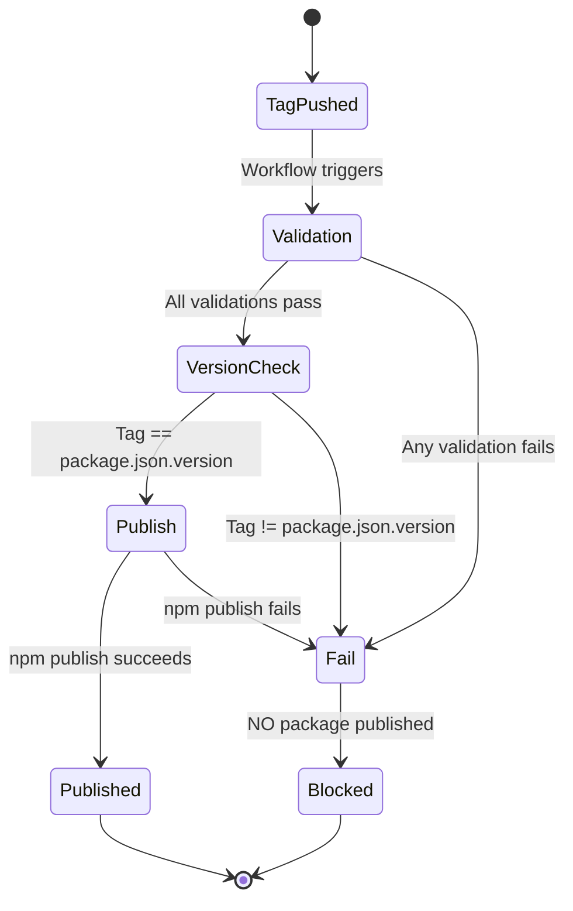
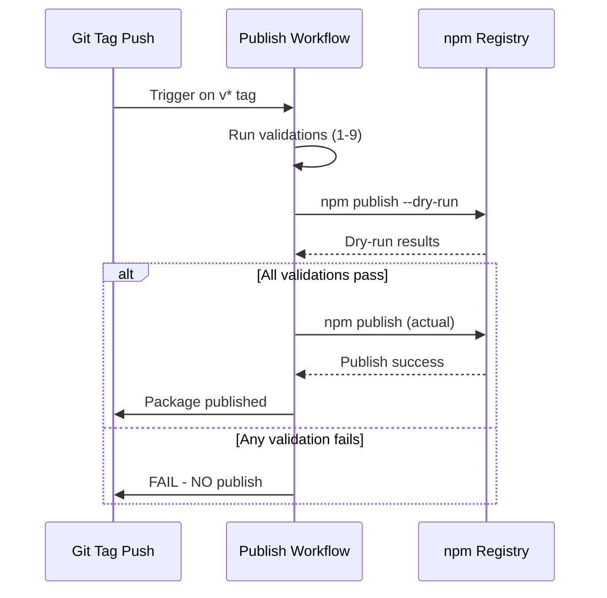
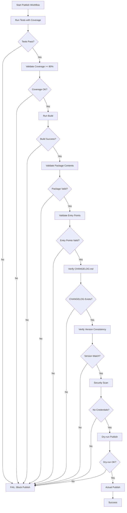

# Infrastructure Publish Fix - Delta Specification

**Related Main Spec**: `../../../../specs/infrastructure/spec.md`

## MODIFIED Requirements

### Requirement: CI/CD Pipeline Configuration

The project SHALL use GitHub Actions as the CI/CD platform.

The CI/CD pipeline SHALL execute on push and pull_request events to all branches.

The CI/CD pipeline SHALL use ubuntu-latest as the execution environment.

The CI/CD pipeline SHALL setup Node.js 24.x environment for all jobs.

The CI/CD pipeline SHALL install dependencies using `npm ci` for reproducible builds.

The CI/CD pipeline SHALL trigger the publish workflow on push events for tags matching the pattern `v?[0-9]+.[0-9]+.[0-9]*` (semantic version tags with optional v prefix).

The CI/CD pipeline SHALL use a single unified workflow for both validation and publishing to eliminate redundancy.

**Implementation**: .github/workflows/publish.yml
**Verification**: GitHub Actions execution, tag push triggers

```mermaid
flowchart TD
    A[Tag Push: v?[0-9]+.[0-9]+.[0-9]*] --> B[Checkout repository]
    B --> C[Setup Node.js 24.x]
    C --> D[npm ci]
    D --> E[Run Tests with Coverage]
    E --> F[Validate Coverage Thresholds]
    F --> G[Run Build]
    G --> H[Validate Package Contents]
    H --> I[Validate Entry Points]
    I --> J[Verify CHANGELOG.md]
    J --> K[Verify Version Consistency]
    K --> L[Security Scan]
    L --> M[Dry-run Publish]
    M --> N{All Validations Pass?}
    N -->|Yes| O[Actual npm publish]
    N -->|No| P[FAIL: Block Publication]
    O --> Q[Published to npm registry]
    P --> R[NO package published]
```
*Caption: Unified publish workflow with fail-closed behavior and comprehensive validation*

#### Scenario: Publish workflow triggers on version tag push with v prefix
- **WHEN** a git tag matching pattern `vX.Y.Z` is pushed to the repository (e.g., `v0.1.5`)
- **THEN** publish.yml workflow executes automatically

#### Scenario: Publish workflow triggers on version tag push without v prefix
- **WHEN** a git tag matching pattern `X.Y.Z` is pushed to the repository (e.g., `0.1.5`)
- **THEN** publish.yml workflow executes automatically

#### Scenario: Publish workflow does not trigger on non-version tags
- **WHEN** a git tag not matching pattern `v?[0-9]+.[0-9]+.[0-9]*` is pushed (e.g., `test-tag`, `alpha`)
- **THEN** publish.yml workflow does NOT execute

#### Scenario: Single unified workflow for publishing
- **WHEN** publish validation is needed
- **THEN** a single publish.yml workflow handles all validation and publishing logic

#### Scenario: Previous verify-publish.yml workflow is removed
- **WHEN** the change is implemented
- **THEN** .github/workflows/verify-publish.yml no longer exists

---

### Requirement: Testing System Configuration

The project SHALL use Jest 30.x as the primary testing framework.

The testing system SHALL configure jsdom environment for DOM-related tests.

The testing system SHALL transform source code using Babel with @babel/preset-env.

The testing system SHALL run on Node.js 24.x environment.

The testing system SHALL support asynchronous test execution.

The testing system SHALL output Jest text coverage report to stdout.

The testing system SHALL generate LCOV coverage report at `coverage/lcov.info`.

**Implementation**: jest.config.cjs, babel.config.json, .github/workflows/test.yml
**Verification**: npm test -- --coverage

**Modified**: Updated from Node.js 20.x to Node.js 24.x to align with GitHub Actions runner deprecation of Node.js 20.

#### Scenario: Tests execute on Node.js 24.x
- **WHEN** `npm test` is executed in Node.js 24.x environment
- **THEN** all defined tests run and complete successfully

#### Scenario: jsdom environment available on Node.js 24.x
- **WHEN** tests requiring DOM APIs are executed on Node.js 24.x
- **THEN** jsdom environment provides necessary DOM APIs

---

### Requirement: Release Management

The project SHALL follow Semantic Versioning (semver) 2.0.0 specification for all releases.

The project SHALL use MAJOR.MINOR.PATCH format for stable releases.

The project SHALL support pre-release versions with identifiers: alpha, beta, rc as an OPTIONAL path.

The project SHALL publish to the public npm registry.

The project SHALL include prepublishOnly script for pre-publish validation.

The project SHALL maintain a CHANGELOG.md file for tracking release history as a REQUIRED artifact.

The project SHALL ensure that SemVer version tag MUST match package.json version exactly with no discrepancies.

The publishing workflow SHALL trigger automatically when a semantic version tag is pushed to the repository.

**Implementation**: package.json (version field), CHANGELOG.md, .github/workflows/publish.yml
**Verification**: Version comparison between git tag and package.json, workflow execution on tag push


*Caption: Release management state machine with version consistency and fail-closed publishing*

#### Scenario: Semantic versioning followed
- **WHEN** new version is released
- **THEN** version follows MAJOR.MINOR.PATCH format

#### Scenario: Version tag matches package.json version exactly (with v prefix)
- **WHEN** a version tag `vX.Y.Z` is pushed
- **THEN** the git tag version (with v stripped) MUST be identical to package.json version field

#### Scenario: Version tag matches package.json version exactly (without v prefix)
- **WHEN** a version tag `X.Y.Z` is pushed
- **THEN** the git tag version MUST be identical to package.json version field

#### Scenario: Publish triggered by version tag push
- **WHEN** a semantic version tag is pushed
- **THEN** publish workflow executes and publishes to npm registry

#### Scenario: Pre-release versions trigger publish
- **WHEN** a pre-release tag matching `v*-*`-pattern is pushed (e.g., `v1.0.0-alpha.1`)
- **THEN** publish workflow executes and publishes pre-release version to npm registry

---

### Requirement: Safe Publishing

The verification system SHALL use only non-publish methods (such as `npm publish --dry-run`) for validation purposes.

The verification system SHALL NEVER use actual `npm publish` for verification or testing purposes.

The actual `npm publish` command SHALL only execute as the final step after ALL validation checks have passed successfully.

The publishing workflow SHALL include a dry-run validation step before the actual publish step.

**Implementation**: .github/workflows/publish.yml, verification scripts
**Verification**: Inspection of workflow commands, confirmation that dry-run is used for validation


*Caption: Safe publishing sequence with dry-run validation before actual publish*

#### Scenario: Dry-run used for validation
- **WHEN** validation of publishing is performed
- **THEN** system uses `npm publish --dry-run` for validation step

#### Scenario: Actual publish only after all validations pass
- **WHEN** all validation steps complete successfully
- **THEN** system executes `npm publish` as the final step

#### Scenario: No actual publish during validation failure
- **WHEN** any validation step fails
- **THEN** NO actual package is published to any registry

#### Scenario: Actual npm publish is used for release
- **WHEN** all validations pass and it is a production release
- **THEN** system uses actual `npm publish` command to publish package

---

### Requirement: Release Validation

The publishing system SHALL require that all tests pass with 100% pass rate before package publication.

The publishing system SHALL require that all coverage thresholds (80% minimum for statements, branches, functions, lines) are met before package publication.

The publishing system SHALL require that build completes successfully without errors before package publication.

The publishing system SHALL require that package contents validation passes before package publication.

The validation steps SHALL execute in the following order:
1. Run all tests with coverage
2. Validate coverage thresholds are met
3. Run build
4. Validate package contents
5. Validate entry points
6. Verify CHANGELOG.md exists
7. Verify version consistency between tag and package.json
8. Security scan for credentials
9. Dry-run npm publish

**Implementation**: CI/CD workflow pre-publish checks, custom validation scripts
**Verification**: Complete pre-publish validation execution in correct order


*Caption: Complete release validation workflow with ordered checks and fail-closed behavior*

#### Scenario: All tests pass before publish
- **WHEN** pre-publish validation runs
- **THEN** all tests MUST pass with 100% pass rate

#### Scenario: Coverage thresholds met before publish
- **WHEN** pre-publish validation runs
- **THEN** coverage for statements, branches, functions, and lines MUST all be at or above 80%

#### Scenario: Build succeeds before publish
- **WHEN** pre-publish validation runs
- **THEN** build MUST complete successfully without any errors

#### Scenario: Package validation passes before publish
- **WHEN** pre-publish validation runs
- **THEN** package contents validation MUST pass

#### Scenario: Validations execute in correct order
- **WHEN** publish workflow executes
- **THEN** validation steps execute in the order: tests, coverage, build, package validation, entry points, changelog, version, security, dry-run

---

## Acceptance Criteria Verification

The infrastructure SHALL have all build scripts execute successfully without errors.

The infrastructure SHALL have all tests pass with 100% pass rate.

The infrastructure SHALL meet or exceed the 80% test coverage threshold.

The infrastructure SHALL successfully publish to npm registry when version tags are pushed.

**Implementation**: All configuration files and workflows
**Verification**: Complete build, test, and publish cycle
