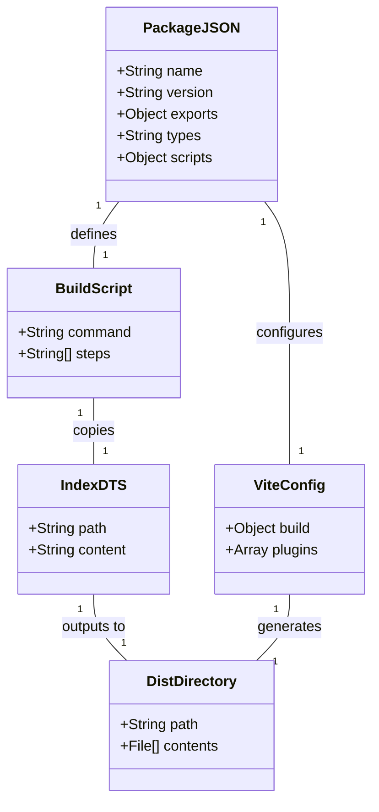
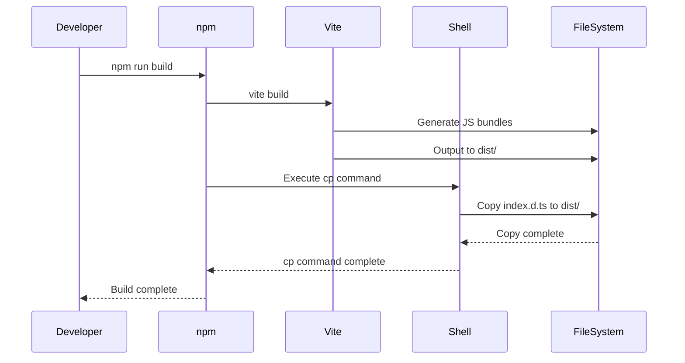
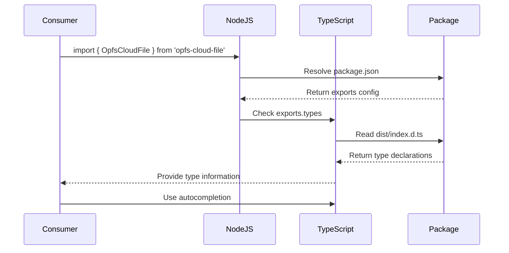
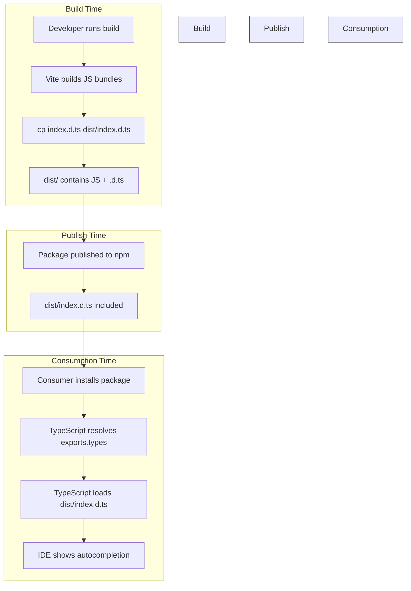

# Design: Type Declaration Publish Fix

**Change**: fix-type-declaration-publish  
**Created**: 2026-07-25  
**Version**: 1.0.0  
**Status**: Implemented  
**Implementation Commit**: c6b76e3  

---

## 1. Architecture Overview

The type declaration publishing system consists of the following components:



*Caption: Component relationships in type declaration publishing system*

---

## 2. Design Decisions

### 2.1 Decision: Manual Type Declaration Copy vs vite-plugin-dts

**Problem**: vite-plugin-dts was not generating correct type declarations for the package exports.

**Options Considered**:

| Option | Pros | Cons | Decision |
|--------|------|------|----------|
| **A. Fix vite-plugin-dts configuration** | Automated type generation | Complex configuration, may not work with Vite's lib mode | Rejected |
| **B. Use tsc to generate declarations** | Standard TypeScript approach | Requires additional build step, may conflict with Vite | Rejected |
| **C. Manual copy of index.d.ts** | Simple, reliable, full control | Manual maintenance, must remember to update | **Selected** |

**Rationale**: 
The manual copy approach was selected because:
- The existing index.d.ts file already contains all necessary type declarations
- Vite's library mode with vite-plugin-dts was generating empty or incorrect declaration files
- Manual copy provides full control and predictability
- The build script is simple and easy to maintain

**Implementation**: 
```bash
# In package.json build script
"build": "vite build && cp index.d.ts dist/index.d.ts"
```

---

### 2.2 Decision: Exports Field Structure

**Problem**: TypeScript consumers could not resolve type declarations from the package.

**Decision**: Add explicit `types` entry to the `exports` field in package.json.

**Rationale**:
- Node.js package exports specification supports a `types` field for each entry point
- This is the standard way to publish dual packages (CommonJS + ESM) with type declarations
- Explicit types entry ensures TypeScript can resolve declarations regardless of import style

**Implementation**:
```json
{
  "exports": {
    ".": {
      "types": "./dist/index.d.ts",
      "import": "./dist/opfs-cloud-file.js",
      "require": "./dist/opfs-cloud-file.umd.cjs"
    }
  }
}
```

---

### 2.3 Decision: Disable vite-plugin-dts

**Problem**: vite-plugin-dts was generating empty dist/index.d.ts file.

**Decision**: Disable the plugin entirely and use manual copy instead.

**Rationale**:
- Plugin configuration was not working correctly with Vite's library mode
- Manual approach is simpler and more reliable
- Reduces build complexity and potential points of failure

**Implementation**:
```javascript
// In vite.config.js
plugins: [
    dts({ enabled: false }),
],
```

---

## 3. Component Interactions

### 3.1 Build Process Sequence



*Caption: Build process component interaction sequence*

---

### 3.2 Package Consumption Flow



*Caption: TypeScript consumer type resolution sequence*

---

## 4. Type Declaration Workflow



*Caption: Complete type declaration lifecycle*

---

## 5. Data Flow


*Caption: Type declaration file data flow*

---

## 6. Design Constraints

- **Build Tool**: Must use Vite as the primary build tool
- **Package Manager**: Must work with npm publish workflow
- **TypeScript Version**: Must be compatible with TypeScript 5.x
- **Node.js Version**: Must support Node.js package exports field
- **File System**: Must work on Unix-like systems (cp command available)

---

## 7. Assumptions

- index.d.ts file exists at project root and contains all necessary type declarations
- Build is executed on a system with standard Unix utilities (cp command)
- Consumers use TypeScript 4.5+ which supports package.json exports field
- Consumers use Node.js 12+ which supports package exports field

---

## 8. Trade-offs

| Aspect | Trade-off |
|--------|-----------|
| **Automation vs Control** | Manual copy provides more control but less automation |
| **Complexity vs Simplicity** | Simple solution but requires manual maintenance |
| **Flexibility vs Rigidity** | Easy to modify types but must remember to update |

---

## 9. Future Considerations

- If the API surface grows significantly, consider automating type declaration generation
- If vite-plugin-dts improves support for library mode, reconsider enabling it
- If cross-platform support is needed, replace `cp` command with cross-platform script

---

## 10. References

- [Vite Library Mode](https://vitejs.dev/guide/build.html#library-mode)
- [TypeScript Publishing Declarations](https://www.typescriptlang.org/docs/handbook/declaration-files/publishing.html)
- [Node.js Package Exports](https://nodejs.org/api/packages.html#packages_package_entry_points)
