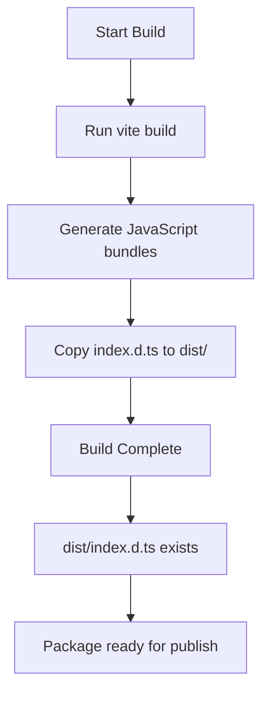
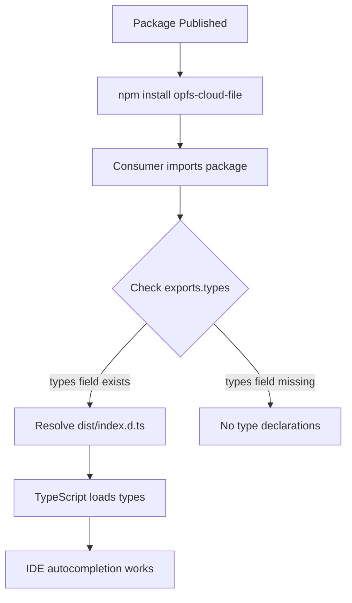

# Specification: Type Declaration Fix

**Change**: fix-type-declaration-publish  
**Capability**: type-declaration-fix  
**Created**: 2026-07-25  
**Version**: 1.0.0  
**Status**: Implemented  
**Implementation Commit**: c6b76e3  

---

## 1. Overview

This specification defines the requirements for proper TypeScript type declaration publishing in the `opfs-cloud-file` package. Type declarations MUST be available to consumers when the package is imported in TypeScript projects.

---

## 2. Requirements

### 2.1 Package Configuration

**Requirement 1**: Package exports MUST include a types field

The package.json `exports` field MUST explicitly define the location of type declaration files for each entry point.

#### Scenario: Exports field contains types entry

```
WHEN a consumer imports the package using `import type { OpfsCloudFile } from 'opfs-cloud-file'
THEN TypeScript MUST resolve type declarations from the package
```

#### Scenario: Exports field missing types entry

```
WHEN a consumer imports the package using `import type { OpfsCloudFile } from 'opfs-cloud-file'
THEN TypeScript MUST NOT resolve type declarations from the package
```

**Verification**: Check package.json exports field contains `"types": "./dist/index.d.ts"`

---

### 2.2 Build Process

**Requirement 2**: Build process MUST copy type declaration files to output directory

The build script MUST ensure that type declaration files are present in the distribution directory after build completion.

#### Scenario: Build copies type declarations

```
WHEN npm run build is executed
THEN index.d.ts MUST be copied to dist/index.d.ts
AND dist/index.d.ts MUST exist after build completes
```

#### Scenario: Build without type declaration copy

```
WHEN npm run build is executed
THEN dist/index.d.ts MUST NOT exist
```

**Verification**: Run build and check dist/index.d.ts exists

---

### 2.3 Plugin Configuration

**Requirement 3**: vite-plugin-dts MUST be disabled

The vite-plugin-dts plugin MUST be disabled in the Vite configuration to prevent incorrect type generation.

#### Scenario: vite-plugin-dts is disabled

```
WHEN vite build is executed
THEN vite-plugin-dts MUST NOT generate type declaration files
AND vite-plugin-dts MUST NOT modify the build output
```

#### Scenario: vite-plugin-dts is enabled

```
WHEN vite build is executed
THEN vite-plugin-dts MAY generate type declaration files
AND generated files MAY overwrite manual type declarations
```

**Verification**: Check vite.config.js contains `dts({ enabled: false })`

---

### 2.4 File Structure

**Requirement 4**: Type declaration files MUST exist at expected locations

Type declaration files MUST be present at both the project root and the distribution directory.

#### Scenario: Type declaration files exist

```
WHEN package is installed via npm
THEN index.d.ts MUST exist at package root
AND dist/index.d.ts MUST exist in distribution directory
```

#### Scenario: Type declaration files missing

```
WHEN package is installed via npm
THEN index.d.ts MUST NOT exist at package root
OR dist/index.d.ts MUST NOT exist in distribution directory
```

**Verification**: Check index.d.ts and dist/index.d.ts exist in published package

---

## 3. Quality Attributes

| Attribute | Requirement |
|-----------|-------------|
| **Completeness** | All exports MUST have corresponding type declarations |
| **Correctness** | Type declarations MUST accurately reflect API surface |
| **Availability** | Type declarations MUST be included in published package |
| **Maintainability** | Type declaration generation MUST be simple and reliable |

---

## 4. Build Process Flow



*Caption: Type declaration build process workflow*

---

## 5. Package Publish Flow



*Caption: Type declaration resolution flow for consumers*

---

## 6. Acceptance Criteria

- [x] Package.json exports field MUST contain types entry pointing to dist/index.d.ts
- [x] Build script MUST copy index.d.ts to dist/index.d.ts
- [x] vite-plugin-dts MUST be configured with enabled: false
- [x] Published package MUST contain dist/index.d.ts file
- [x] TypeScript consumers MUST be able to import types from the package

---

## 7. Traceability

| Requirement | Implementation File | Implementation Line | Commit |
|-------------|---------------------|---------------------|--------|
| Exports types field | package.json | Line 29 | c6b76e3 |
| Build copy command | package.json | Line 36 | c6b76e3 |
| Plugin disabled | vite.config.js | Line 14 | c6b76e3 |

---

## 8. References

- [TypeScript Declaration Files](https://www.typescriptlang.org/docs/handbook/declaration-files/introduction.html)
- [Node.js Package Exports](https://nodejs.org/api/packages.html#packages_package_entry_points)
- [Vite Plugin DTS](https://github.com/rollup/plugins/tree/master/packages/dts)
