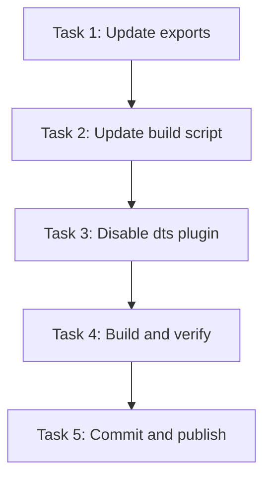

# Tasks: Fix Type Declaration Publish

**Change**: fix-type-declaration-publish  
**Created**: 2026-07-25  
**Version**: 1.0.0  
**Status**: Completed  
**Implementation Commit**: c6b76e3  
**Tag**: v0.1.6  

---

## 1. Task Overview

This document lists all tasks required to implement the type declaration publishing fix for the `opfs-cloud-file` package.

---

## 2. Task List

### Task 1: Update package.json exports field

**ID**: TASK-001  
**Priority**: High  
**Status**: Completed  
**Assignee**: gjchen  
**Commit**: c6b76e3  

**Description**: Add `types` entry to the package.json exports field to enable TypeScript type resolution.

**Steps**:
1. Open package.json
2. Locate the `exports` field
3. Add `"types": "./dist/index.d.ts"` to the main entry point configuration

**Before**:
```json
"exports": {
  ".": {
    "import": "./dist/opfs-cloud-file.js",
    "require": "./dist/opfs-cloud-file.umd.cjs"
  }
}
```

**After**:
```json
"exports": {
  ".": {
    "types": "./dist/index.d.ts",
    "import": "./dist/opfs-cloud-file.js",
    "require": "./dist/opfs-cloud-file.umd.cjs"
  }
}
```

**Verification Criteria**:
- [x] Run `npm pack` and verify exports field in resulting tarball
- [x] Check TypeScript can resolve types from local package
- [x] Verify `node -e "console.log(require('./package.json').exports)"` shows types field

**File Changed**: package.json (Line 29)

---

### Task 2: Update package.json build script

**ID**: TASK-002  
**Priority**: High  
**Status**: Completed  
**Assignee**: gjchen  
**Commit**: c6b76e3  

**Description**: Modify the build script to copy type declaration files to the distribution directory.

**Steps**:
1. Open package.json
2. Locate the `scripts` section
3. Update the `build` script to copy index.d.ts after Vite build

**Before**:
```json
"scripts": {
  "build": "vite build",
  ...
}
```

**After**:
```json
"scripts": {
  "build": "vite build && cp index.d.ts dist/index.d.ts",
  ...
}
```

**Verification Criteria**:
- [x] Run `npm run build` and verify dist/index.d.ts exists
- [x] Check dist/index.d.ts content matches index.d.ts
- [x] Verify build completes successfully without errors

**File Changed**: package.json (Line 36)

---

### Task 3: Update vite.config.js to disable dts plugin

**ID**: TASK-003  
**Priority**: High  
**Status**: Completed  
**Assignee**: gjchen  
**Commit**: c6b76e3  

**Description**: Disable vite-plugin-dts in the Vite configuration to prevent incorrect type generation.

**Steps**:
1. Open vite.config.js
2. Locate the plugins array
3. Update dts plugin configuration to disabled state

**Before**:
```javascript
plugins: [
    dts({
        insertTypesEntry: true,
    }),
],
```

**After**:
```javascript
plugins: [
    dts({ enabled: false }),
],
```

**Verification Criteria**:
- [x] Run `npm run build` and verify no dts plugin errors
- [x] Check dist/index.d.ts is not generated by plugin (should be copied manually)
- [x] Verify Vite build completes successfully

**File Changed**: vite.config.js (Line 14)

---

### Task 4: Build and verify locally

**ID**: TASK-004  
**Priority**: Medium  
**Status**: Completed  
**Assignee**: gjchen  
**Commit**: c6b76e3  

**Description**: Perform local build and verify type declarations are working correctly.

**Steps**:
1. Run `npm run build`
2. Check dist/ directory contents
3. Verify dist/index.d.ts exists and has correct content
4. Test local package import in a TypeScript project

**Verification Criteria**:
- [x] `npm run build` completes without errors
- [x] dist/index.d.ts exists
- [x] dist/opfs-cloud-file.js exists
- [x] dist/opfs-cloud-file.umd.cjs exists
- [x] TypeScript can resolve types from dist/index.d.ts

**No Files Changed** (verification only)

---

### Task 5: Commit, tag, and publish

**ID**: TASK-005  
**Priority**: High  
**Status**: Completed  
**Assignee**: gjchen  
**Commit**: c6b76e3  
**Tag**: v0.1.6  

**Description**: Commit changes, create Git tag, and publish to npm registry.

**Steps**:
1. Stage all changed files
2. Commit with descriptive message
3. Create annotated tag for version
4. Push commit and tag to remote
5. Publish to npm registry

**Commands Executed**:
```bash
# Commit changes
git add package.json vite.config.js
git commit -m "fix: add types to exports and fix empty dist/index.d.ts"

# Tag version
git tag v0.1.6

# Push to remote
git push origin master
git push origin v0.1.6

# Publish to npm
npm publish
```

**Verification Criteria**:
- [x] Git commit exists with correct message
- [x] Git tag v0.1.6 exists and points to correct commit
- [x] Package published to npm registry
- [x] Published package includes dist/index.d.ts
- [x] Published package has correct exports field

**Files Committed**:
- package.json
- vite.config.js

---

## 3. Task Dependencies



*Caption: Task dependency graph - all tasks must be completed in order*

---

## 4. Task Summary

| Task ID | Title | Status | Priority | Commit |
|---------|-------|--------|----------|--------|
| TASK-001 | Update package.json exports field | Completed | High | c6b76e3 |
| TASK-002 | Update package.json build script | Completed | High | c6b76e3 |
| TASK-003 | Update vite.config.js to disable dts plugin | Completed | High | c6b76e3 |
| TASK-004 | Build and verify locally | Completed | Medium | c6b76e3 |
| TASK-005 | Commit, tag, and publish | Completed | High | c6b76e3 |

**Total Tasks**: 5  
**Completed**: 5 (100%)  
**In Progress**: 0  
**Pending**: 0  

---

## 5. Verification Checklist

- [x] All tasks completed successfully
- [x] All verification criteria met
- [x] Changes committed with proper message
- [x] Tag created for version v0.1.6
- [x] Package published to npm
- [x] Type declarations available in published package

---

## 6. Rollback Plan

If issues are discovered after publishing:

1. **Revert commit**: `git revert c6b76e3`
2. **Create new version**: Increment version and publish fix
3. **Yank npm version**: `npm unpublish opfs-cloud-file@0.1.6` (if necessary)

---

## 7. References

- [Git Commit](https://github.com/gjchentw/opfs-cloud-file/commit/c6b76e3edf9c0245030ded5588d45448ff6c4dc0)
- [Git Tag](https://github.com/gjchentw/opfs-cloud-file/releases/tag/v0.1.6)
- [npm Package](https://www.npmjs.com/package/opfs-cloud-file/v/0.1.6)
