# Google Drive V2 Provider Specification

## Purpose

This specification defines the requirements for the **Google Drive V2 Provider**, which is a concrete implementation of the BaseCloudProvider interface for Google Drive API v2. This provider enables file synchronization between OPFS and Google Drive using API v2 endpoints. This specification explicitly implements the interface defined in the opfs-cloud-file baseline specification and does not modify that baseline.

## Scope

This specification covers:
- Google Drive API v2 provider implementation
- Authentication and authorization requirements
- API endpoints and request formats
- File metadata management
- File download and upload operations
- Change detection mechanisms

This specification does NOT cover:
- Core opfs-cloud-file library behavior (covered by opfs-cloud-file baseline spec)
- Google Drive API v3 (separate provider specification)
- OAuth 2.0 token acquisition flow
- Build, test, or CI/CD infrastructure (covered by infrastructure spec)

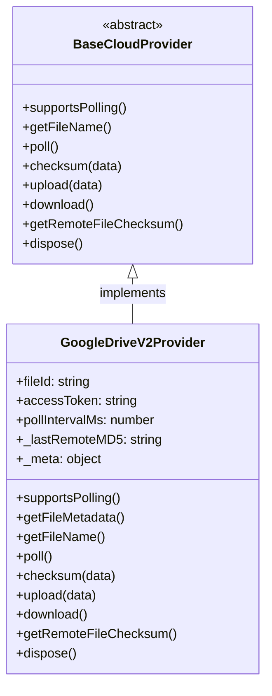
*Caption: Google Drive V2 Provider class diagram showing inheritance from BaseCloudProvider*

## Requirements

### Requirement: Provider Instantiation

The Google Drive V2 Provider SHALL be instantiated with a configuration object containing required properties.

The configuration object SHALL contain the following required properties:
- `fileId`: A string containing the Google Drive file ID
- `accessToken`: A string containing the Bearer access token for authentication

The configuration object MAY contain the following optional properties:
- `pollIntervalMs`: A number specifying the polling interval in milliseconds (defaults to 8000)

The constructor SHALL throw an error with a descriptive message if `fileId` or `accessToken` is missing.

**Implementation**: `providers/google-drive-v2/GoogleDriveV2Provider.js:5-14`
**Verification**: Unit tests for constructor validation

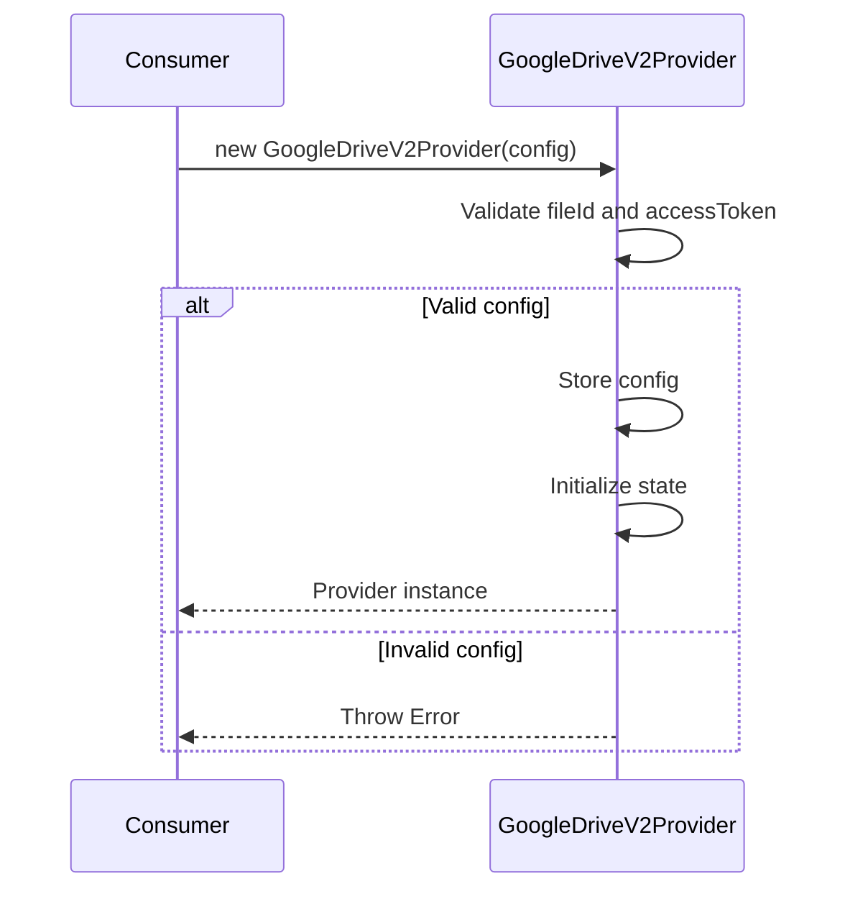
*Caption: Google Drive V2 Provider instantiation sequence with validation*

#### Scenario: Successful instantiation with required config
- **WHEN** `new GoogleDriveV2Provider({ fileId: 'abc123', accessToken: 'xyz789' })` is called
- **THEN** system creates and returns a GoogleDriveV2Provider instance

#### Scenario: Missing fileId throws error
- **WHEN** `new GoogleDriveV2Provider({ accessToken: 'xyz789' })` is called
- **THEN** system throws an error with message 'fileId and accessToken required for Google Drive v2'

#### Scenario: Missing accessToken throws error
- **WHEN** `new GoogleDriveV2Provider({ fileId: 'abc123' })` is called
- **THEN** system throws an error with message 'fileId and accessToken required for Google Drive v2'

#### Scenario: Custom pollIntervalMs used
- **WHEN** `new GoogleDriveV2Provider({ fileId: 'abc123', accessToken: 'xyz789', pollIntervalMs: 5000 })` is called
- **THEN** system uses 5000 as the polling interval

#### Scenario: Default pollIntervalMs used
- **WHEN** `new GoogleDriveV2Provider({ fileId: 'abc123', accessToken: 'xyz789' })` is called
- **THEN** system uses 8000 as the default polling interval

---

### Requirement: Polling Support

The Google Drive V2 Provider SHALL support polling for remote file changes.

The `supportsPolling()` method SHALL return `true`.

**Implementation**: `providers/google-drive-v2/GoogleDriveV2Provider.js:16`
**Verification**: Unit tests for polling support

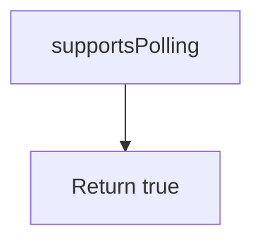
*Caption: Simple flowchart for polling support*

#### Scenario: Polling support returns true
- **WHEN** `provider.supportsPolling()` is called
- **THEN** system returns true

---

### Requirement: Metadata Fetching

The Google Drive V2 Provider SHALL provide a method to fetch file metadata from Google Drive API v2.

The `getFileMetadata()` method SHALL:
- Construct the API URL as `https://www.googleapis.com/drive/v2/files/{fileId}`
- Send a GET request with the Authorization header: `Bearer {accessToken}`
- If the response is not OK, throw an error with the status code
- Store the metadata response in the `_meta` property
- Return the metadata object

**Implementation**: `providers/google-drive-v2/GoogleDriveV2Provider.js:18-24`
**Verification**: Unit tests for metadata fetching

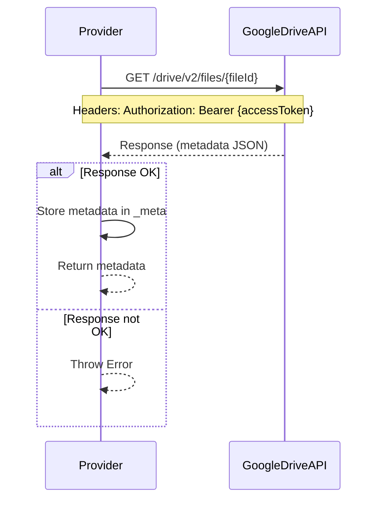
*Caption: Metadata fetching sequence with error handling*

#### Scenario: Metadata fetched successfully
- **WHEN** `provider.getFileMetadata()` is called with valid fileId and accessToken
- **THEN** system makes GET request to Google Drive API v2 and returns metadata object

#### Scenario: Metadata fetch with correct URL
- **WHEN** `provider.getFileMetadata()` is called with fileId 'test-file-id'
- **THEN** system makes request to `https://www.googleapis.com/drive/v2/files/test-file-id`

#### Scenario: Metadata fetch with correct headers
- **WHEN** `provider.getFileMetadata()` is called with accessToken 'test-token'
- **THEN** system includes header `Authorization: Bearer test-token` in the request

#### Scenario: Metadata fetch error handling
- **WHEN** Google Drive API returns non-OK response with status 404
- **THEN** system throws error with message 'metadata fetch failed: 404'

---

### Requirement: File Name Retrieval

The Google Drive V2 Provider SHALL retrieve the file name from Google Drive metadata.

The `getFileName()` method SHALL:
- Call `getFileMetadata()` to fetch the metadata
- Return the `title` property from the metadata if it exists
- Return `null` if the metadata or title is missing

**Implementation**: `providers/google-drive-v2/GoogleDriveV2Provider.js:26-29`
**Verification**: Unit tests for file name retrieval

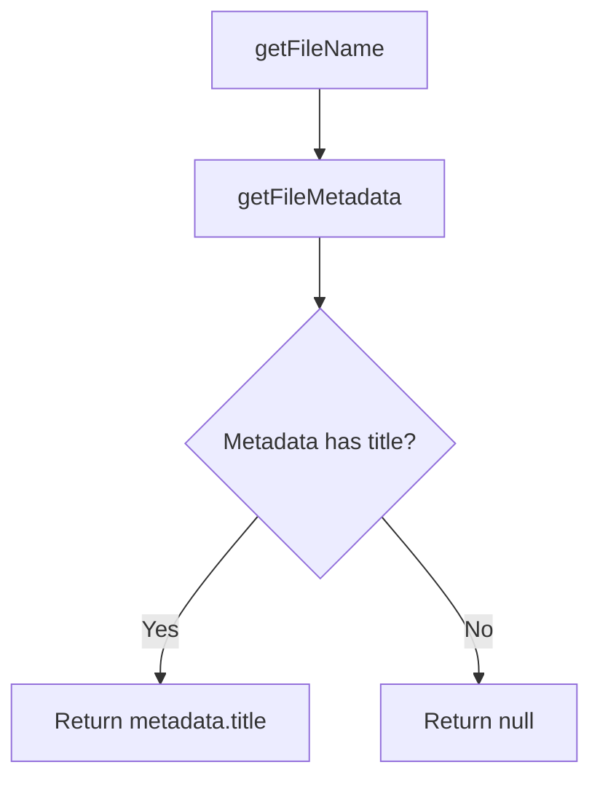
*Caption: File name retrieval flowchart with metadata fetching*

#### Scenario: Return file title from metadata
- **WHEN** `provider.getFileName()` is called and metadata contains `{ title: 'test.txt', ... }`
- **THEN** system returns 'test.txt'

#### Scenario: Return null when metadata has no title
- **WHEN** `provider.getFileName()` is called and metadata contains `{ md5Checksum: 'abc' }` without title
- **THEN** system returns null

#### Scenario: Return null when metadata is null
- **WHEN** `provider.getFileName()` is called and getFileMetadata returns null
- **THEN** system returns null

---

### Requirement: File Download

The Google Drive V2 Provider SHALL download file content from Google Drive.

The `download()` method SHALL:
- Check if the file is a Google Apps file by examining `_meta.mimeType`
- If the mimeType starts with `application/vnd.google-apps.`, throw an error with an **enhanced error message** containing the file type name (e.g., 'Google Docs'), an explanation (not downloadable as binary content), and an actionable suggestion (use the Google Drive web interface to export)
- Construct the download URL as `https://www.googleapis.com/drive/v2/files/{fileId}?alt=media`
- Send a GET request with the Authorization header: `Bearer {accessToken}`
- If the response is not OK, throw an error with the status code
- Return the response as an ArrayBuffer

**Implementation**: `providers/google-drive-v2/GoogleDriveV2Provider.js:41-55`
**Verification**: Unit tests for file download with enhanced error messages

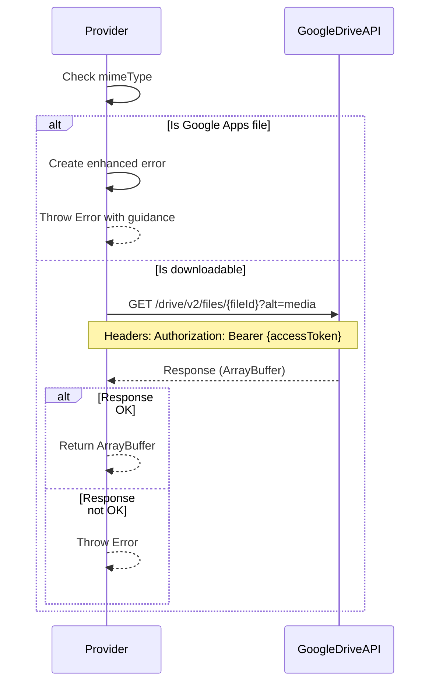
*Caption: File download sequence with enhanced Google Apps file error handling*

#### Scenario: Download file content successfully
- **WHEN** `provider.download()` is called with valid fileId and accessToken
- **THEN** system makes GET request to Google Drive API v2 with alt=media and returns ArrayBuffer

#### Scenario: Download non-Google Apps file successfully
- **WHEN** `provider.download()` is called for non-Google Apps file
- **THEN** system downloads and returns ArrayBuffer as before

#### Scenario: Download with correct URL
- **WHEN** `provider.download()` is called with fileId 'test-file-id'
- **THEN** system makes request to `https://www.googleapis.com/drive/v2/files/test-file-id?alt=media`

#### Scenario: Download with correct headers
- **WHEN** `provider.download()` is called with accessToken 'test-token'
- **THEN** system includes header `Authorization: Bearer test-token` in the request

#### Scenario: Throw enhanced error for Google Apps files
- **WHEN** `provider.download()` is called and _meta.mimeType is 'application/vnd.google-apps.document'
- **THEN** system throws error with message containing file type, explanation, and suggestion

#### Scenario: Enhanced error message format
- **WHEN** download fails for Google Apps file
- **THEN** error message includes: file type (e.g., 'Google Docs'), reason (not downloadable as binary), and suggestion (use Google Drive web interface to export)

#### Scenario: Download error handling for API errors
- **WHEN** Google Drive API returns non-OK response with status 500
- **THEN** system throws error with message 'download failed: 500'

---

### Requirement: File Upload

The Google Drive V2 Provider SHALL upload file content to Google Drive.

The `upload(data)` method SHALL:
- Construct the upload URL as `https://www.googleapis.com/upload/drive/v2/files/{fileId}?uploadType=media`
- Send a PUT request with:
  - The Authorization header: `Bearer {accessToken}`
  - The Content-Type header: `_meta.mimeType` or 'application/octet-stream' if mimeType is not available
  - The request body containing the data (ArrayBuffer)
- If the response is not OK, throw an error with the status code
- Store the response metadata in the `_meta` property
- Store the `md5Checksum` from the response in the `_lastRemoteMD5` property

**Implementation**: `providers/google-drive-v2/GoogleDriveV2Provider.js:42-57`
**Verification**: Unit tests for file upload

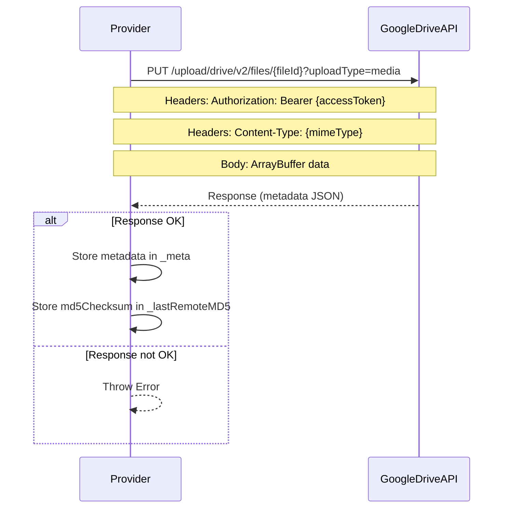
*Caption: File upload sequence with PUT method and metadata storage*

#### Scenario: Upload file content successfully
- **WHEN** `provider.upload(data)` is called with valid data, fileId, and accessToken
- **THEN** system makes PUT request to Google Drive API v2 upload endpoint and stores response metadata

#### Scenario: Upload with correct URL
- **WHEN** `provider.upload(data)` is called with fileId 'test-file-id'
- **THEN** system makes request to `https://www.googleapis.com/upload/drive/v2/files/test-file-id?uploadType=media`

#### Scenario: Upload with correct method
- **WHEN** `provider.upload(data)` is called
- **THEN** system uses HTTP PUT method for the request

#### Scenario: Upload with correct headers
- **WHEN** `provider.upload(data)` is called with accessToken 'test-token' and _meta.mimeType 'text/plain'
- **THEN** system includes headers `Authorization: Bearer test-token` and `Content-Type: text/plain` in the request

#### Scenario: Upload with default Content-Type
- **WHEN** `provider.upload(data)` is called and _meta.mimeType is not available
- **THEN** system uses 'application/octet-stream' as Content-Type header

#### Scenario: Upload stores metadata and checksum
- **WHEN** `provider.upload(data)` is called and API returns `{ md5Checksum: 'abc123', ... }`
- **THEN** system stores metadata in _meta and 'abc123' in _lastRemoteMD5

#### Scenario: Upload error handling
- **WHEN** Google Drive API returns non-OK response with status 403
- **THEN** system throws error with message 'upload failed: 403'

---

### Requirement: Change Polling

The Google Drive V2 Provider SHALL detect remote file changes using MD5 checksum comparison.

The `poll()` method SHALL:
- Call `getFileMetadata()` to fetch current metadata
- Extract the `md5Checksum` from the metadata
- If `_lastRemoteMD5` is null (first poll), store the checksum and return `false`
- Compare the current checksum with `_lastRemoteMD5`
- Update `_lastRemoteMD5` with the current checksum
- Return `true` if checksums differ, `false` if they match

**Implementation**: `providers/google-drive-v2/GoogleDriveV2Provider.js:59-69`
**Verification**: Unit tests for change polling

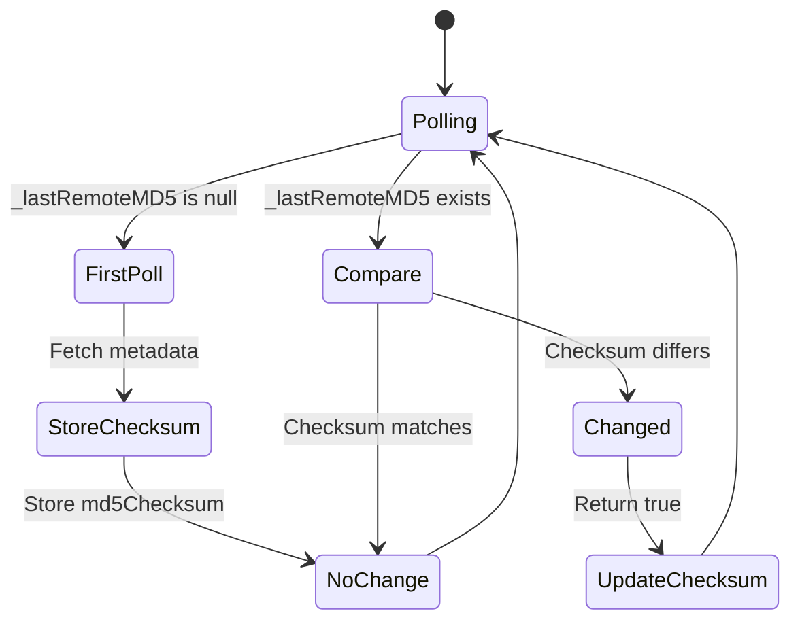
*Caption: Change polling state machine with first poll and comparison logic*

#### Scenario: First poll returns false
- **WHEN** `provider.poll()` is called for the first time
- **THEN** system stores the remote MD5 checksum and returns false

#### Scenario: Polling detects change
- **WHEN** `provider.poll()` is called and remote checksum differs from _lastRemoteMD5
- **THEN** system updates _lastRemoteMD5 and returns true

#### Scenario: Polling detects no change
- **WHEN** `provider.poll()` is called and remote checksum matches _lastRemoteMD5
- **THEN** system returns false

#### Scenario: Polling with null md5Checksum
- **WHEN** `provider.poll()` is called and metadata has no md5Checksum field
- **THEN** system stores null in _lastRemoteMD5 and returns false

---

### Requirement: Remote File Checksum

The Google Drive V2 Provider SHALL provide access to the last known remote file checksum.

The `getRemoteFileChecksum()` method SHALL:
- Return the value stored in `_lastRemoteMD5`
- Return `null` if no checksum has been stored yet

**Implementation**: `providers/google-drive-v2/GoogleDriveV2Provider.js:71-73`
**Verification**: Unit tests for remote checksum retrieval

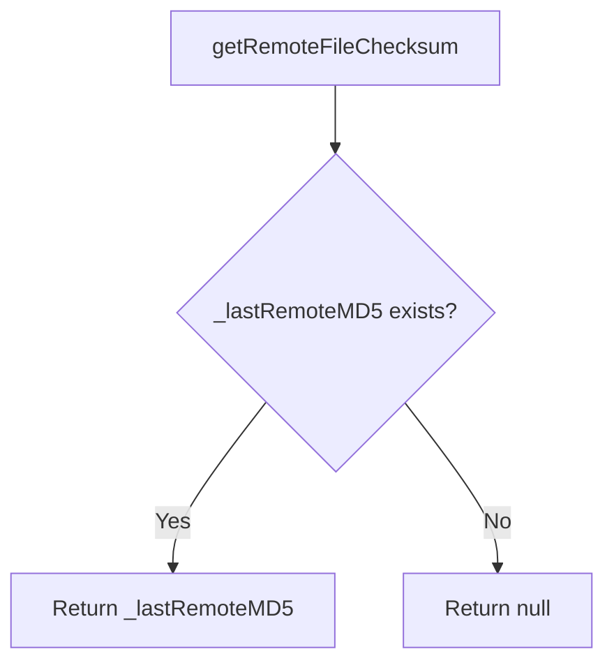
*Caption: Remote checksum retrieval flowchart*

#### Scenario: Return stored remote checksum
- **WHEN** `provider.getRemoteFileChecksum()` is called and _lastRemoteMD5 is 'abc123'
- **THEN** system returns 'abc123'

#### Scenario: Return null when no checksum available
- **WHEN** `provider.getRemoteFileChecksum()` is called and _lastRemoteMD5 is null
- **THEN** system returns null

---

### Requirement: Local Data Checksum

The Google Drive V2 Provider SHALL compute checksums for local data using the MD5 algorithm.

The `checksum(data)` method SHALL:
- Accept ArrayBuffer data as input
- Call `md5FromArrayBuffer(data)` from the utils module
- Return the resulting checksum string
- Return `null` if an error occurs during checksum computation

**Implementation**: `providers/google-drive-v2/GoogleDriveV2Provider.js:75-81`
**Verification**: Unit tests for local checksum computation

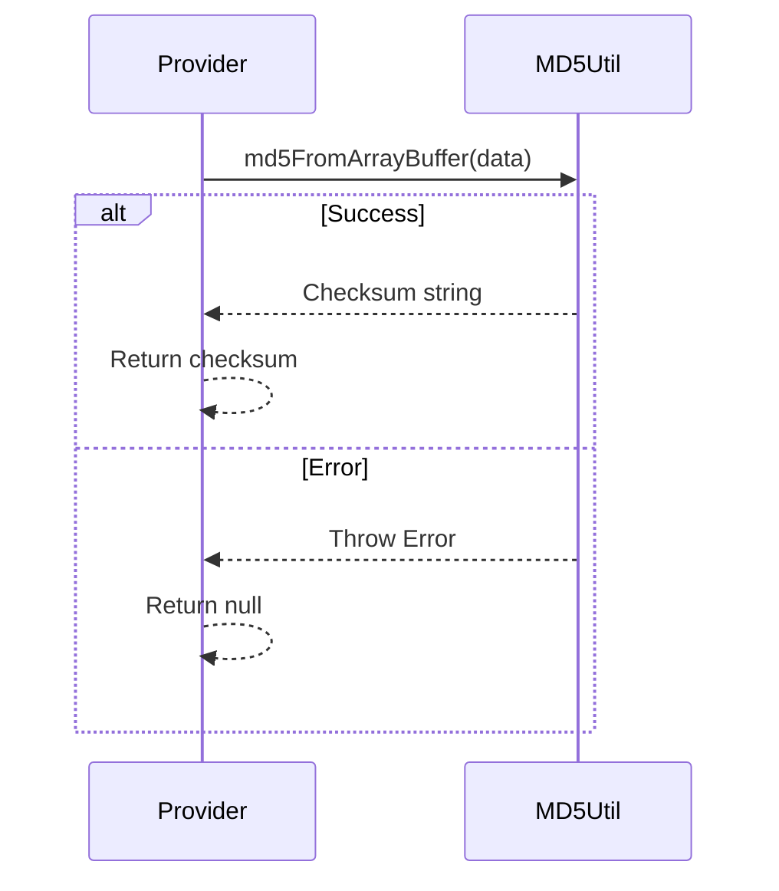
*Caption: Local checksum computation sequence with error handling*

#### Scenario: Compute checksum for data successfully
- **WHEN** `provider.checksum(data)` is called with valid ArrayBuffer data
- **THEN** system calls md5FromArrayBuffer and returns the checksum string

#### Scenario: Return null on checksum error
- **WHEN** `provider.checksum(data)` is called and md5FromArrayBuffer throws an error
- **THEN** system returns null

---

### Requirement: Resource Cleanup

The Google Drive V2 Provider SHALL provide a method for resource cleanup.

The `dispose()` method SHALL:
- Be defined to satisfy the BaseCloudProvider interface
- Not throw errors if called
- May perform cleanup operations (currently a no-op in this implementation)

**Implementation**: `providers/BaseCloudProvider.js:11` (inherited)
**Verification**: Interface compliance check

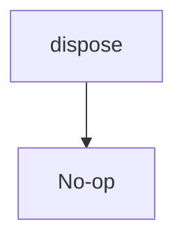
*Caption: Resource cleanup flowchart - currently a no-op*

#### Scenario: Dispose method exists
- **WHEN** `provider.dispose()` is called
- **THEN** system executes without errors

---

### Requirement: Interface Compliance

The Google Drive V2 Provider SHALL fully implement the BaseCloudProvider interface.

The provider SHALL implement all required methods:
- `constructor(config)` - Initializes with fileId and accessToken
- `supportsPolling()` - Returns true
- `getFileName()` - Returns Promise<string|null> with file title
- `poll()` - Returns Promise<bool> indicating if file changed
- `checksum(data)` - Returns Promise<string> with MD5 hash
- `upload(data)` - Returns Promise<void> for uploading data
- `download()` - Returns Promise<ArrayBuffer> with file content
- `getRemoteFileChecksum()` - Returns Promise<string> with remote MD5
- `dispose()` - Cleans up resources

**Implementation**: `providers/google-drive-v2/GoogleDriveV2Provider.js:5-82`
**Verification**: Provider interface validation, unit tests

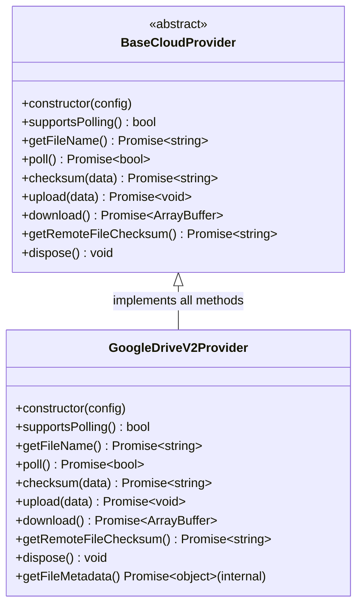
*Caption: Interface compliance class diagram showing all implemented methods*

#### Scenario: All required methods implemented
- **WHEN** provider is instantiated
- **THEN** all BaseCloudProvider methods are available and callable

---

### Requirement: Provider Type Registration

The Google Drive V2 Provider SHALL be registered as a valid provider type in the core library.

Consumers SHALL be able to instantiate the provider using:
- Type: `'google-drive-v2'`
- Configuration: `{ fileId: string, accessToken: string, pollIntervalMs?: number }`

The core library SHALL create an instance of GoogleDriveV2Provider when type `'google-drive-v2'` is specified.

**Implementation**: `providers/google-drive-v2/index.js:1`, `src/OpfsCloudFile.js:13-14`
**Verification**: Integration tests with provider type

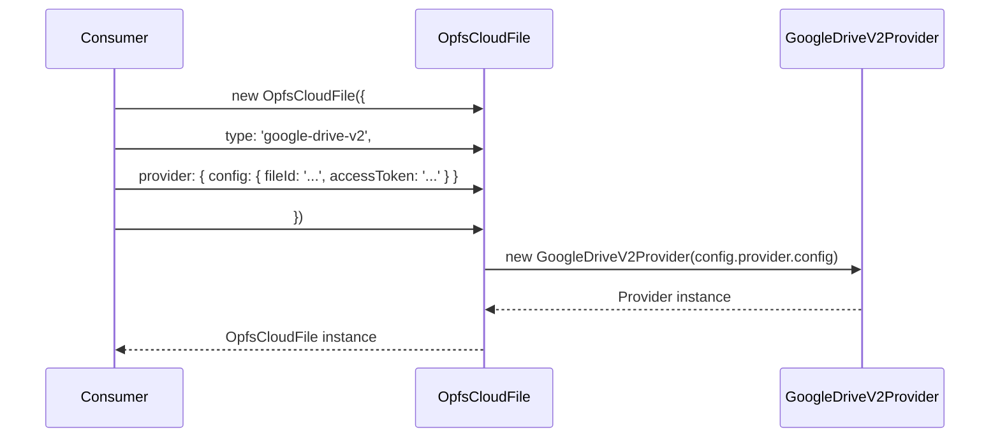
*Caption: Provider type registration sequence for google-drive-v2 type*

#### Scenario: Provider created via type string
- **WHEN** `new OpfsCloudFile({ type: 'google-drive-v2', provider: { config: { fileId: 'abc', accessToken: 'xyz' } } })` is called
- **THEN** system creates GoogleDriveV2Provider instance and initializes OpfsCloudFile

---

## Traceability

| Requirement | Implementation | Verification |
|-------------|----------------|--------------|
| Provider Instantiation | `providers/google-drive-v2/GoogleDriveV2Provider.js:5-14` | Unit tests for constructor validation |
| Polling Support | `providers/google-drive-v2/GoogleDriveV2Provider.js:16` | Unit tests for polling support |
| Metadata Fetching | `providers/google-drive-v2/GoogleDriveV2Provider.js:18-24` | Unit tests for metadata fetching |
| File Name Retrieval | `providers/google-drive-v2/GoogleDriveV2Provider.js:26-29` | Unit tests for file name retrieval |
| File Download | `providers/google-drive-v2/GoogleDriveV2Provider.js:41-55` | Unit tests for enhanced error messages |
| File Upload | `providers/google-drive-v2/GoogleDriveV2Provider.js:42-57` | Unit tests for file upload |
| Change Polling | `providers/google-drive-v2/GoogleDriveV2Provider.js:59-69` | Unit tests for change polling |
| Remote File Checksum | `providers/google-drive-v2/GoogleDriveV2Provider.js:71-73` | Unit tests for remote checksum |
| Local Data Checksum | `providers/google-drive-v2/GoogleDriveV2Provider.js:75-81` | Unit tests for local checksum |
| Resource Cleanup | `providers/BaseCloudProvider.js:11` (inherited) | Interface compliance check |
| Interface Compliance | `providers/google-drive-v2/GoogleDriveV2Provider.js:5-82` | Provider interface validation |
| Provider Type Registration | `providers/google-drive-v2/index.js:1`, `src/OpfsCloudFile.js:13-14` | Integration tests |

---

*Document Version: 1.1.0*  
*Last Updated: 2026-07-16*  
*Status: Draft*  
*Author: Mistral Vibe*  
*Dependencies: opfs-cloud-file baseline specification*
