# Infrastructure Baseline Specification

## Purpose

This specification defines the complete infrastructure requirements for the opfs-cloud-file project, including build system, testing system, CI/CD pipeline, dependency management, and release management.

All requirements are defined using declarative language with verifiable acceptance criteria and Mermaid diagrams for visualization of complex workflows.

## Requirements

### Requirement: Build System Configuration

The project SHALL use Vite 7.x as the primary build tool with vite-plugin-dts for TypeScript declaration generation.

The build system SHALL output both ESM (ES Modules) and UMD (Universal Module Definition) formats.

The build system SHALL support library mode with appropriate entry points.

The build system SHALL preserve TypeScript strict mode settings during compilation.

**Implementation**: vite.config.js, tsconfig.json
**Verification**: npm run build

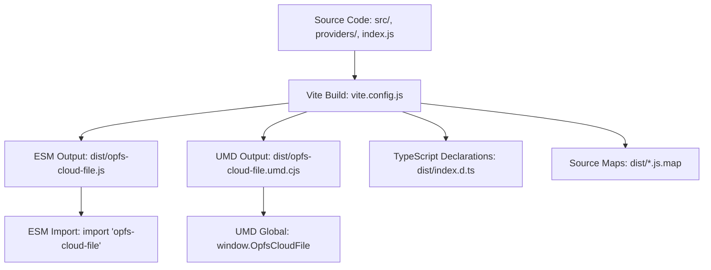
*Caption: Vite build system workflow for ESM and UMD outputs with TypeScript declarations*

#### Scenario: Successful library build
- **WHEN** `npm run build` is executed
- **THEN** system generates `opfs-cloud-file.js` (ESM) and `opfs-cloud-file.umd.cjs` (UMD) in dist/ directory

#### Scenario: TypeScript declarations generated
- **WHEN** build completes successfully
- **THEN** system generates TypeScript declaration files (.d.ts) in dist/ directory

#### Scenario: Source maps generated
- **WHEN** build completes successfully
- **THEN** system generates source map files for debugging

---

### Requirement: Testing System Configuration

The project SHALL use Jest 30.x as the primary testing framework.

The testing system SHALL configure jsdom environment for DOM-related tests.

The testing system SHALL transform source code using Babel with @babel/preset-env.

The testing system SHALL run on Node.js 24.x environment.

The testing system SHALL support asynchronous test execution.

The testing system SHALL output Jest text coverage report to stdout.

The testing system SHALL generate LCOV coverage report at `coverage/lcov.info`.

**Implementation**: jest.config.cjs (coverageReporters configuration), babel.config.json, .github/workflows/test.yml
**Verification**: npm test -- --coverage

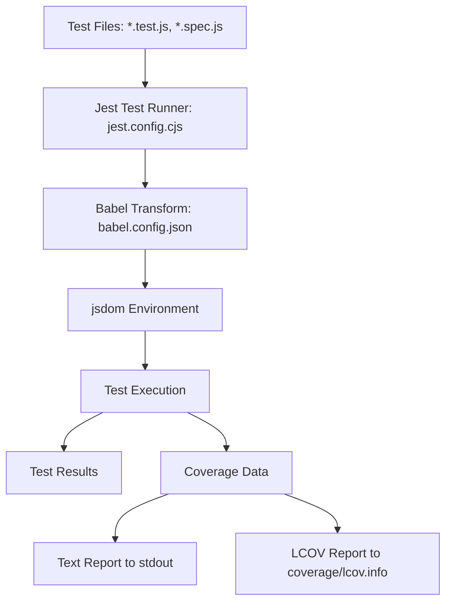
*Caption: Jest testing system workflow with Babel transformation, jsdom environment, and coverage report output*

#### Scenario: Tests execute successfully
- **WHEN** `npm test` is executed
- **THEN** all defined tests run and complete successfully

#### Scenario: Tests execute on Node.js 24.x
- **WHEN** `npm test` is executed in Node.js 24.x environment
- **THEN** all defined tests run and complete successfully

#### Scenario: jsdom environment available
- **WHEN** tests requiring DOM APIs are executed
- **THEN** jsdom environment provides necessary DOM APIs

#### Scenario: jsdom environment available on Node.js 24.x
- **WHEN** tests requiring DOM APIs are executed on Node.js 24.x
- **THEN** jsdom environment provides necessary DOM APIs

#### Scenario: Babel transformation applied
- **WHEN** tests with modern JavaScript syntax are executed
- **THEN** Babel transforms code to runnable format

#### Scenario: Text coverage report output to stdout
- **WHEN** `npm test -- --coverage` is executed
- **THEN** system outputs text coverage report to stdout

#### Scenario: LCOV coverage report generated at coverage/lcov.info
- **WHEN** `npm test -- --coverage` is executed
- **THEN** system creates coverage/lcov.info file with LCOV format coverage data

---

### Requirement: Test Coverage Configuration

The testing system SHALL enforce minimum test coverage thresholds of 80% for statements, branches, functions, and lines globally.

The testing system SHALL collect coverage data for all applicable source files in the project.

The testing system SHALL generate coverage reports in text format for human readability.

The testing system SHALL generate coverage reports in LCOV format for machine processing.

The testing system SHALL output coverage reports to ./coverage directory.

**Implementation**: jest.config.cjs (coverage thresholds), package.json (test scripts)
**Verification**: npm test -- --coverage

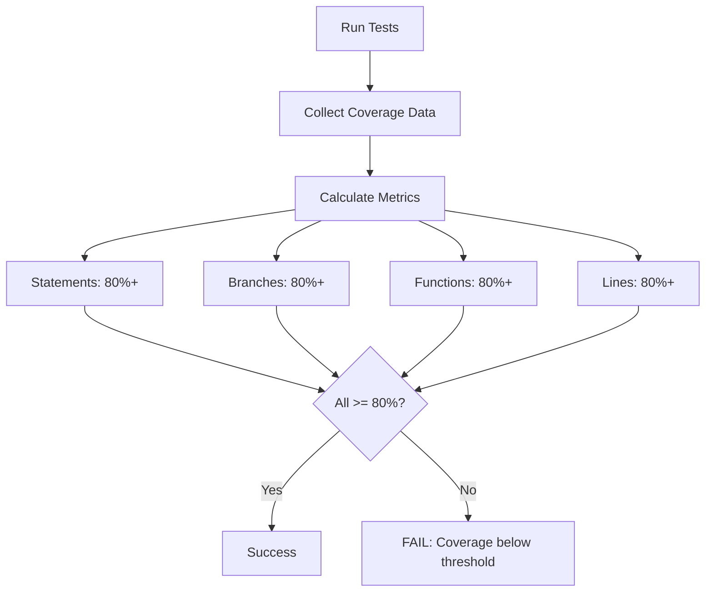
*Caption: Test coverage collection and threshold enforcement workflow with explicit metrics*

#### Scenario: Coverage data collected
- **WHEN** `npm test` is executed with coverage enabled
- **THEN** system collects coverage data for all source files

#### Scenario: Coverage reports generated
- **WHEN** tests complete with coverage enabled
- **THEN** system generates text and LCOV coverage reports in ./coverage directory

#### Scenario: Statement coverage meets minimum threshold
- **WHEN** `npm test -- --coverage` is executed
- **THEN** system reports statement coverage at or above 80%

#### Scenario: Branch coverage meets minimum threshold
- **WHEN** `npm test -- --coverage` is executed
- **THEN** system reports branch coverage at or above 80%

#### Scenario: Function coverage meets minimum threshold
- **WHEN** `npm test -- --coverage` is executed
- **THEN** system reports function coverage at or above 80%

#### Scenario: Line coverage meets minimum threshold
- **WHEN** `npm test -- --coverage` is executed
- **THEN** system reports line coverage at or above 80%

#### Scenario: Minimum coverage threshold enforced
- **WHEN** test coverage is below 80%
- **THEN** system fails the test run with coverage threshold error

---

### Requirement: CI/CD Pipeline Configuration

The project SHALL use GitHub Actions as the CI/CD platform.

The CI/CD pipeline SHALL execute on push and pull_request events to all branches.

The CI/CD pipeline SHALL use ubuntu-latest as the execution environment.

The CI/CD pipeline SHALL setup Node.js 24.x environment for all jobs.

The CI/CD pipeline SHALL install dependencies using `npm ci` for reproducible builds.

The CI/CD pipeline SHALL trigger the publish workflow on push events for tags matching the pattern `v?[0-9]+.[0-9]+.[0-9]*` (semantic version tags with optional v prefix).

The CI/CD pipeline SHALL use a single unified workflow for both validation and publishing to eliminate redundancy.

**Implementation**: .github/workflows/test.yml, .github/workflows/build.yml, .github/workflows/publish.yml
**Verification**: GitHub Actions execution

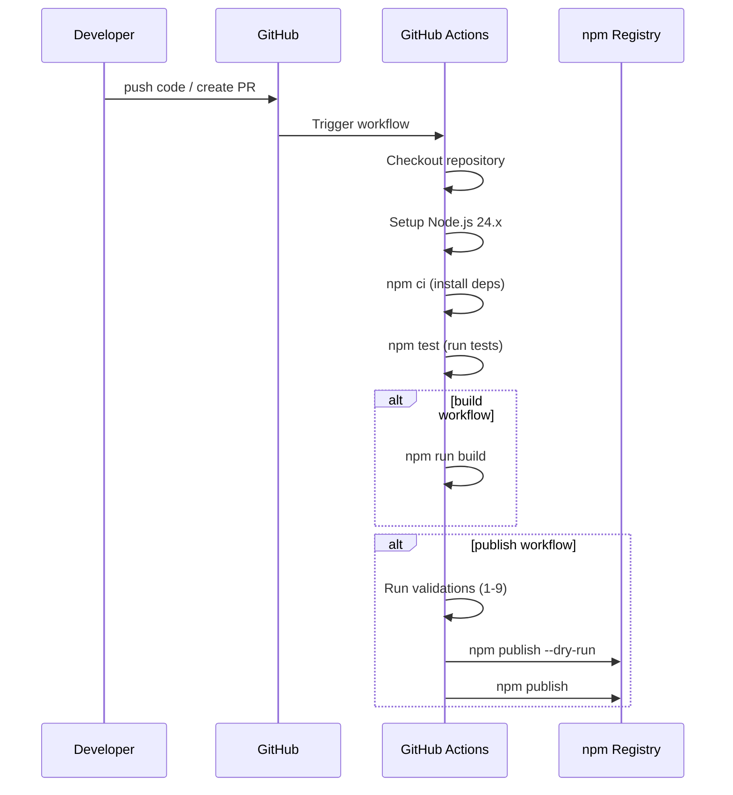
*Caption: CI/CD pipeline sequence for push, PR, and release events*

#### Scenario: Test workflow triggers on push
- **WHEN** code is pushed to any branch
- **THEN** test.yml workflow executes automatically

#### Scenario: Test workflow triggers on PR
- **WHEN** pull request is created to any branch
- **THEN** test.yml workflow executes automatically

#### Scenario: Build workflow executes successfully
- **WHEN** code is merged to main branch
- **THEN** build.yml workflow builds the library successfully

#### Scenario: Publish workflow executes on version tag push with v prefix
- **WHEN** a git tag matching pattern `vX.Y.Z` is pushed to the repository
- **THEN** publish.yml workflow executes automatically

#### Scenario: Publish workflow executes on version tag push without v prefix
- **WHEN** a git tag matching pattern `X.Y.Z` is pushed to the repository
- **THEN** publish.yml workflow executes automatically

#### Scenario: Publish workflow does not trigger on non-version tags
- **WHEN** a git tag not matching pattern `v?[0-9]+.[0-9]+.[0-9]*` is pushed
- **THEN** publish.yml workflow does NOT execute

#### Scenario: Single unified workflow for publishing
- **WHEN** publish validation is needed
- **THEN** a single publish.yml workflow handles all validation and publishing logic

#### Scenario: Dependencies installed reproducibly
- **WHEN** CI workflow executes
- **THEN** `npm ci` installs exact dependency versions from package-lock.json

---

### Requirement: Dependency Management

The project SHALL use npm as the exclusive package manager.

The project SHALL lock all dependency versions using package-lock.json.

The project SHALL use `npm ci` for installation in CI environments.

The project SHALL document all development dependencies in package.json.

The project SHALL include type definitions for all TypeScript-consuming dependencies.

**Implementation**: package.json, package-lock.json
**Verification**: npm ci

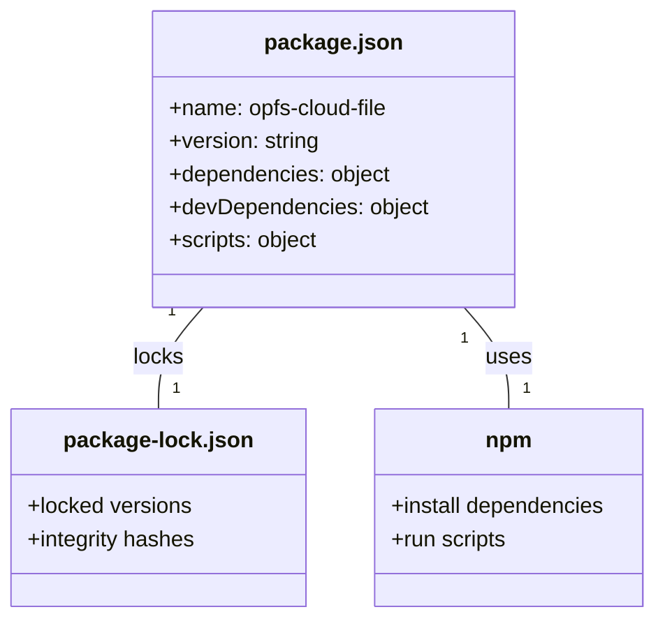
*Caption: npm dependency management structure with package.json and package-lock.json*

#### Scenario: Dependencies installed
- **WHEN** `npm ci` is executed
- **THEN** system installs all dependencies without errors

#### Scenario: Version locking maintained
- **WHEN** package.json is modified
- **THEN** package-lock.json is updated to match

#### Scenario: Type definitions available
- **WHEN** TypeScript code imports external dependencies
- **THEN** type definitions are available for type checking

---

### Requirement: Release Management

The project SHALL follow Semantic Versioning (semver) 2.0.0 specification for all releases.

The project SHALL use MAJOR.MINOR.PATCH format for stable releases.

The project SHALL support pre-release versions with identifiers: alpha, beta, rc as an OPTIONAL path.

The project SHALL publish to the public npm registry.

The project SHALL include prepublishOnly script for pre-publish validation.

The project SHALL maintain a CHANGELOG.md file for tracking release history as a REQUIRED artifact.

The project SHALL ensure that SemVer version tag MUST match package.json version exactly with no discrepancies.

The publishing workflow SHALL trigger automatically when a semantic version tag is pushed to the repository.

**Implementation**: package.json (version field), CHANGELOG.md, .github/workflows/publish.yml
**Verification**: Version comparison between git tag and package.json, workflow execution on tag push

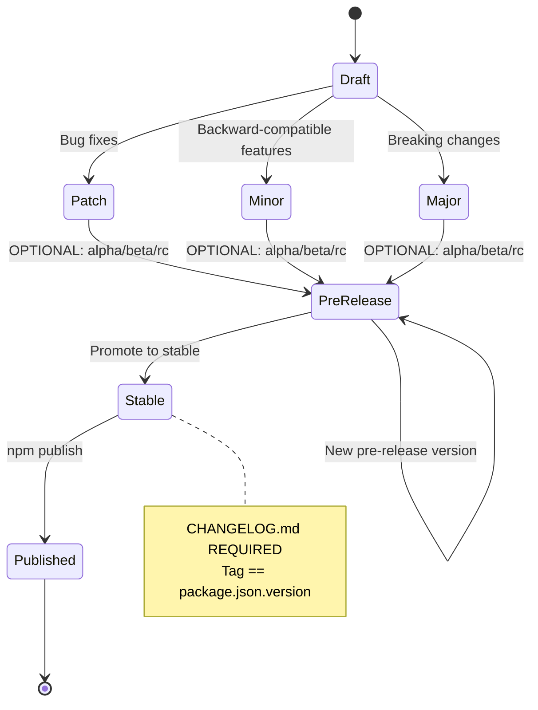
*Caption: Semantic versioning state machine with optional pre-release versions and required changelog*

#### Scenario: Semantic versioning followed
- **WHEN** new version is released
- **THEN** version follows MAJOR.MINOR.PATCH format

#### Scenario: Pre-release versions are optional
- **WHEN** project decides on release strategy
- **THEN** project MAY choose to use prerelease versions (alpha, beta, rc) OR may use only stable releases

#### Scenario: CHANGELOG.md is required for releases
- **WHEN** a release is prepared
- **THEN** CHANGELOG.md file MUST exist in the repository root

#### Scenario: Version tag matches package.json version exactly (with v prefix)
- **WHEN** a version tag `vX.Y.Z` is pushed
- **THEN** the git tag version (with v stripped) MUST be identical to package.json version field

#### Scenario: Version tag matches package.json version exactly (without v prefix)
- **WHEN** a version tag `X.Y.Z` is pushed
- **THEN** the git tag version MUST be identical to package.json version field

#### Scenario: Package published to npm
- **WHEN** publish workflow completes successfully
- **THEN** package is available on npm registry

#### Scenario: Publish triggered by version tag push
- **WHEN** a semantic version tag is pushed
- **THEN** publish workflow executes and publishes to npm registry

#### Scenario: Pre-release versions trigger publish
- **WHEN** a pre-release tag matching `v*-*`-pattern is pushed (e.g., `v1.0.0-alpha.1`)
- **THEN** publish workflow executes and publishes pre-release version to npm registry

#### Scenario: Prepublish validation runs
- **WHEN** npm publish is executed
- **THEN** prepublishOnly script runs to validate build

---

### Requirement: OPFS Mock Requirements (ADDED)

The testing system SHALL provide deterministic mock implementations for OPFS APIs that are not supported by jsdom.

The testing system SHALL ensure OPFS mocks are resettable between test executions to maintain test isolation.

The testing system SHALL ensure OPFS mocks provide behavior that is compatible with the actual OPFS API interface.

**Implementation**: Test setup files (jest.setup.js or similar)
**Verification**: Test execution with OPFS-dependent code

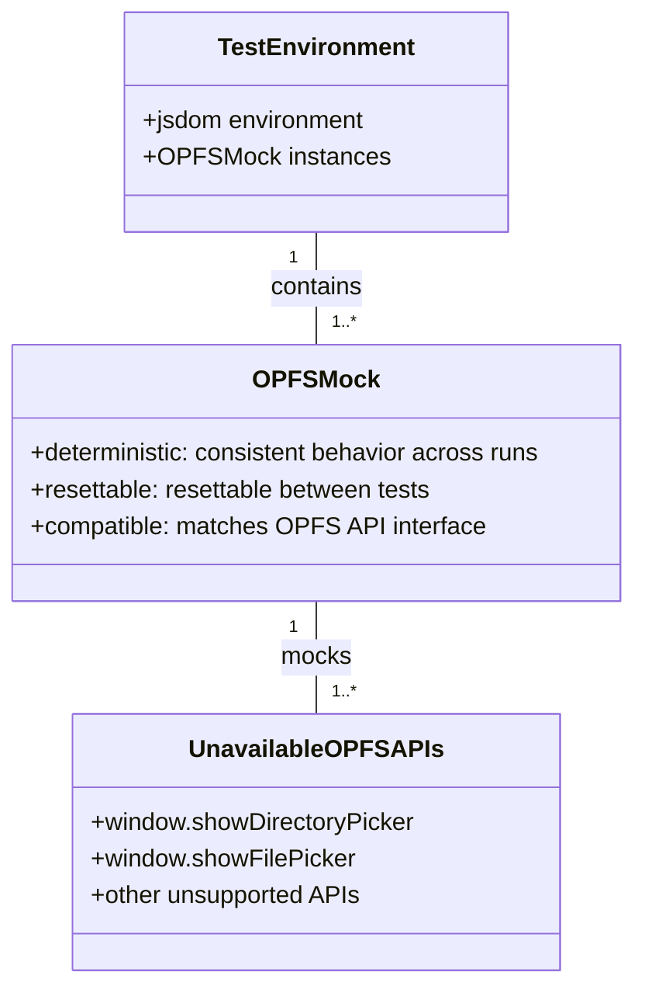
*Caption: OPFS mock structure for unavailable APIs in jsdom test environment*

#### Scenario: Deterministic OPFS mock behavior
- **WHEN** the same test is executed multiple times
- **THEN** OPFS mocks produce identical results each time

#### Scenario: Resettable OPFS mocks between tests
- **WHEN** a new test begins execution
- **THEN** OPFS mocks are in their initial state, isolated from previous tests

#### Scenario: Compatible OPFS mock API interface
- **WHEN** code calls mocked OPFS APIs
- **THEN** the mock accepts the same parameters and returns compatible values as the real OPFS API

---

### Requirement: Entry Point Validation (ADDED)

The build system SHALL verify that package entry points (ESM, UMD) are usable by consumer code through import and global access patterns.

The build system SHALL verify that TypeScript declaration files are usable by TypeScript consumers for type checking and IntelliSense.

**Implementation**: Build verification scripts, consumer test projects
**Verification**: Package installation and usage in consumer environment

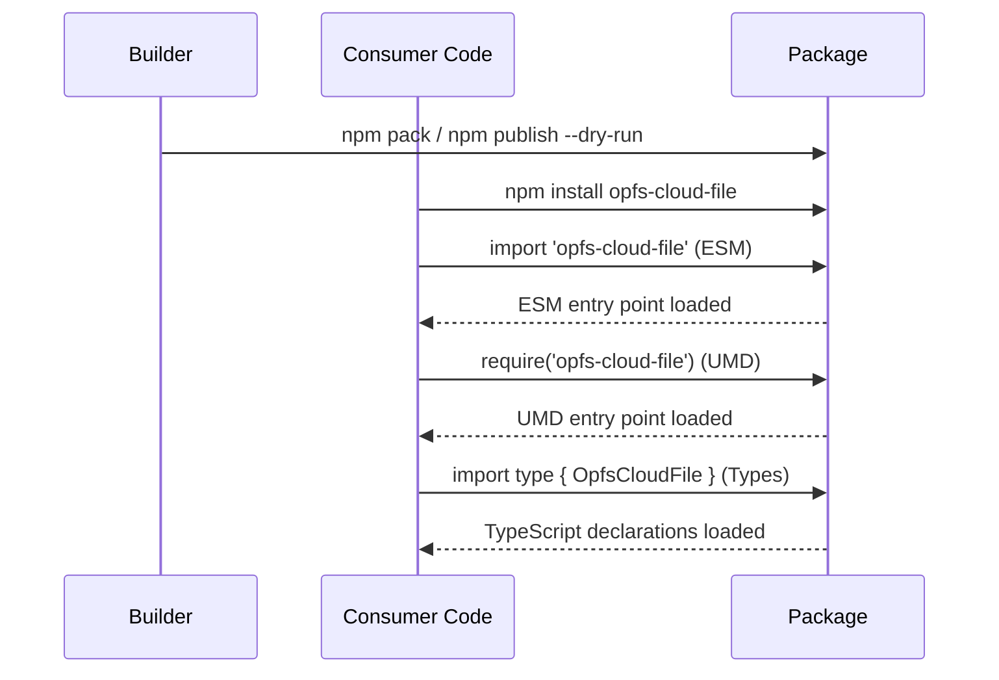
*Caption: Entry point and declaration validation sequence from consumer perspective*

#### Scenario: ESM entry point is usable by consumers
- **WHEN** consumer code executes `import 'opfs-cloud-file'`
- **THEN** ESM entry point loads successfully without errors

#### Scenario: UMD entry point is usable by consumers
- **WHEN** consumer code executes `require('opfs-cloud-file')` or uses browser global
- **THEN** UMD entry point loads successfully without errors

#### Scenario: TypeScript declarations are usable by consumers
- **WHEN** consumer TypeScript code imports types from 'opfs-cloud-file'
- **THEN** TypeScript compiler successfully resolves types without errors

---

### Requirement: Package Contents Validation (ADDED)

The publishing system SHALL verify package contents before publication to ensure no error files are included.

The publishing system SHALL verify package contents before publication to ensure no sensitive files (credentials, secrets, private keys) are included.

The publishing system SHALL verify package contents before publication to ensure no unnecessary files (development dependencies, build artifacts, temporary files) are included.

**Implementation**: Pre-publish verification scripts, npm pack inspection
**Verification**: npm pack output validation

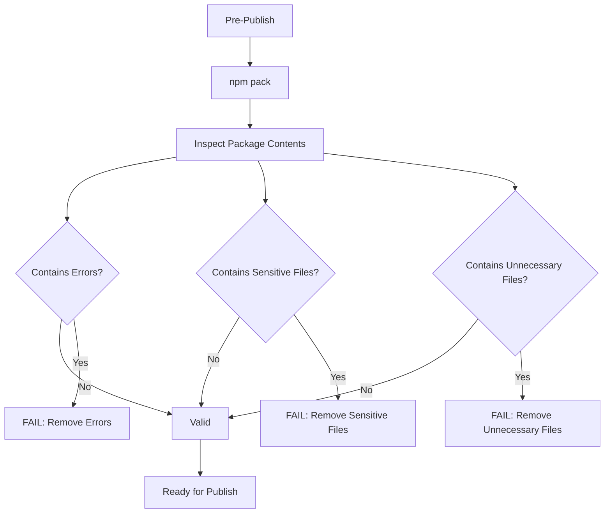
*Caption: Package contents validation decision tree with three security checks*

#### Scenario: Package does not contain error files
- **WHEN** package contents are inspected before publish
- **THEN** no error files (*.err, crash dumps, error logs) are present in the package

#### Scenario: Package does not contain sensitive files
- **WHEN** package contents are inspected before publish
- **THEN** no sensitive files (.env, *.pem, *.key, credentials) are present in the package

#### Scenario: Package does not contain unnecessary files
- **WHEN** package contents are inspected before publish
- **THEN** no unnecessary files (node_modules, devDependencies, build artifacts, temporary files) are present in the package

---

### Requirement: Security Boundaries (ADDED)

The publishing system SHALL adopt fail-closed behavior where any security violation prevents publication completely.

The publishing system SHALL ensure credentials are NEVER written to the repository in any form.

The publishing system SHALL ensure credentials are NEVER written to logs or console output in any form.

The publishing system SHALL ensure publication failure results in NO package being published, not even partially.

**Implementation**: CI/CD workflow security checks, environment variable management
**Verification**: Security audit of publishing workflow

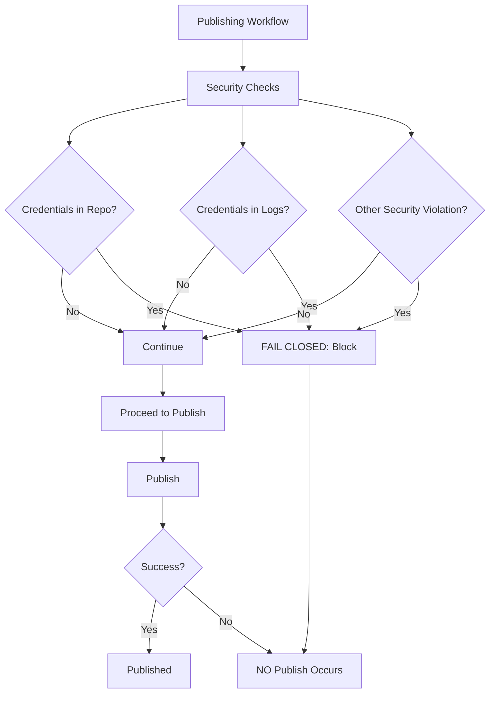
*Caption: Security boundary enforcement with fail-closed behavior for all violations*

#### Scenario: Fail-closed on credential in repository
- **WHEN** credentials are detected in the repository
- **THEN** publishing workflow is blocked and NO package is published

#### Scenario: Fail-closed on credential in logs
- **WHEN** credentials are detected in workflow logs
- **THEN** publishing workflow is blocked and NO package is published

#### Scenario: No partial publication on failure
- **WHEN** publishing workflow encounters any error
- **THEN** NO package is published to the registry, even partially

---

### Requirement: Release Validation

The publishing system SHALL require that all tests pass with 100% pass rate before package publication.

The publishing system SHALL require that all coverage thresholds (80% minimum for statements, branches, functions, lines) are met before package publication.

The publishing system SHALL require that build completes successfully without errors before package publication.

The publishing system SHALL require that package contents validation passes before package publication.

The validation steps SHALL execute in the following order:
1. Run all tests with coverage
2. Validate coverage thresholds are met
3. Run build
4. Validate package contents
5. Validate entry points
6. Verify CHANGELOG.md exists
7. Verify version consistency between tag and package.json
8. Security scan for credentials
9. Dry-run npm publish

**Implementation**: CI/CD workflow pre-publish checks, custom validation scripts
**Verification**: Complete pre-publish validation execution in correct order

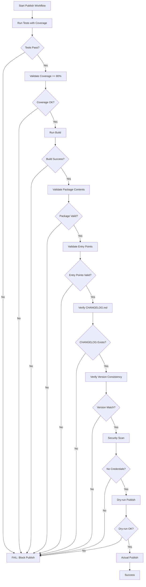
*Caption: Complete release validation workflow with ordered checks and fail-closed behavior*

#### Scenario: All tests pass before publish
- **WHEN** pre-publish validation runs
- **THEN** all tests MUST pass with 100% pass rate

#### Scenario: Coverage thresholds met before publish
- **WHEN** pre-publish validation runs
- **THEN** coverage for statements, branches, functions, and lines MUST all be at or above 80%

#### Scenario: Build succeeds before publish
- **WHEN** pre-publish validation runs
- **THEN** build MUST complete successfully without any errors

#### Scenario: Package validation passes before publish
- **WHEN** pre-publish validation runs
- **THEN** package contents validation MUST pass

#### Scenario: Validations execute in correct order
- **WHEN** publish workflow executes
- **THEN** validation steps execute in the order: tests, coverage, build, package validation, entry points, changelog, version, security, dry-run

---

### Requirement: Safe Publishing

The verification system SHALL use only non-publish methods (such as `npm publish --dry-run`) for validation purposes.

The verification system SHALL NEVER use actual `npm publish` for verification or testing purposes.

The actual `npm publish` command SHALL only execute as the final step after ALL validation checks have passed successfully.

The publishing workflow SHALL include a dry-run validation step before the actual publish step.

**Implementation**: .github/workflows/publish.yml, verification scripts
**Verification**: Inspection of workflow commands, confirmation that dry-run is used for validation

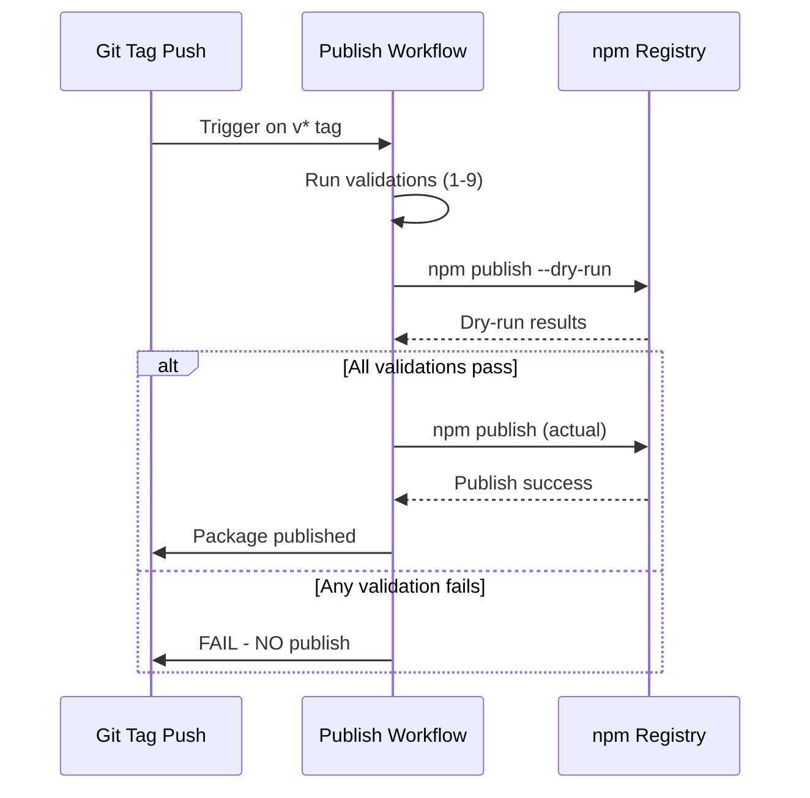
*Caption: Safe publishing sequence with dry-run validation before actual publish*

#### Scenario: Dry-run used for validation
- **WHEN** validation of publishing is performed
- **THEN** system uses `npm publish --dry-run` for validation step

#### Scenario: Actual publish only after all validations pass
- **WHEN** all validation steps complete successfully
- **THEN** system executes `npm publish` as the final step

#### Scenario: No actual publish during validation failure
- **WHEN** any validation step fails
- **THEN** NO actual package is published to any registry

#### Scenario: Actual npm publish is used for release
- **WHEN** all validations pass and it is a production release
- **THEN** system uses actual `npm publish` command to publish package

---

### Requirement: Acceptance Criteria Verification

The infrastructure SHALL have all build scripts execute successfully without errors.

The infrastructure SHALL have all tests pass with 100% pass rate.

The infrastructure SHALL meet or exceed the 80% test coverage threshold.

The infrastructure SHALL successfully publish to npm registry when version tags are pushed.

**Implementation**: All configuration files and workflows
**Verification**: Complete build, test, and publish cycle

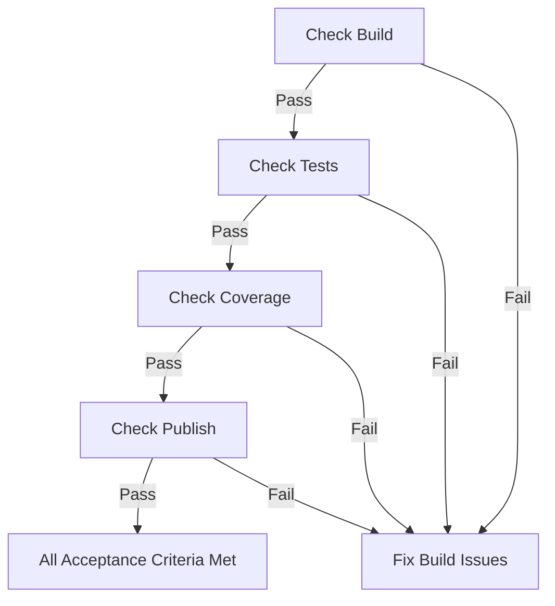
*Caption: Acceptance criteria verification workflow*

#### Scenario: Build scripts execute successfully
- **WHEN** `npm run build` is executed
- **THEN** command completes without errors

#### Scenario: All tests pass
- **WHEN** `npm test` is executed
- **THEN** all tests pass with 100% pass rate

#### Scenario: Coverage threshold met
- **WHEN** `npm test` is executed with coverage
- **THEN** coverage meets or exceeds 80% threshold

#### Scenario: Publishing succeeds
- **WHEN** version tag is pushed to repository
- **THEN** package is published to npm registry successfully

---

*Document Version: 2.0.0*
*Last Updated: 2026-07-16*
*Status: Active*
*Related Changes: infrastructure, harden-infrastructure-validation*
*Author: Mistral Vibe
